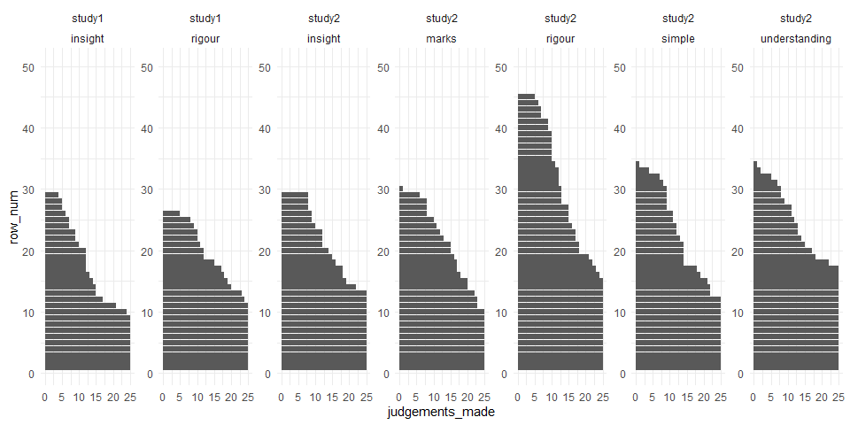
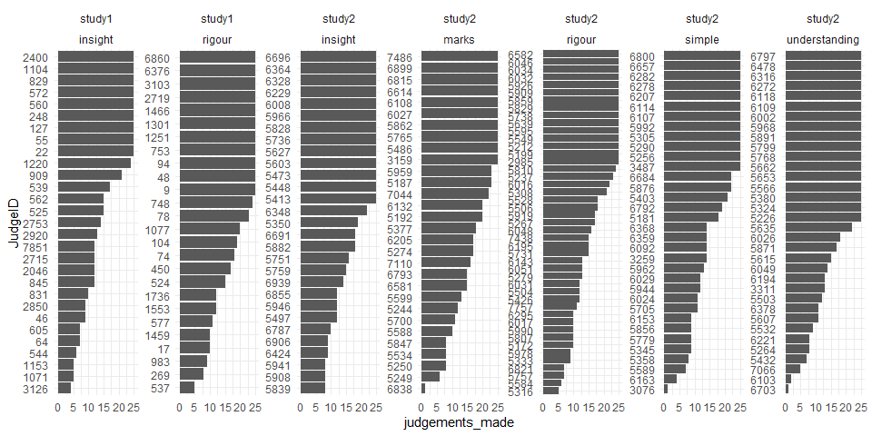
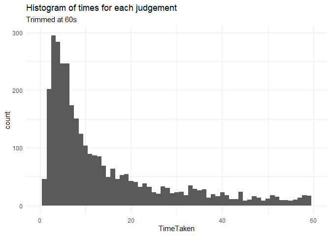
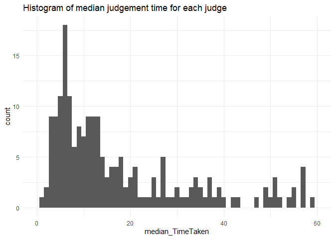
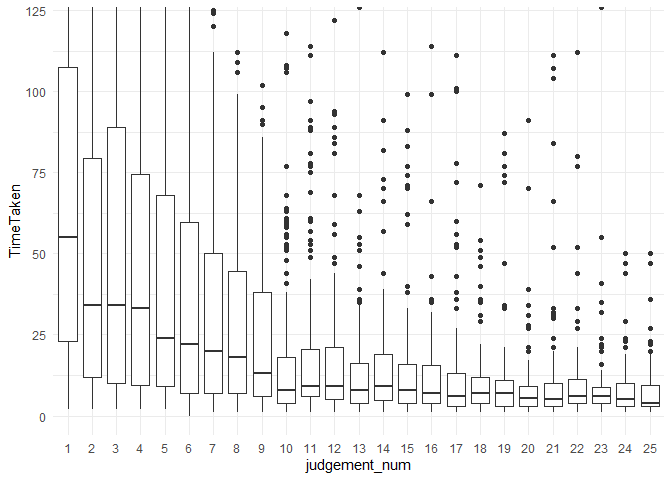
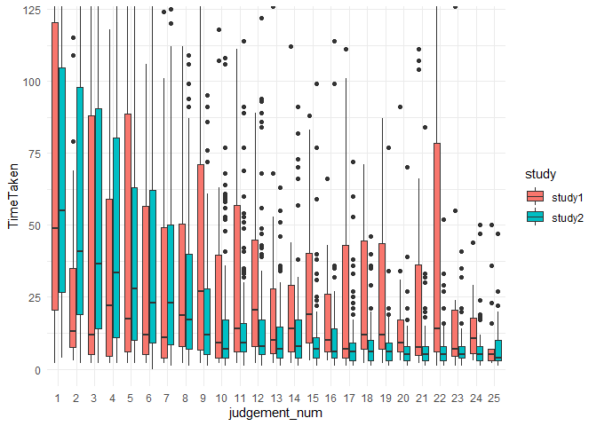
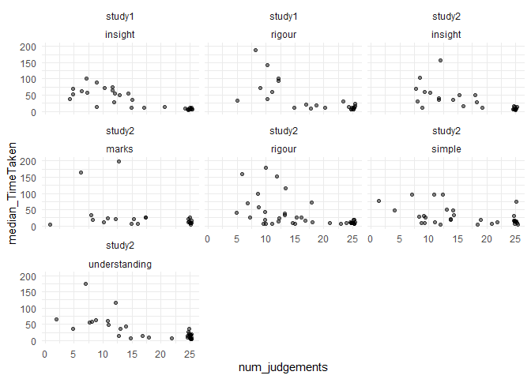

Proof CJ: Judgement data
================
George Kinnear
22/03/2021

    ## [1] "Data loaded from data-out folder"

# Summary of the decision data

## Judges summary

<table class="table table-striped" style="width: auto !important; ">
<thead>
<tr>
<th style="text-align:left;">
study
</th>
<th style="text-align:left;">
dimension
</th>
<th style="text-align:right;">
num\_judges
</th>
</tr>
</thead>
<tbody>
<tr>
<td style="text-align:left;">
study1
</td>
<td style="text-align:left;">
insight
</td>
<td style="text-align:right;">
29
</td>
</tr>
<tr>
<td style="text-align:left;">
study1
</td>
<td style="text-align:left;">
rigour
</td>
<td style="text-align:right;">
26
</td>
</tr>
<tr>
<td style="text-align:left;">
study2
</td>
<td style="text-align:left;">
insight
</td>
<td style="text-align:right;">
29
</td>
</tr>
<tr>
<td style="text-align:left;">
study2
</td>
<td style="text-align:left;">
marks
</td>
<td style="text-align:right;">
30
</td>
</tr>
<tr>
<td style="text-align:left;">
study2
</td>
<td style="text-align:left;">
rigour
</td>
<td style="text-align:right;">
45
</td>
</tr>
<tr>
<td style="text-align:left;">
study2
</td>
<td style="text-align:left;">
simple
</td>
<td style="text-align:right;">
34
</td>
</tr>
<tr>
<td style="text-align:left;">
study2
</td>
<td style="text-align:left;">
understanding
</td>
<td style="text-align:right;">
34
</td>
</tr>
</tbody>
</table>

## Judgements per judge

<!-- -->

<!-- -->

## Time taken

<!-- --><!-- -->

Judges became progressively quicker at making decisions as judging went
on:

    ## # A tibble: 25 x 3
    ##    judgement_num  mean median
    ##            <int> <dbl>  <dbl>
    ##  1             1  92.1     55
    ##  2             2  66.8     34
    ##  3             3  76.8     34
    ##  4             4  74.4     33
    ##  5             5  70.2     24
    ##  6             6  73.2     22
    ##  7             7  85.0     20
    ##  8             8  40.5     18
    ##  9             9  44.0     13
    ## 10            10  30.8      8
    ## # ... with 15 more rows

<!-- -->

By study:

    ## `summarise()` has grouped output by 'study'. You can override using the `.groups` argument.

    ## # A tibble: 50 x 4
    ## # Groups:   study [2]
    ##    study  judgement_num  mean median
    ##    <chr>          <int> <dbl>  <dbl>
    ##  1 study1             1  93.7   49  
    ##  2 study1             2  30.9   13  
    ##  3 study1             3  67.3   12  
    ##  4 study1             4  40.5   22  
    ##  5 study1             5  94.5   17.5
    ##  6 study1             6  47.6   12  
    ##  7 study1             7  68.2   11  
    ##  8 study1             8  50.2   18.5
    ##  9 study1             9  52.2   27  
    ## 10 study1            10  71.1    9  
    ## # ... with 40 more rows

<!-- -->

Median judgement times per study:

<table class="table table-striped" style="width: auto !important; margin-left: auto; margin-right: auto;">
<thead>
<tr>
<th style="text-align:left;">
study
</th>
<th style="text-align:right;">
median\_TimeTaken
</th>
</tr>
</thead>
<tbody>
<tr>
<td style="text-align:left;">
study1
</td>
<td style="text-align:right;">
14
</td>
</tr>
<tr>
<td style="text-align:left;">
study2
</td>
<td style="text-align:right;">
11
</td>
</tr>
</tbody>
</table>

Filtering out nonserious judges, whose median judgement time is under 5
seconds.

<table class="table table-striped" style="width: auto !important; margin-left: auto; margin-right: auto;">
<thead>
<tr>
<th style="text-align:left;">
nonserious\_judge
</th>
<th style="text-align:right;">
n
</th>
<th style="text-align:right;">
percent
</th>
</tr>
</thead>
<tbody>
<tr>
<td style="text-align:left;">
FALSE
</td>
<td style="text-align:right;">
206
</td>
<td style="text-align:right;">
0.907489
</td>
</tr>
<tr>
<td style="text-align:left;">
TRUE
</td>
<td style="text-align:right;">
21
</td>
<td style="text-align:right;">
0.092511
</td>
</tr>
</tbody>
</table>
<table class="table table-striped" style="width: auto !important; margin-left: auto; margin-right: auto;">
<thead>
<tr>
<th style="text-align:left;">
</th>
<th style="text-align:left;">
Judgements to be discarded
</th>
<th style="text-align:left;">
</th>
</tr>
</thead>
<tbody>
<tr>
<td style="text-align:left;">
study\_dim
</td>
<td style="text-align:left;">
FALSE
</td>
<td style="text-align:left;">
TRUE
</td>
</tr>
<tr>
<td style="text-align:left;">
study1 insight
</td>
<td style="text-align:left;">
100.00% (454)
</td>
<td style="text-align:left;">
0.00% (0)
</td>
</tr>
<tr>
<td style="text-align:left;">
study1 rigour
</td>
<td style="text-align:left;">
89.75% (438)
</td>
<td style="text-align:left;">
10.25% (50)
</td>
</tr>
<tr>
<td style="text-align:left;">
study2 insight
</td>
<td style="text-align:left;">
81.87% (438)
</td>
<td style="text-align:left;">
18.13% (97)
</td>
</tr>
<tr>
<td style="text-align:left;">
study2 marks
</td>
<td style="text-align:left;">
71.67% (382)
</td>
<td style="text-align:left;">
28.33% (151)
</td>
</tr>
<tr>
<td style="text-align:left;">
study2 rigour
</td>
<td style="text-align:left;">
82.06% (636)
</td>
<td style="text-align:left;">
17.94% (139)
</td>
</tr>
<tr>
<td style="text-align:left;">
study2 simple
</td>
<td style="text-align:left;">
91.80% (526)
</td>
<td style="text-align:left;">
8.20% (47)
</td>
</tr>
<tr>
<td style="text-align:left;">
study2 understanding
</td>
<td style="text-align:left;">
100.00% (611)
</td>
<td style="text-align:left;">
0.00% (0)
</td>
</tr>
</tbody>
</table>

<!-- -->

## Summary of the filtered judgements

<table class="table table-striped" style="width: auto !important; ">
<thead>
<tr>
<th style="text-align:left;">
study
</th>
<th style="text-align:left;">
dimension
</th>
<th style="text-align:right;">
script
</th>
<th style="text-align:right;">
proof
</th>
<th style="text-align:right;">
judgements
</th>
<th style="text-align:right;">
wins
</th>
<th style="text-align:right;">
losses
</th>
</tr>
</thead>
<tbody>
<tr>
<td style="text-align:left;">
study1
</td>
<td style="text-align:left;">
insight
</td>
<td style="text-align:right;">
29
</td>
<td style="text-align:right;">
1
</td>
<td style="text-align:right;">
70
</td>
<td style="text-align:right;">
14
</td>
<td style="text-align:right;">
56
</td>
</tr>
<tr>
<td style="text-align:left;">
study1
</td>
<td style="text-align:left;">
insight
</td>
<td style="text-align:right;">
30
</td>
<td style="text-align:right;">
2
</td>
<td style="text-align:right;">
70
</td>
<td style="text-align:right;">
50
</td>
<td style="text-align:right;">
20
</td>
</tr>
<tr>
<td style="text-align:left;">
study1
</td>
<td style="text-align:left;">
insight
</td>
<td style="text-align:right;">
31
</td>
<td style="text-align:right;">
3
</td>
<td style="text-align:right;">
70
</td>
<td style="text-align:right;">
18
</td>
<td style="text-align:right;">
52
</td>
</tr>
<tr>
<td style="text-align:left;">
study1
</td>
<td style="text-align:left;">
insight
</td>
<td style="text-align:right;">
32
</td>
<td style="text-align:right;">
4
</td>
<td style="text-align:right;">
70
</td>
<td style="text-align:right;">
37
</td>
<td style="text-align:right;">
33
</td>
</tr>
<tr>
<td style="text-align:left;">
study1
</td>
<td style="text-align:left;">
insight
</td>
<td style="text-align:right;">
33
</td>
<td style="text-align:right;">
5
</td>
<td style="text-align:right;">
70
</td>
<td style="text-align:right;">
34
</td>
<td style="text-align:right;">
36
</td>
</tr>
<tr>
<td style="text-align:left;">
study1
</td>
<td style="text-align:left;">
insight
</td>
<td style="text-align:right;">
34
</td>
<td style="text-align:right;">
6
</td>
<td style="text-align:right;">
70
</td>
<td style="text-align:right;">
42
</td>
<td style="text-align:right;">
28
</td>
</tr>
<tr>
<td style="text-align:left;">
study1
</td>
<td style="text-align:left;">
insight
</td>
<td style="text-align:right;">
35
</td>
<td style="text-align:right;">
7
</td>
<td style="text-align:right;">
69
</td>
<td style="text-align:right;">
41
</td>
<td style="text-align:right;">
28
</td>
</tr>
<tr>
<td style="text-align:left;">
study1
</td>
<td style="text-align:left;">
insight
</td>
<td style="text-align:right;">
36
</td>
<td style="text-align:right;">
8
</td>
<td style="text-align:right;">
70
</td>
<td style="text-align:right;">
40
</td>
<td style="text-align:right;">
30
</td>
</tr>
<tr>
<td style="text-align:left;">
study1
</td>
<td style="text-align:left;">
insight
</td>
<td style="text-align:right;">
37
</td>
<td style="text-align:right;">
9
</td>
<td style="text-align:right;">
69
</td>
<td style="text-align:right;">
38
</td>
<td style="text-align:right;">
31
</td>
</tr>
<tr>
<td style="text-align:left;">
study1
</td>
<td style="text-align:left;">
insight
</td>
<td style="text-align:right;">
38
</td>
<td style="text-align:right;">
10
</td>
<td style="text-align:right;">
70
</td>
<td style="text-align:right;">
59
</td>
<td style="text-align:right;">
11
</td>
</tr>
<tr>
<td style="text-align:left;">
study1
</td>
<td style="text-align:left;">
insight
</td>
<td style="text-align:right;">
39
</td>
<td style="text-align:right;">
11
</td>
<td style="text-align:right;">
70
</td>
<td style="text-align:right;">
26
</td>
<td style="text-align:right;">
44
</td>
</tr>
<tr>
<td style="text-align:left;">
study1
</td>
<td style="text-align:left;">
insight
</td>
<td style="text-align:right;">
40
</td>
<td style="text-align:right;">
12
</td>
<td style="text-align:right;">
70
</td>
<td style="text-align:right;">
34
</td>
<td style="text-align:right;">
36
</td>
</tr>
<tr>
<td style="text-align:left;">
study1
</td>
<td style="text-align:left;">
insight
</td>
<td style="text-align:right;">
43
</td>
<td style="text-align:right;">
13
</td>
<td style="text-align:right;">
70
</td>
<td style="text-align:right;">
21
</td>
<td style="text-align:right;">
49
</td>
</tr>
<tr>
<td style="text-align:left;">
study1
</td>
<td style="text-align:left;">
rigour
</td>
<td style="text-align:right;">
17
</td>
<td style="text-align:right;">
1
</td>
<td style="text-align:right;">
67
</td>
<td style="text-align:right;">
2
</td>
<td style="text-align:right;">
65
</td>
</tr>
<tr>
<td style="text-align:left;">
study1
</td>
<td style="text-align:left;">
rigour
</td>
<td style="text-align:right;">
18
</td>
<td style="text-align:right;">
2
</td>
<td style="text-align:right;">
67
</td>
<td style="text-align:right;">
27
</td>
<td style="text-align:right;">
40
</td>
</tr>
<tr>
<td style="text-align:left;">
study1
</td>
<td style="text-align:left;">
rigour
</td>
<td style="text-align:right;">
19
</td>
<td style="text-align:right;">
3
</td>
<td style="text-align:right;">
67
</td>
<td style="text-align:right;">
4
</td>
<td style="text-align:right;">
63
</td>
</tr>
<tr>
<td style="text-align:left;">
study1
</td>
<td style="text-align:left;">
rigour
</td>
<td style="text-align:right;">
20
</td>
<td style="text-align:right;">
4
</td>
<td style="text-align:right;">
67
</td>
<td style="text-align:right;">
37
</td>
<td style="text-align:right;">
30
</td>
</tr>
<tr>
<td style="text-align:left;">
study1
</td>
<td style="text-align:left;">
rigour
</td>
<td style="text-align:right;">
21
</td>
<td style="text-align:right;">
5
</td>
<td style="text-align:right;">
67
</td>
<td style="text-align:right;">
26
</td>
<td style="text-align:right;">
41
</td>
</tr>
<tr>
<td style="text-align:left;">
study1
</td>
<td style="text-align:left;">
rigour
</td>
<td style="text-align:right;">
22
</td>
<td style="text-align:right;">
6
</td>
<td style="text-align:right;">
68
</td>
<td style="text-align:right;">
46
</td>
<td style="text-align:right;">
22
</td>
</tr>
<tr>
<td style="text-align:left;">
study1
</td>
<td style="text-align:left;">
rigour
</td>
<td style="text-align:right;">
23
</td>
<td style="text-align:right;">
7
</td>
<td style="text-align:right;">
67
</td>
<td style="text-align:right;">
44
</td>
<td style="text-align:right;">
23
</td>
</tr>
<tr>
<td style="text-align:left;">
study1
</td>
<td style="text-align:left;">
rigour
</td>
<td style="text-align:right;">
24
</td>
<td style="text-align:right;">
8
</td>
<td style="text-align:right;">
67
</td>
<td style="text-align:right;">
47
</td>
<td style="text-align:right;">
20
</td>
</tr>
<tr>
<td style="text-align:left;">
study1
</td>
<td style="text-align:left;">
rigour
</td>
<td style="text-align:right;">
25
</td>
<td style="text-align:right;">
9
</td>
<td style="text-align:right;">
68
</td>
<td style="text-align:right;">
46
</td>
<td style="text-align:right;">
22
</td>
</tr>
<tr>
<td style="text-align:left;">
study1
</td>
<td style="text-align:left;">
rigour
</td>
<td style="text-align:right;">
26
</td>
<td style="text-align:right;">
10
</td>
<td style="text-align:right;">
69
</td>
<td style="text-align:right;">
64
</td>
<td style="text-align:right;">
5
</td>
</tr>
<tr>
<td style="text-align:left;">
study1
</td>
<td style="text-align:left;">
rigour
</td>
<td style="text-align:right;">
27
</td>
<td style="text-align:right;">
11
</td>
<td style="text-align:right;">
67
</td>
<td style="text-align:right;">
43
</td>
<td style="text-align:right;">
24
</td>
</tr>
<tr>
<td style="text-align:left;">
study1
</td>
<td style="text-align:left;">
rigour
</td>
<td style="text-align:right;">
41
</td>
<td style="text-align:right;">
12
</td>
<td style="text-align:right;">
67
</td>
<td style="text-align:right;">
26
</td>
<td style="text-align:right;">
41
</td>
</tr>
<tr>
<td style="text-align:left;">
study1
</td>
<td style="text-align:left;">
rigour
</td>
<td style="text-align:right;">
42
</td>
<td style="text-align:right;">
13
</td>
<td style="text-align:right;">
68
</td>
<td style="text-align:right;">
26
</td>
<td style="text-align:right;">
42
</td>
</tr>
<tr>
<td style="text-align:left;">
study2
</td>
<td style="text-align:left;">
insight
</td>
<td style="text-align:right;">
113
</td>
<td style="text-align:right;">
1
</td>
<td style="text-align:right;">
60
</td>
<td style="text-align:right;">
21
</td>
<td style="text-align:right;">
39
</td>
</tr>
<tr>
<td style="text-align:left;">
study2
</td>
<td style="text-align:left;">
insight
</td>
<td style="text-align:right;">
118
</td>
<td style="text-align:right;">
2
</td>
<td style="text-align:right;">
58
</td>
<td style="text-align:right;">
37
</td>
<td style="text-align:right;">
21
</td>
</tr>
<tr>
<td style="text-align:left;">
study2
</td>
<td style="text-align:left;">
insight
</td>
<td style="text-align:right;">
123
</td>
<td style="text-align:right;">
3
</td>
<td style="text-align:right;">
57
</td>
<td style="text-align:right;">
14
</td>
<td style="text-align:right;">
43
</td>
</tr>
<tr>
<td style="text-align:left;">
study2
</td>
<td style="text-align:left;">
insight
</td>
<td style="text-align:right;">
128
</td>
<td style="text-align:right;">
4
</td>
<td style="text-align:right;">
58
</td>
<td style="text-align:right;">
32
</td>
<td style="text-align:right;">
26
</td>
</tr>
<tr>
<td style="text-align:left;">
study2
</td>
<td style="text-align:left;">
insight
</td>
<td style="text-align:right;">
133
</td>
<td style="text-align:right;">
5
</td>
<td style="text-align:right;">
59
</td>
<td style="text-align:right;">
35
</td>
<td style="text-align:right;">
24
</td>
</tr>
<tr>
<td style="text-align:left;">
study2
</td>
<td style="text-align:left;">
insight
</td>
<td style="text-align:right;">
138
</td>
<td style="text-align:right;">
6
</td>
<td style="text-align:right;">
59
</td>
<td style="text-align:right;">
29
</td>
<td style="text-align:right;">
30
</td>
</tr>
<tr>
<td style="text-align:left;">
study2
</td>
<td style="text-align:left;">
insight
</td>
<td style="text-align:right;">
143
</td>
<td style="text-align:right;">
7
</td>
<td style="text-align:right;">
58
</td>
<td style="text-align:right;">
29
</td>
<td style="text-align:right;">
29
</td>
</tr>
<tr>
<td style="text-align:left;">
study2
</td>
<td style="text-align:left;">
insight
</td>
<td style="text-align:right;">
148
</td>
<td style="text-align:right;">
8
</td>
<td style="text-align:right;">
59
</td>
<td style="text-align:right;">
33
</td>
<td style="text-align:right;">
26
</td>
</tr>
<tr>
<td style="text-align:left;">
study2
</td>
<td style="text-align:left;">
insight
</td>
<td style="text-align:right;">
153
</td>
<td style="text-align:right;">
9
</td>
<td style="text-align:right;">
60
</td>
<td style="text-align:right;">
31
</td>
<td style="text-align:right;">
29
</td>
</tr>
<tr>
<td style="text-align:left;">
study2
</td>
<td style="text-align:left;">
insight
</td>
<td style="text-align:right;">
158
</td>
<td style="text-align:right;">
10
</td>
<td style="text-align:right;">
59
</td>
<td style="text-align:right;">
45
</td>
<td style="text-align:right;">
14
</td>
</tr>
<tr>
<td style="text-align:left;">
study2
</td>
<td style="text-align:left;">
insight
</td>
<td style="text-align:right;">
163
</td>
<td style="text-align:right;">
11
</td>
<td style="text-align:right;">
58
</td>
<td style="text-align:right;">
32
</td>
<td style="text-align:right;">
26
</td>
</tr>
<tr>
<td style="text-align:left;">
study2
</td>
<td style="text-align:left;">
insight
</td>
<td style="text-align:right;">
168
</td>
<td style="text-align:right;">
12
</td>
<td style="text-align:right;">
59
</td>
<td style="text-align:right;">
27
</td>
<td style="text-align:right;">
32
</td>
</tr>
<tr>
<td style="text-align:left;">
study2
</td>
<td style="text-align:left;">
insight
</td>
<td style="text-align:right;">
173
</td>
<td style="text-align:right;">
13
</td>
<td style="text-align:right;">
58
</td>
<td style="text-align:right;">
19
</td>
<td style="text-align:right;">
39
</td>
</tr>
<tr>
<td style="text-align:left;">
study2
</td>
<td style="text-align:left;">
insight
</td>
<td style="text-align:right;">
178
</td>
<td style="text-align:right;">
14
</td>
<td style="text-align:right;">
57
</td>
<td style="text-align:right;">
29
</td>
<td style="text-align:right;">
28
</td>
</tr>
<tr>
<td style="text-align:left;">
study2
</td>
<td style="text-align:left;">
insight
</td>
<td style="text-align:right;">
183
</td>
<td style="text-align:right;">
15
</td>
<td style="text-align:right;">
57
</td>
<td style="text-align:right;">
25
</td>
<td style="text-align:right;">
32
</td>
</tr>
<tr>
<td style="text-align:left;">
study2
</td>
<td style="text-align:left;">
marks
</td>
<td style="text-align:right;">
116
</td>
<td style="text-align:right;">
1
</td>
<td style="text-align:right;">
51
</td>
<td style="text-align:right;">
9
</td>
<td style="text-align:right;">
42
</td>
</tr>
<tr>
<td style="text-align:left;">
study2
</td>
<td style="text-align:left;">
marks
</td>
<td style="text-align:right;">
121
</td>
<td style="text-align:right;">
2
</td>
<td style="text-align:right;">
51
</td>
<td style="text-align:right;">
7
</td>
<td style="text-align:right;">
44
</td>
</tr>
<tr>
<td style="text-align:left;">
study2
</td>
<td style="text-align:left;">
marks
</td>
<td style="text-align:right;">
126
</td>
<td style="text-align:right;">
3
</td>
<td style="text-align:right;">
51
</td>
<td style="text-align:right;">
5
</td>
<td style="text-align:right;">
46
</td>
</tr>
<tr>
<td style="text-align:left;">
study2
</td>
<td style="text-align:left;">
marks
</td>
<td style="text-align:right;">
131
</td>
<td style="text-align:right;">
4
</td>
<td style="text-align:right;">
51
</td>
<td style="text-align:right;">
18
</td>
<td style="text-align:right;">
33
</td>
</tr>
<tr>
<td style="text-align:left;">
study2
</td>
<td style="text-align:left;">
marks
</td>
<td style="text-align:right;">
136
</td>
<td style="text-align:right;">
5
</td>
<td style="text-align:right;">
51
</td>
<td style="text-align:right;">
27
</td>
<td style="text-align:right;">
24
</td>
</tr>
<tr>
<td style="text-align:left;">
study2
</td>
<td style="text-align:left;">
marks
</td>
<td style="text-align:right;">
141
</td>
<td style="text-align:right;">
6
</td>
<td style="text-align:right;">
51
</td>
<td style="text-align:right;">
40
</td>
<td style="text-align:right;">
11
</td>
</tr>
<tr>
<td style="text-align:left;">
study2
</td>
<td style="text-align:left;">
marks
</td>
<td style="text-align:right;">
146
</td>
<td style="text-align:right;">
7
</td>
<td style="text-align:right;">
53
</td>
<td style="text-align:right;">
28
</td>
<td style="text-align:right;">
25
</td>
</tr>
<tr>
<td style="text-align:left;">
study2
</td>
<td style="text-align:left;">
marks
</td>
<td style="text-align:right;">
151
</td>
<td style="text-align:right;">
8
</td>
<td style="text-align:right;">
51
</td>
<td style="text-align:right;">
31
</td>
<td style="text-align:right;">
20
</td>
</tr>
<tr>
<td style="text-align:left;">
study2
</td>
<td style="text-align:left;">
marks
</td>
<td style="text-align:right;">
156
</td>
<td style="text-align:right;">
9
</td>
<td style="text-align:right;">
51
</td>
<td style="text-align:right;">
32
</td>
<td style="text-align:right;">
19
</td>
</tr>
<tr>
<td style="text-align:left;">
study2
</td>
<td style="text-align:left;">
marks
</td>
<td style="text-align:right;">
161
</td>
<td style="text-align:right;">
10
</td>
<td style="text-align:right;">
52
</td>
<td style="text-align:right;">
50
</td>
<td style="text-align:right;">
2
</td>
</tr>
<tr>
<td style="text-align:left;">
study2
</td>
<td style="text-align:left;">
marks
</td>
<td style="text-align:right;">
166
</td>
<td style="text-align:right;">
11
</td>
<td style="text-align:right;">
49
</td>
<td style="text-align:right;">
27
</td>
<td style="text-align:right;">
22
</td>
</tr>
<tr>
<td style="text-align:left;">
study2
</td>
<td style="text-align:left;">
marks
</td>
<td style="text-align:right;">
171
</td>
<td style="text-align:right;">
12
</td>
<td style="text-align:right;">
52
</td>
<td style="text-align:right;">
29
</td>
<td style="text-align:right;">
23
</td>
</tr>
<tr>
<td style="text-align:left;">
study2
</td>
<td style="text-align:left;">
marks
</td>
<td style="text-align:right;">
176
</td>
<td style="text-align:right;">
13
</td>
<td style="text-align:right;">
50
</td>
<td style="text-align:right;">
20
</td>
<td style="text-align:right;">
30
</td>
</tr>
<tr>
<td style="text-align:left;">
study2
</td>
<td style="text-align:left;">
marks
</td>
<td style="text-align:right;">
181
</td>
<td style="text-align:right;">
14
</td>
<td style="text-align:right;">
49
</td>
<td style="text-align:right;">
36
</td>
<td style="text-align:right;">
13
</td>
</tr>
<tr>
<td style="text-align:left;">
study2
</td>
<td style="text-align:left;">
marks
</td>
<td style="text-align:right;">
186
</td>
<td style="text-align:right;">
15
</td>
<td style="text-align:right;">
51
</td>
<td style="text-align:right;">
23
</td>
<td style="text-align:right;">
28
</td>
</tr>
<tr>
<td style="text-align:left;">
study2
</td>
<td style="text-align:left;">
rigour
</td>
<td style="text-align:right;">
112
</td>
<td style="text-align:right;">
1
</td>
<td style="text-align:right;">
86
</td>
<td style="text-align:right;">
12
</td>
<td style="text-align:right;">
74
</td>
</tr>
<tr>
<td style="text-align:left;">
study2
</td>
<td style="text-align:left;">
rigour
</td>
<td style="text-align:right;">
117
</td>
<td style="text-align:right;">
2
</td>
<td style="text-align:right;">
86
</td>
<td style="text-align:right;">
29
</td>
<td style="text-align:right;">
57
</td>
</tr>
<tr>
<td style="text-align:left;">
study2
</td>
<td style="text-align:left;">
rigour
</td>
<td style="text-align:right;">
122
</td>
<td style="text-align:right;">
3
</td>
<td style="text-align:right;">
83
</td>
<td style="text-align:right;">
17
</td>
<td style="text-align:right;">
66
</td>
</tr>
<tr>
<td style="text-align:left;">
study2
</td>
<td style="text-align:left;">
rigour
</td>
<td style="text-align:right;">
127
</td>
<td style="text-align:right;">
4
</td>
<td style="text-align:right;">
85
</td>
<td style="text-align:right;">
52
</td>
<td style="text-align:right;">
33
</td>
</tr>
<tr>
<td style="text-align:left;">
study2
</td>
<td style="text-align:left;">
rigour
</td>
<td style="text-align:right;">
132
</td>
<td style="text-align:right;">
5
</td>
<td style="text-align:right;">
84
</td>
<td style="text-align:right;">
29
</td>
<td style="text-align:right;">
55
</td>
</tr>
<tr>
<td style="text-align:left;">
study2
</td>
<td style="text-align:left;">
rigour
</td>
<td style="text-align:right;">
137
</td>
<td style="text-align:right;">
6
</td>
<td style="text-align:right;">
84
</td>
<td style="text-align:right;">
50
</td>
<td style="text-align:right;">
34
</td>
</tr>
<tr>
<td style="text-align:left;">
study2
</td>
<td style="text-align:left;">
rigour
</td>
<td style="text-align:right;">
142
</td>
<td style="text-align:right;">
7
</td>
<td style="text-align:right;">
85
</td>
<td style="text-align:right;">
47
</td>
<td style="text-align:right;">
38
</td>
</tr>
<tr>
<td style="text-align:left;">
study2
</td>
<td style="text-align:left;">
rigour
</td>
<td style="text-align:right;">
147
</td>
<td style="text-align:right;">
8
</td>
<td style="text-align:right;">
85
</td>
<td style="text-align:right;">
56
</td>
<td style="text-align:right;">
29
</td>
</tr>
<tr>
<td style="text-align:left;">
study2
</td>
<td style="text-align:left;">
rigour
</td>
<td style="text-align:right;">
152
</td>
<td style="text-align:right;">
9
</td>
<td style="text-align:right;">
85
</td>
<td style="text-align:right;">
51
</td>
<td style="text-align:right;">
34
</td>
</tr>
<tr>
<td style="text-align:left;">
study2
</td>
<td style="text-align:left;">
rigour
</td>
<td style="text-align:right;">
157
</td>
<td style="text-align:right;">
10
</td>
<td style="text-align:right;">
85
</td>
<td style="text-align:right;">
81
</td>
<td style="text-align:right;">
4
</td>
</tr>
<tr>
<td style="text-align:left;">
study2
</td>
<td style="text-align:left;">
rigour
</td>
<td style="text-align:right;">
162
</td>
<td style="text-align:right;">
11
</td>
<td style="text-align:right;">
85
</td>
<td style="text-align:right;">
59
</td>
<td style="text-align:right;">
26
</td>
</tr>
<tr>
<td style="text-align:left;">
study2
</td>
<td style="text-align:left;">
rigour
</td>
<td style="text-align:right;">
167
</td>
<td style="text-align:right;">
12
</td>
<td style="text-align:right;">
86
</td>
<td style="text-align:right;">
44
</td>
<td style="text-align:right;">
42
</td>
</tr>
<tr>
<td style="text-align:left;">
study2
</td>
<td style="text-align:left;">
rigour
</td>
<td style="text-align:right;">
172
</td>
<td style="text-align:right;">
13
</td>
<td style="text-align:right;">
83
</td>
<td style="text-align:right;">
24
</td>
<td style="text-align:right;">
59
</td>
</tr>
<tr>
<td style="text-align:left;">
study2
</td>
<td style="text-align:left;">
rigour
</td>
<td style="text-align:right;">
177
</td>
<td style="text-align:right;">
14
</td>
<td style="text-align:right;">
85
</td>
<td style="text-align:right;">
51
</td>
<td style="text-align:right;">
34
</td>
</tr>
<tr>
<td style="text-align:left;">
study2
</td>
<td style="text-align:left;">
rigour
</td>
<td style="text-align:right;">
182
</td>
<td style="text-align:right;">
15
</td>
<td style="text-align:right;">
85
</td>
<td style="text-align:right;">
34
</td>
<td style="text-align:right;">
51
</td>
</tr>
<tr>
<td style="text-align:left;">
study2
</td>
<td style="text-align:left;">
simple
</td>
<td style="text-align:right;">
114
</td>
<td style="text-align:right;">
1
</td>
<td style="text-align:right;">
70
</td>
<td style="text-align:right;">
40
</td>
<td style="text-align:right;">
30
</td>
</tr>
<tr>
<td style="text-align:left;">
study2
</td>
<td style="text-align:left;">
simple
</td>
<td style="text-align:right;">
119
</td>
<td style="text-align:right;">
2
</td>
<td style="text-align:right;">
69
</td>
<td style="text-align:right;">
53
</td>
<td style="text-align:right;">
16
</td>
</tr>
<tr>
<td style="text-align:left;">
study2
</td>
<td style="text-align:left;">
simple
</td>
<td style="text-align:right;">
124
</td>
<td style="text-align:right;">
3
</td>
<td style="text-align:right;">
70
</td>
<td style="text-align:right;">
20
</td>
<td style="text-align:right;">
50
</td>
</tr>
<tr>
<td style="text-align:left;">
study2
</td>
<td style="text-align:left;">
simple
</td>
<td style="text-align:right;">
129
</td>
<td style="text-align:right;">
4
</td>
<td style="text-align:right;">
70
</td>
<td style="text-align:right;">
45
</td>
<td style="text-align:right;">
25
</td>
</tr>
<tr>
<td style="text-align:left;">
study2
</td>
<td style="text-align:left;">
simple
</td>
<td style="text-align:right;">
134
</td>
<td style="text-align:right;">
5
</td>
<td style="text-align:right;">
69
</td>
<td style="text-align:right;">
49
</td>
<td style="text-align:right;">
20
</td>
</tr>
<tr>
<td style="text-align:left;">
study2
</td>
<td style="text-align:left;">
simple
</td>
<td style="text-align:right;">
139
</td>
<td style="text-align:right;">
6
</td>
<td style="text-align:right;">
70
</td>
<td style="text-align:right;">
37
</td>
<td style="text-align:right;">
33
</td>
</tr>
<tr>
<td style="text-align:left;">
study2
</td>
<td style="text-align:left;">
simple
</td>
<td style="text-align:right;">
144
</td>
<td style="text-align:right;">
7
</td>
<td style="text-align:right;">
69
</td>
<td style="text-align:right;">
28
</td>
<td style="text-align:right;">
41
</td>
</tr>
<tr>
<td style="text-align:left;">
study2
</td>
<td style="text-align:left;">
simple
</td>
<td style="text-align:right;">
149
</td>
<td style="text-align:right;">
8
</td>
<td style="text-align:right;">
70
</td>
<td style="text-align:right;">
50
</td>
<td style="text-align:right;">
20
</td>
</tr>
<tr>
<td style="text-align:left;">
study2
</td>
<td style="text-align:left;">
simple
</td>
<td style="text-align:right;">
154
</td>
<td style="text-align:right;">
9
</td>
<td style="text-align:right;">
71
</td>
<td style="text-align:right;">
40
</td>
<td style="text-align:right;">
31
</td>
</tr>
<tr>
<td style="text-align:left;">
study2
</td>
<td style="text-align:left;">
simple
</td>
<td style="text-align:right;">
159
</td>
<td style="text-align:right;">
10
</td>
<td style="text-align:right;">
71
</td>
<td style="text-align:right;">
46
</td>
<td style="text-align:right;">
25
</td>
</tr>
<tr>
<td style="text-align:left;">
study2
</td>
<td style="text-align:left;">
simple
</td>
<td style="text-align:right;">
164
</td>
<td style="text-align:right;">
11
</td>
<td style="text-align:right;">
70
</td>
<td style="text-align:right;">
14
</td>
<td style="text-align:right;">
56
</td>
</tr>
<tr>
<td style="text-align:left;">
study2
</td>
<td style="text-align:left;">
simple
</td>
<td style="text-align:right;">
169
</td>
<td style="text-align:right;">
12
</td>
<td style="text-align:right;">
70
</td>
<td style="text-align:right;">
20
</td>
<td style="text-align:right;">
50
</td>
</tr>
<tr>
<td style="text-align:left;">
study2
</td>
<td style="text-align:left;">
simple
</td>
<td style="text-align:right;">
174
</td>
<td style="text-align:right;">
13
</td>
<td style="text-align:right;">
71
</td>
<td style="text-align:right;">
9
</td>
<td style="text-align:right;">
62
</td>
</tr>
<tr>
<td style="text-align:left;">
study2
</td>
<td style="text-align:left;">
simple
</td>
<td style="text-align:right;">
179
</td>
<td style="text-align:right;">
14
</td>
<td style="text-align:right;">
71
</td>
<td style="text-align:right;">
49
</td>
<td style="text-align:right;">
22
</td>
</tr>
<tr>
<td style="text-align:left;">
study2
</td>
<td style="text-align:left;">
simple
</td>
<td style="text-align:right;">
184
</td>
<td style="text-align:right;">
15
</td>
<td style="text-align:right;">
71
</td>
<td style="text-align:right;">
26
</td>
<td style="text-align:right;">
45
</td>
</tr>
<tr>
<td style="text-align:left;">
study2
</td>
<td style="text-align:left;">
understanding
</td>
<td style="text-align:right;">
115
</td>
<td style="text-align:right;">
1
</td>
<td style="text-align:right;">
81
</td>
<td style="text-align:right;">
44
</td>
<td style="text-align:right;">
37
</td>
</tr>
<tr>
<td style="text-align:left;">
study2
</td>
<td style="text-align:left;">
understanding
</td>
<td style="text-align:right;">
120
</td>
<td style="text-align:right;">
2
</td>
<td style="text-align:right;">
81
</td>
<td style="text-align:right;">
50
</td>
<td style="text-align:right;">
31
</td>
</tr>
<tr>
<td style="text-align:left;">
study2
</td>
<td style="text-align:left;">
understanding
</td>
<td style="text-align:right;">
125
</td>
<td style="text-align:right;">
3
</td>
<td style="text-align:right;">
81
</td>
<td style="text-align:right;">
17
</td>
<td style="text-align:right;">
64
</td>
</tr>
<tr>
<td style="text-align:left;">
study2
</td>
<td style="text-align:left;">
understanding
</td>
<td style="text-align:right;">
130
</td>
<td style="text-align:right;">
4
</td>
<td style="text-align:right;">
81
</td>
<td style="text-align:right;">
42
</td>
<td style="text-align:right;">
39
</td>
</tr>
<tr>
<td style="text-align:left;">
study2
</td>
<td style="text-align:left;">
understanding
</td>
<td style="text-align:right;">
135
</td>
<td style="text-align:right;">
5
</td>
<td style="text-align:right;">
82
</td>
<td style="text-align:right;">
46
</td>
<td style="text-align:right;">
36
</td>
</tr>
<tr>
<td style="text-align:left;">
study2
</td>
<td style="text-align:left;">
understanding
</td>
<td style="text-align:right;">
140
</td>
<td style="text-align:right;">
6
</td>
<td style="text-align:right;">
81
</td>
<td style="text-align:right;">
42
</td>
<td style="text-align:right;">
39
</td>
</tr>
<tr>
<td style="text-align:left;">
study2
</td>
<td style="text-align:left;">
understanding
</td>
<td style="text-align:right;">
145
</td>
<td style="text-align:right;">
7
</td>
<td style="text-align:right;">
81
</td>
<td style="text-align:right;">
36
</td>
<td style="text-align:right;">
45
</td>
</tr>
<tr>
<td style="text-align:left;">
study2
</td>
<td style="text-align:left;">
understanding
</td>
<td style="text-align:right;">
150
</td>
<td style="text-align:right;">
8
</td>
<td style="text-align:right;">
82
</td>
<td style="text-align:right;">
48
</td>
<td style="text-align:right;">
34
</td>
</tr>
<tr>
<td style="text-align:left;">
study2
</td>
<td style="text-align:left;">
understanding
</td>
<td style="text-align:right;">
155
</td>
<td style="text-align:right;">
9
</td>
<td style="text-align:right;">
81
</td>
<td style="text-align:right;">
43
</td>
<td style="text-align:right;">
38
</td>
</tr>
<tr>
<td style="text-align:left;">
study2
</td>
<td style="text-align:left;">
understanding
</td>
<td style="text-align:right;">
160
</td>
<td style="text-align:right;">
10
</td>
<td style="text-align:right;">
82
</td>
<td style="text-align:right;">
62
</td>
<td style="text-align:right;">
20
</td>
</tr>
<tr>
<td style="text-align:left;">
study2
</td>
<td style="text-align:left;">
understanding
</td>
<td style="text-align:right;">
165
</td>
<td style="text-align:right;">
11
</td>
<td style="text-align:right;">
81
</td>
<td style="text-align:right;">
31
</td>
<td style="text-align:right;">
50
</td>
</tr>
<tr>
<td style="text-align:left;">
study2
</td>
<td style="text-align:left;">
understanding
</td>
<td style="text-align:right;">
170
</td>
<td style="text-align:right;">
12
</td>
<td style="text-align:right;">
82
</td>
<td style="text-align:right;">
28
</td>
<td style="text-align:right;">
54
</td>
</tr>
<tr>
<td style="text-align:left;">
study2
</td>
<td style="text-align:left;">
understanding
</td>
<td style="text-align:right;">
175
</td>
<td style="text-align:right;">
13
</td>
<td style="text-align:right;">
82
</td>
<td style="text-align:right;">
27
</td>
<td style="text-align:right;">
55
</td>
</tr>
<tr>
<td style="text-align:left;">
study2
</td>
<td style="text-align:left;">
understanding
</td>
<td style="text-align:right;">
180
</td>
<td style="text-align:right;">
14
</td>
<td style="text-align:right;">
82
</td>
<td style="text-align:right;">
54
</td>
<td style="text-align:right;">
28
</td>
</tr>
<tr>
<td style="text-align:left;">
study2
</td>
<td style="text-align:left;">
understanding
</td>
<td style="text-align:right;">
185
</td>
<td style="text-align:right;">
15
</td>
<td style="text-align:right;">
82
</td>
<td style="text-align:right;">
41
</td>
<td style="text-align:right;">
41
</td>
</tr>
</tbody>
</table>

## Total time taken per serious judge in study 2

    ##    Min. 1st Qu.  Median    Mean 3rd Qu.    Max. 
    ##     5.0   314.0   537.0   754.7   866.0  4988.0

    ## [1] 756.7849

<!-- -->

# Save data

Filtered judgement data written to `data-out/judgement_data.csv`.
