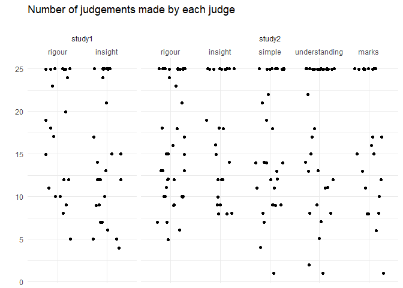
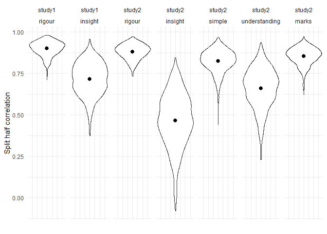
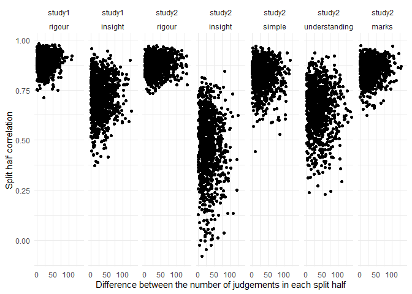
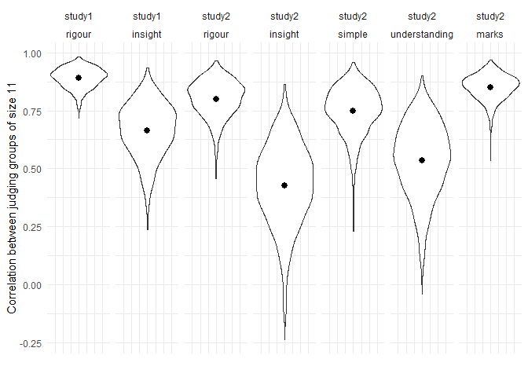
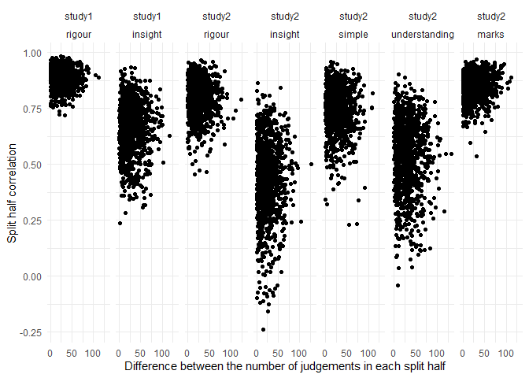

Proof CJ: Split-halves reliability
================
George Kinnear
22/03/2021

# Read data

<table class="table table-striped" style="width: auto !important; margin-left: auto; margin-right: auto;">

<thead>

<tr>

<th style="text-align:left;">

study

</th>

<th style="text-align:left;">

dimension

</th>

<th style="text-align:right;">

num\_judgements

</th>

<th style="text-align:right;">

num\_judges

</th>

</tr>

</thead>

<tbody>

<tr>

<td style="text-align:left;vertical-align: top !important;" rowspan="2">

study1

</td>

<td style="text-align:left;">

rigour

</td>

<td style="text-align:right;">

438

</td>

<td style="text-align:right;">

24

</td>

</tr>

<tr>

<td style="text-align:left;">

insight

</td>

<td style="text-align:right;">

454

</td>

<td style="text-align:right;">

29

</td>

</tr>

<tr>

<td style="text-align:left;vertical-align: top !important;" rowspan="5">

study2

</td>

<td style="text-align:left;">

rigour

</td>

<td style="text-align:right;">

636

</td>

<td style="text-align:right;">

39

</td>

</tr>

<tr>

<td style="text-align:left;">

insight

</td>

<td style="text-align:right;">

438

</td>

<td style="text-align:right;">

25

</td>

</tr>

<tr>

<td style="text-align:left;">

simple

</td>

<td style="text-align:right;">

526

</td>

<td style="text-align:right;">

32

</td>

</tr>

<tr>

<td style="text-align:left;">

understanding

</td>

<td style="text-align:right;">

611

</td>

<td style="text-align:right;">

34

</td>

</tr>

<tr>

<td style="text-align:left;">

marks

</td>

<td style="text-align:right;">

382

</td>

<td style="text-align:right;">

23

</td>

</tr>

</tbody>

</table>

Note that the number of judgements made by each judge varies
considerably:

<!-- -->

# Split-halves reliability

We split the judges into two groups, and find the correlation between
the scale scores produced by running each group’s judgements through
btm.

We do this in two ways:

1.  genuine split-halves, i.e. dividing the judging group into two (N
    judges into groups of size floor(N/2) and ceiling(N/2))
2.  subsets of judges of a given size, i.e. selecting two distinct
    groups of judges from the pool of available judges, each group
    having the given size.

We do this splitting many times (in this case 1000 times), and look at
the mean of correlation between the split judging groups across all
those iterations. All the individual correlations are cached in
`data-out/splithalf-iterations.csv` and
`data-out/splits-iterations.csv`.

## Split halves

<table class="table table-striped" style="width: auto !important; margin-left: auto; margin-right: auto;">

<thead>

<tr>

<th style="text-align:left;">

study

</th>

<th style="text-align:left;">

dimension

</th>

<th style="text-align:right;">

num\_judges

</th>

<th style="text-align:right;">

n\_iters

</th>

<th style="text-align:right;">

corr\_mean

</th>

<th style="text-align:right;">

corr\_median

</th>

<th style="text-align:right;">

corr\_sd

</th>

<th style="text-align:right;">

corr\_se

</th>

</tr>

</thead>

<tbody>

<tr>

<td style="text-align:left;vertical-align: top !important;" rowspan="2">

study1

</td>

<td style="text-align:left;">

rigour

</td>

<td style="text-align:right;">

24

</td>

<td style="text-align:right;">

1000

</td>

<td style="text-align:right;">

0.8994808

</td>

<td style="text-align:right;">

0.9061834

</td>

<td style="text-align:right;">

0.0439219

</td>

<td style="text-align:right;">

0.0013889

</td>

</tr>

<tr>

<td style="text-align:left;">

insight

</td>

<td style="text-align:right;">

29

</td>

<td style="text-align:right;">

1000

</td>

<td style="text-align:right;">

0.7162182

</td>

<td style="text-align:right;">

0.7227203

</td>

<td style="text-align:right;">

0.0993699

</td>

<td style="text-align:right;">

0.0031424

</td>

</tr>

<tr>

<td style="text-align:left;vertical-align: top !important;" rowspan="5">

study2

</td>

<td style="text-align:left;">

rigour

</td>

<td style="text-align:right;">

39

</td>

<td style="text-align:right;">

1000

</td>

<td style="text-align:right;">

0.8796523

</td>

<td style="text-align:right;">

0.8854057

</td>

<td style="text-align:right;">

0.0447267

</td>

<td style="text-align:right;">

0.0014144

</td>

</tr>

<tr>

<td style="text-align:left;">

insight

</td>

<td style="text-align:right;">

25

</td>

<td style="text-align:right;">

1000

</td>

<td style="text-align:right;">

0.4653565

</td>

<td style="text-align:right;">

0.4726624

</td>

<td style="text-align:right;">

0.1629697

</td>

<td style="text-align:right;">

0.0051536

</td>

</tr>

<tr>

<td style="text-align:left;">

simple

</td>

<td style="text-align:right;">

32

</td>

<td style="text-align:right;">

1000

</td>

<td style="text-align:right;">

0.8225689

</td>

<td style="text-align:right;">

0.8315237

</td>

<td style="text-align:right;">

0.0698441

</td>

<td style="text-align:right;">

0.0022087

</td>

</tr>

<tr>

<td style="text-align:left;">

understanding

</td>

<td style="text-align:right;">

34

</td>

<td style="text-align:right;">

1000

</td>

<td style="text-align:right;">

0.6593149

</td>

<td style="text-align:right;">

0.6738894

</td>

<td style="text-align:right;">

0.1203898

</td>

<td style="text-align:right;">

0.0038071

</td>

</tr>

<tr>

<td style="text-align:left;">

marks

</td>

<td style="text-align:right;">

23

</td>

<td style="text-align:right;">

1000

</td>

<td style="text-align:right;">

0.8529139

</td>

<td style="text-align:right;">

0.8598536

</td>

<td style="text-align:right;">

0.0534166

</td>

<td style="text-align:right;">

0.0016892

</td>

</tr>

</tbody>

</table>

<!-- -->

This shows the correlation coefficient obtained in each iteration (on
the y-axis) plotted against the difference in the number of judgements
in each group (on the x-axis). This shows that the spread of correlation
coefficient values is quite similar even when there is a large
difference in the number of judgements in each group.

<!-- -->

## Equal-sized judge groups

Since the smallest judging group has 23 judges, we use **split judging
groups of size 11**.

<table class="table table-striped" style="width: auto !important; margin-left: auto; margin-right: auto;">

<thead>

<tr>

<th style="text-align:left;">

study

</th>

<th style="text-align:left;">

dimension

</th>

<th style="text-align:right;">

num\_judges

</th>

<th style="text-align:right;">

n\_iters

</th>

<th style="text-align:right;">

corr\_mean

</th>

<th style="text-align:right;">

corr\_median

</th>

<th style="text-align:right;">

corr\_sd

</th>

<th style="text-align:right;">

corr\_se

</th>

</tr>

</thead>

<tbody>

<tr>

<td style="text-align:left;vertical-align: top !important;" rowspan="2">

study1

</td>

<td style="text-align:left;">

rigour

</td>

<td style="text-align:right;">

24

</td>

<td style="text-align:right;">

1000

</td>

<td style="text-align:right;">

0.8909965

</td>

<td style="text-align:right;">

0.8971858

</td>

<td style="text-align:right;">

0.0439003

</td>

<td style="text-align:right;">

0.0013882

</td>

</tr>

<tr>

<td style="text-align:left;">

insight

</td>

<td style="text-align:right;">

29

</td>

<td style="text-align:right;">

1000

</td>

<td style="text-align:right;">

0.6652310

</td>

<td style="text-align:right;">

0.6765805

</td>

<td style="text-align:right;">

0.1176054

</td>

<td style="text-align:right;">

0.0037190

</td>

</tr>

<tr>

<td style="text-align:left;vertical-align: top !important;" rowspan="5">

study2

</td>

<td style="text-align:left;">

rigour

</td>

<td style="text-align:right;">

39

</td>

<td style="text-align:right;">

1000

</td>

<td style="text-align:right;">

0.8006989

</td>

<td style="text-align:right;">

0.8106834

</td>

<td style="text-align:right;">

0.0800971

</td>

<td style="text-align:right;">

0.0025329

</td>

</tr>

<tr>

<td style="text-align:left;">

insight

</td>

<td style="text-align:right;">

25

</td>

<td style="text-align:right;">

1000

</td>

<td style="text-align:right;">

0.4283257

</td>

<td style="text-align:right;">

0.4379118

</td>

<td style="text-align:right;">

0.1764862

</td>

<td style="text-align:right;">

0.0055810

</td>

</tr>

<tr>

<td style="text-align:left;">

simple

</td>

<td style="text-align:right;">

32

</td>

<td style="text-align:right;">

1000

</td>

<td style="text-align:right;">

0.7487681

</td>

<td style="text-align:right;">

0.7611033

</td>

<td style="text-align:right;">

0.1037888

</td>

<td style="text-align:right;">

0.0032821

</td>

</tr>

<tr>

<td style="text-align:left;">

understanding

</td>

<td style="text-align:right;">

34

</td>

<td style="text-align:right;">

1000

</td>

<td style="text-align:right;">

0.5367518

</td>

<td style="text-align:right;">

0.5501220

</td>

<td style="text-align:right;">

0.1594017

</td>

<td style="text-align:right;">

0.0050407

</td>

</tr>

<tr>

<td style="text-align:left;">

marks

</td>

<td style="text-align:right;">

23

</td>

<td style="text-align:right;">

1000

</td>

<td style="text-align:right;">

0.8511112

</td>

<td style="text-align:right;">

0.8578404

</td>

<td style="text-align:right;">

0.0544941

</td>

<td style="text-align:right;">

0.0017233

</td>

</tr>

</tbody>

</table>

<!-- --><!-- -->
