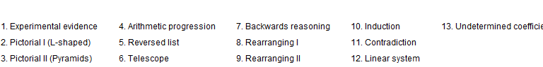
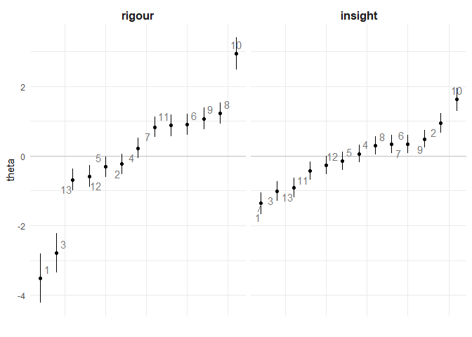
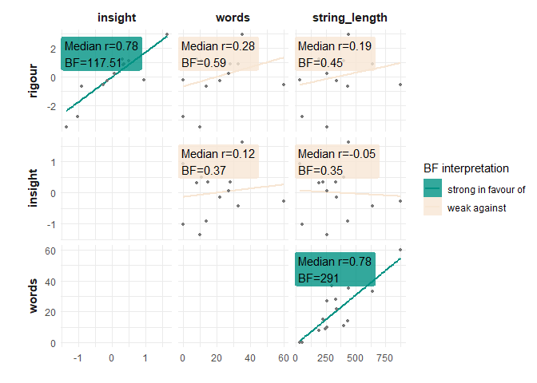
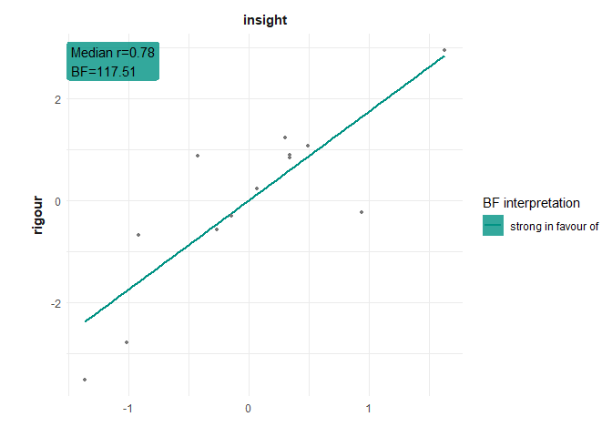
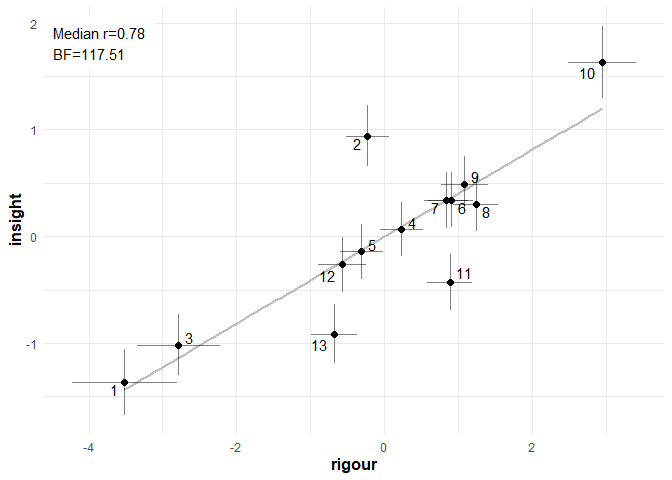
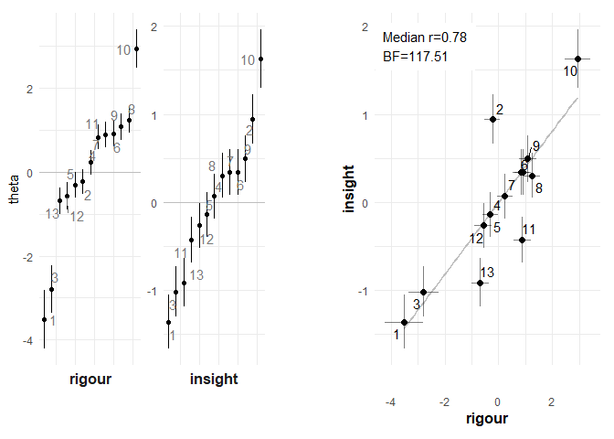
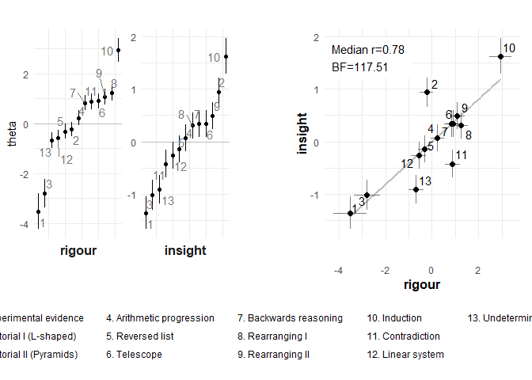

Proof CJ: Study 1 analysis
================
George Kinnear
22/03/2021

<!-- -->

# Basic plot of the two scales

The scale values with standard errors:

<!-- -->

# Bayesian stats

Do a Bayesian correlation test on each combination, and describe the
resulting posteriors.

<table class="table table-striped" style="width: auto !important; ">

<thead>

<tr>

<th style="text-align:left;">

Interpretation

</th>

<th style="text-align:right;">

BF

</th>

<th style="text-align:left;">

Dimension 1

</th>

<th style="text-align:left;">

Dimension 2

</th>

<th style="text-align:right;">

Median

</th>

<th style="text-align:left;">

95% HDI

</th>

<th style="text-align:left;">

Visualisation

</th>

</tr>

</thead>

<tbody>

<tr>

<td style="text-align:left;vertical-align: top !important;" rowspan="2">

strong in favour of

</td>

<td style="text-align:right;">

291.00

</td>

<td style="text-align:left;">

string\_length

</td>

<td style="text-align:left;">

words

</td>

<td style="text-align:right;">

0.78

</td>

<td style="text-align:left;">

\[0.49, 0.94\]

</td>

<td style="text-align:left;">

<svg xmlns="http://www.w3.org/2000/svg" xmlns:xlink="http://www.w3.org/1999/xlink" class="svglite" width="48.00pt" height="12.00pt" viewbox="0 0 48.00 12.00">

<defs>

</defs><rect width="100%" height="100%" style="stroke: none; fill: none;"></rect><defs><clippath id="cpMC4wMHw0OC4wMHwwLjAwfDEyLjAw"><rect x="0.00" y="0.00" width="48.00" height="12.00"></rect></clippath></defs><g clip-path="url(#cpMC4wMHw0OC4wMHwwLjAwfDEyLjAw)">
</g><defs><clippath id="cpMC4wMHw0OC4wMHwyLjg4fDEyLjAw"><rect x="0.00" y="2.88" width="48.00" height="9.12"></rect></clippath></defs><g clip-path="url(#cpMC4wMHw0OC4wMHwyLjg4fDEyLjAw)"><rect x="39.81" y="6.94" width="1.00" height="1.00" style="stroke-width: 0.75; stroke: none; fill: #000000;"></rect><line x1="32.13" y1="7.44" x2="44.54" y2="7.44" style="stroke-width: 0.75;"></line><polyline points="32.13,5.04 32.13,7.44 32.13,9.84 " style="stroke-width: 0.75;"></polyline><polyline points="44.54,9.84 44.54,7.44 44.54,5.04 " style="stroke-width: 0.75;"></polyline><polygon points="38.96,8.79 41.66,8.79 41.66,6.09 38.96,6.09 " style="stroke-width: 0.75; stroke: none; fill: #FF0000;"></polygon><line x1="18.50" y1="12.00" x2="18.50" y2="2.88" style="stroke-width: 0.75; stroke-dasharray: 1.00,3.00;"></line></g>

</svg>

</td>

</tr>

<tr>

<td style="text-align:right;">

117.51

</td>

<td style="text-align:left;">

insight

</td>

<td style="text-align:left;">

rigour

</td>

<td style="text-align:right;">

0.78

</td>

<td style="text-align:left;">

\[0.5, 0.94\]

</td>

<td style="text-align:left;">

<svg xmlns="http://www.w3.org/2000/svg" xmlns:xlink="http://www.w3.org/1999/xlink" class="svglite" width="48.00pt" height="12.00pt" viewbox="0 0 48.00 12.00">

<defs>

</defs><rect width="100%" height="100%" style="stroke: none; fill: none;"></rect><defs><clippath id="cpMC4wMHw0OC4wMHwwLjAwfDEyLjAw"><rect x="0.00" y="0.00" width="48.00" height="12.00"></rect></clippath></defs><g clip-path="url(#cpMC4wMHw0OC4wMHwwLjAwfDEyLjAw)">
</g><defs><clippath id="cpMC4wMHw0OC4wMHwyLjg4fDEyLjAw"><rect x="0.00" y="2.88" width="48.00" height="9.12"></rect></clippath></defs><g clip-path="url(#cpMC4wMHw0OC4wMHwyLjg4fDEyLjAw)"><rect x="39.77" y="6.94" width="1.00" height="1.00" style="stroke-width: 0.75; stroke: none; fill: #000000;"></rect><line x1="32.48" y1="7.44" x2="44.58" y2="7.44" style="stroke-width: 0.75;"></line><polyline points="32.48,5.04 32.48,7.44 32.48,9.84 " style="stroke-width: 0.75;"></polyline><polyline points="44.58,9.84 44.58,7.44 44.58,5.04 " style="stroke-width: 0.75;"></polyline><polygon points="38.92,8.79 41.62,8.79 41.62,6.09 38.92,6.09 " style="stroke-width: 0.75; stroke: none; fill: #FF0000;"></polygon><line x1="18.50" y1="12.00" x2="18.50" y2="2.88" style="stroke-width: 0.75; stroke-dasharray: 1.00,3.00;"></line></g>

</svg>

</td>

</tr>

<tr>

<td style="text-align:left;vertical-align: top !important;" rowspan="4">

weak against

</td>

<td style="text-align:right;">

0.59

</td>

<td style="text-align:left;">

words

</td>

<td style="text-align:left;">

rigour

</td>

<td style="text-align:right;">

0.28

</td>

<td style="text-align:left;">

\[-0.24, 0.68\]

</td>

<td style="text-align:left;">

<svg xmlns="http://www.w3.org/2000/svg" xmlns:xlink="http://www.w3.org/1999/xlink" class="svglite" width="48.00pt" height="12.00pt" viewbox="0 0 48.00 12.00">

<defs>

</defs><rect width="100%" height="100%" style="stroke: none; fill: none;"></rect><defs><clippath id="cpMC4wMHw0OC4wMHwwLjAwfDEyLjAw"><rect x="0.00" y="0.00" width="48.00" height="12.00"></rect></clippath></defs><g clip-path="url(#cpMC4wMHw0OC4wMHwwLjAwfDEyLjAw)">
</g><defs><clippath id="cpMC4wMHw0OC4wMHwyLjg4fDEyLjAw"><rect x="0.00" y="2.88" width="48.00" height="9.12"></rect></clippath></defs><g clip-path="url(#cpMC4wMHw0OC4wMHwyLjg4fDEyLjAw)"><rect x="25.73" y="6.94" width="1.00" height="1.00" style="stroke-width: 0.75; stroke: none; fill: #000000;"></rect><line x1="11.89" y1="7.44" x2="37.52" y2="7.44" style="stroke-width: 0.75;"></line><polyline points="11.89,5.04 11.89,7.44 11.89,9.84 " style="stroke-width: 0.75;"></polyline><polyline points="37.52,9.84 37.52,7.44 37.52,5.04 " style="stroke-width: 0.75;"></polyline><polygon points="24.88,8.79 27.58,8.79 27.58,6.09 24.88,6.09 " style="stroke-width: 0.75; stroke: none; fill: #FF0000;"></polygon><line x1="18.50" y1="12.00" x2="18.50" y2="2.88" style="stroke-width: 0.75; stroke-dasharray: 1.00,3.00;"></line></g>

</svg>

</td>

</tr>

<tr>

<td style="text-align:right;">

0.45

</td>

<td style="text-align:left;">

string\_length

</td>

<td style="text-align:left;">

rigour

</td>

<td style="text-align:right;">

0.19

</td>

<td style="text-align:left;">

\[-0.31, 0.65\]

</td>

<td style="text-align:left;">

<svg xmlns="http://www.w3.org/2000/svg" xmlns:xlink="http://www.w3.org/1999/xlink" class="svglite" width="48.00pt" height="12.00pt" viewbox="0 0 48.00 12.00">

<defs>

</defs><rect width="100%" height="100%" style="stroke: none; fill: none;"></rect><defs><clippath id="cpMC4wMHw0OC4wMHwwLjAwfDEyLjAw"><rect x="0.00" y="0.00" width="48.00" height="12.00"></rect></clippath></defs><g clip-path="url(#cpMC4wMHw0OC4wMHwwLjAwfDEyLjAw)">
</g><defs><clippath id="cpMC4wMHw0OC4wMHwyLjg4fDEyLjAw"><rect x="0.00" y="2.88" width="48.00" height="9.12"></rect></clippath></defs><g clip-path="url(#cpMC4wMHw0OC4wMHwyLjg4fDEyLjAw)"><rect x="23.35" y="6.94" width="1.00" height="1.00" style="stroke-width: 0.75; stroke: none; fill: #000000;"></rect><line x1="9.98" y1="7.44" x2="36.63" y2="7.44" style="stroke-width: 0.75;"></line><polyline points="9.98,5.04 9.98,7.44 9.98,9.84 " style="stroke-width: 0.75;"></polyline><polyline points="36.63,9.84 36.63,7.44 36.63,5.04 " style="stroke-width: 0.75;"></polyline><polygon points="22.50,8.79 25.20,8.79 25.20,6.09 22.50,6.09 " style="stroke-width: 0.75; stroke: none; fill: #FF0000;"></polygon><line x1="18.50" y1="12.00" x2="18.50" y2="2.88" style="stroke-width: 0.75; stroke-dasharray: 1.00,3.00;"></line></g>

</svg>

</td>

</tr>

<tr>

<td style="text-align:right;">

0.37

</td>

<td style="text-align:left;">

words

</td>

<td style="text-align:left;">

insight

</td>

<td style="text-align:right;">

0.12

</td>

<td style="text-align:left;">

\[-0.42, 0.58\]

</td>

<td style="text-align:left;">

<svg xmlns="http://www.w3.org/2000/svg" xmlns:xlink="http://www.w3.org/1999/xlink" class="svglite" width="48.00pt" height="12.00pt" viewbox="0 0 48.00 12.00">

<defs>

</defs><rect width="100%" height="100%" style="stroke: none; fill: none;"></rect><defs><clippath id="cpMC4wMHw0OC4wMHwwLjAwfDEyLjAw"><rect x="0.00" y="0.00" width="48.00" height="12.00"></rect></clippath></defs><g clip-path="url(#cpMC4wMHw0OC4wMHwwLjAwfDEyLjAw)">
</g><defs><clippath id="cpMC4wMHw0OC4wMHwyLjg4fDEyLjAw"><rect x="0.00" y="2.88" width="48.00" height="9.12"></rect></clippath></defs><g clip-path="url(#cpMC4wMHw0OC4wMHwyLjg4fDEyLjAw)"><rect x="21.24" y="6.94" width="1.00" height="1.00" style="stroke-width: 0.75; stroke: none; fill: #000000;"></rect><line x1="6.74" y1="7.44" x2="34.52" y2="7.44" style="stroke-width: 0.75;"></line><polyline points="6.74,5.04 6.74,7.44 6.74,9.84 " style="stroke-width: 0.75;"></polyline><polyline points="34.52,9.84 34.52,7.44 34.52,5.04 " style="stroke-width: 0.75;"></polyline><polygon points="20.39,8.79 23.09,8.79 23.09,6.09 20.39,6.09 " style="stroke-width: 0.75; stroke: none; fill: #FF0000;"></polygon><line x1="18.50" y1="12.00" x2="18.50" y2="2.88" style="stroke-width: 0.75; stroke-dasharray: 1.00,3.00;"></line></g>

</svg>

</td>

</tr>

<tr>

<td style="text-align:right;">

0.35

</td>

<td style="text-align:left;">

string\_length

</td>

<td style="text-align:left;">

insight

</td>

<td style="text-align:right;">

\-0.05

</td>

<td style="text-align:left;">

\[-0.54, 0.44\]

</td>

<td style="text-align:left;">

<svg xmlns="http://www.w3.org/2000/svg" xmlns:xlink="http://www.w3.org/1999/xlink" class="svglite" width="48.00pt" height="12.00pt" viewbox="0 0 48.00 12.00">

<defs>

</defs><rect width="100%" height="100%" style="stroke: none; fill: none;"></rect><defs><clippath id="cpMC4wMHw0OC4wMHwwLjAwfDEyLjAw"><rect x="0.00" y="0.00" width="48.00" height="12.00"></rect></clippath></defs><g clip-path="url(#cpMC4wMHw0OC4wMHwwLjAwfDEyLjAw)">
</g><defs><clippath id="cpMC4wMHw0OC4wMHwyLjg4fDEyLjAw"><rect x="0.00" y="2.88" width="48.00" height="9.12"></rect></clippath></defs><g clip-path="url(#cpMC4wMHw0OC4wMHwyLjg4fDEyLjAw)"><rect x="16.70" y="6.94" width="1.00" height="1.00" style="stroke-width: 0.75; stroke: none; fill: #000000;"></rect><line x1="3.42" y1="7.44" x2="30.65" y2="7.44" style="stroke-width: 0.75;"></line><polyline points="3.42,5.04 3.42,7.44 3.42,9.84 " style="stroke-width: 0.75;"></polyline><polyline points="30.65,9.84 30.65,7.44 30.65,5.04 " style="stroke-width: 0.75;"></polyline><polygon points="15.85,8.79 18.55,8.79 18.55,6.09 15.85,6.09 " style="stroke-width: 0.75; stroke: none; fill: #FF0000;"></polygon><line x1="18.50" y1="12.00" x2="18.50" y2="2.88" style="stroke-width: 0.75; stroke-dasharray: 1.00,3.00;"></line></g>

</svg>

</td>

</tr>

</tbody>

</table>

This shows there is no evidence of the string/word length correlating
with the scales, and that there is a reasonable correlation between the
scales.

Here is the detail on the correlation between judging scales:

<table class="table" style="width: auto !important; ">

<thead>

<tr>

<th style="text-align:left;">

Dimension 1

</th>

<th style="text-align:left;">

Dimension 2

</th>

<th style="text-align:right;">

Median

</th>

<th style="text-align:left;">

95% HDI

</th>

<th style="text-align:right;">

BF

</th>

<th style="text-align:left;">

Interpretation

</th>

</tr>

</thead>

<tbody>

<tr>

<td style="text-align:left;">

insight

</td>

<td style="text-align:left;">

rigour

</td>

<td style="text-align:right;">

0.78

</td>

<td style="text-align:left;">

\[0.5, 0.94\]

</td>

<td style="text-align:right;">

117.51

</td>

<td style="text-align:left;">

strong in favour of

</td>

</tr>

</tbody>

</table>

## Summary plots

<!-- --><!-- -->

## Detail plots

<!-- -->

<!-- --><!-- -->
