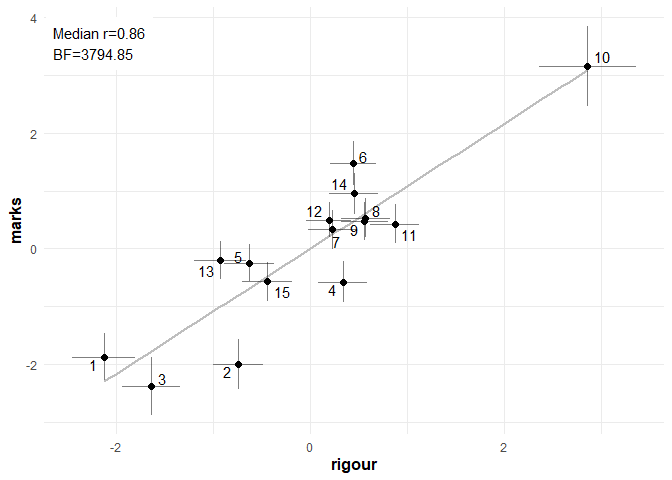

Proof CJ: Study 2 analysis
================
George Kinnear
22/03/2021

<!-- -->

# Basic plots of the scales

The scale values with standard errors:

<!-- --><!-- -->

# Bayesian stats

Do a Bayesian correlation test on each combination, and describe the
resulting posteriors.

<table class="table table-striped" style="width: auto !important; ">

<thead>

<tr>

<th style="text-align:left;">

Interpretation

</th>

<th style="text-align:right;">

BF

</th>

<th style="text-align:left;">

Dimension 1

</th>

<th style="text-align:left;">

Dimension 2

</th>

<th style="text-align:right;">

Median

</th>

<th style="text-align:left;">

95% HDI

</th>

<th style="text-align:left;">

Visualisation

</th>

</tr>

</thead>

<tbody>

<tr>

<td style="text-align:left;vertical-align: top !important;" rowspan="5">

strong in favour of

</td>

<td style="text-align:right;">

3794.85

</td>

<td style="text-align:left;">

marks

</td>

<td style="text-align:left;">

rigour

</td>

<td style="text-align:right;">

0.86

</td>

<td style="text-align:left;">

\[0.67, 0.97\]

</td>

<td style="text-align:left;">

<svg xmlns="http://www.w3.org/2000/svg" xmlns:xlink="http://www.w3.org/1999/xlink" class="svglite" width="48.00pt" height="12.00pt" viewbox="0 0 48.00 12.00">

<defs>

</defs><rect width="100%" height="100%" style="stroke: none; fill: none;"></rect><defs><clippath id="cpMC4wMHw0OC4wMHwwLjAwfDEyLjAw"><rect x="0.00" y="0.00" width="48.00" height="12.00"></rect></clippath></defs><g clip-path="url(#cpMC4wMHw0OC4wMHwwLjAwfDEyLjAw)">
</g><defs><clippath id="cpMC4wMHw0OC4wMHwyLjg4fDEyLjAw"><rect x="0.00" y="2.88" width="48.00" height="9.12"></rect></clippath></defs><g clip-path="url(#cpMC4wMHw0OC4wMHwyLjg4fDEyLjAw)"><rect x="41.51" y="6.94" width="1.00" height="1.00" style="stroke-width: 0.75; stroke: none; fill: #000000;"></rect><line x1="37.36" y1="7.44" x2="44.58" y2="7.44" style="stroke-width: 0.75;"></line><polyline points="37.36,5.04 37.36,7.44 37.36,9.84 " style="stroke-width: 0.75;"></polyline><polyline points="44.58,9.84 44.58,7.44 44.58,5.04 " style="stroke-width: 0.75;"></polyline><polygon points="40.66,8.79 43.36,8.79 43.36,6.09 40.66,6.09 " style="stroke-width: 0.75; stroke: none; fill: #FF0000;"></polygon><line x1="21.69" y1="12.00" x2="21.69" y2="2.88" style="stroke-width: 0.75; stroke-dasharray: 1.00,3.00;"></line></g>

</svg>

</td>

</tr>

<tr>

<td style="text-align:right;">

291.00

</td>

<td style="text-align:left;">

string\_length

</td>

<td style="text-align:left;">

words

</td>

<td style="text-align:right;">

0.78

</td>

<td style="text-align:left;">

\[0.54, 0.94\]

</td>

<td style="text-align:left;">

<svg xmlns="http://www.w3.org/2000/svg" xmlns:xlink="http://www.w3.org/1999/xlink" class="svglite" width="48.00pt" height="12.00pt" viewbox="0 0 48.00 12.00">

<defs>

</defs><rect width="100%" height="100%" style="stroke: none; fill: none;"></rect><defs><clippath id="cpMC4wMHw0OC4wMHwwLjAwfDEyLjAw"><rect x="0.00" y="0.00" width="48.00" height="12.00"></rect></clippath></defs><g clip-path="url(#cpMC4wMHw0OC4wMHwwLjAwfDEyLjAw)">
</g><defs><clippath id="cpMC4wMHw0OC4wMHwyLjg4fDEyLjAw"><rect x="0.00" y="2.88" width="48.00" height="9.12"></rect></clippath></defs><g clip-path="url(#cpMC4wMHw0OC4wMHwyLjg4fDEyLjAw)"><rect x="39.56" y="6.94" width="1.00" height="1.00" style="stroke-width: 0.75; stroke: none; fill: #000000;"></rect><line x1="34.43" y1="7.44" x2="43.86" y2="7.44" style="stroke-width: 0.75;"></line><polyline points="34.43,5.04 34.43,7.44 34.43,9.84 " style="stroke-width: 0.75;"></polyline><polyline points="43.86,9.84 43.86,7.44 43.86,5.04 " style="stroke-width: 0.75;"></polyline><polygon points="38.71,8.79 41.41,8.79 41.41,6.09 38.71,6.09 " style="stroke-width: 0.75; stroke: none; fill: #FF0000;"></polygon><line x1="21.69" y1="12.00" x2="21.69" y2="2.88" style="stroke-width: 0.75; stroke-dasharray: 1.00,3.00;"></line></g>

</svg>

</td>

</tr>

<tr>

<td style="text-align:right;">

118.09

</td>

<td style="text-align:left;">

understanding

</td>

<td style="text-align:left;">

simple

</td>

<td style="text-align:right;">

0.75

</td>

<td style="text-align:left;">

\[0.43, 0.93\]

</td>

<td style="text-align:left;">

<svg xmlns="http://www.w3.org/2000/svg" xmlns:xlink="http://www.w3.org/1999/xlink" class="svglite" width="48.00pt" height="12.00pt" viewbox="0 0 48.00 12.00">

<defs>

</defs><rect width="100%" height="100%" style="stroke: none; fill: none;"></rect><defs><clippath id="cpMC4wMHw0OC4wMHwwLjAwfDEyLjAw"><rect x="0.00" y="0.00" width="48.00" height="12.00"></rect></clippath></defs><g clip-path="url(#cpMC4wMHw0OC4wMHwwLjAwfDEyLjAw)">
</g><defs><clippath id="cpMC4wMHw0OC4wMHwyLjg4fDEyLjAw"><rect x="0.00" y="2.88" width="48.00" height="9.12"></rect></clippath></defs><g clip-path="url(#cpMC4wMHw0OC4wMHwyLjg4fDEyLjAw)"><rect x="38.76" y="6.94" width="1.00" height="1.00" style="stroke-width: 0.75; stroke: none; fill: #000000;"></rect><line x1="31.87" y1="7.44" x2="43.56" y2="7.44" style="stroke-width: 0.75;"></line><polyline points="31.87,5.04 31.87,7.44 31.87,9.84 " style="stroke-width: 0.75;"></polyline><polyline points="43.56,9.84 43.56,7.44 43.56,5.04 " style="stroke-width: 0.75;"></polyline><polygon points="37.91,8.79 40.61,8.79 40.61,6.09 37.91,6.09 " style="stroke-width: 0.75; stroke: none; fill: #FF0000;"></polygon><line x1="21.69" y1="12.00" x2="21.69" y2="2.88" style="stroke-width: 0.75; stroke-dasharray: 1.00,3.00;"></line></g>

</svg>

</td>

</tr>

<tr>

<td style="text-align:right;">

83.81

</td>

<td style="text-align:left;">

understanding

</td>

<td style="text-align:left;">

insight

</td>

<td style="text-align:right;">

0.72

</td>

<td style="text-align:left;">

\[0.42, 0.92\]

</td>

<td style="text-align:left;">

<svg xmlns="http://www.w3.org/2000/svg" xmlns:xlink="http://www.w3.org/1999/xlink" class="svglite" width="48.00pt" height="12.00pt" viewbox="0 0 48.00 12.00">

<defs>

</defs><rect width="100%" height="100%" style="stroke: none; fill: none;"></rect><defs><clippath id="cpMC4wMHw0OC4wMHwwLjAwfDEyLjAw"><rect x="0.00" y="0.00" width="48.00" height="12.00"></rect></clippath></defs><g clip-path="url(#cpMC4wMHw0OC4wMHwwLjAwfDEyLjAw)">
</g><defs><clippath id="cpMC4wMHw0OC4wMHwyLjg4fDEyLjAw"><rect x="0.00" y="2.88" width="48.00" height="9.12"></rect></clippath></defs><g clip-path="url(#cpMC4wMHw0OC4wMHwyLjg4fDEyLjAw)"><rect x="38.24" y="6.94" width="1.00" height="1.00" style="stroke-width: 0.75; stroke: none; fill: #000000;"></rect><line x1="31.69" y1="7.44" x2="43.38" y2="7.44" style="stroke-width: 0.75;"></line><polyline points="31.69,5.04 31.69,7.44 31.69,9.84 " style="stroke-width: 0.75;"></polyline><polyline points="43.38,9.84 43.38,7.44 43.38,5.04 " style="stroke-width: 0.75;"></polyline><polygon points="37.39,8.79 40.09,8.79 40.09,6.09 37.39,6.09 " style="stroke-width: 0.75; stroke: none; fill: #FF0000;"></polygon><line x1="21.69" y1="12.00" x2="21.69" y2="2.88" style="stroke-width: 0.75; stroke-dasharray: 1.00,3.00;"></line></g>

</svg>

</td>

</tr>

<tr>

<td style="text-align:right;">

64.15

</td>

<td style="text-align:left;">

insight

</td>

<td style="text-align:left;">

rigour

</td>

<td style="text-align:right;">

0.72

</td>

<td style="text-align:left;">

\[0.39, 0.9\]

</td>

<td style="text-align:left;">

<svg xmlns="http://www.w3.org/2000/svg" xmlns:xlink="http://www.w3.org/1999/xlink" class="svglite" width="48.00pt" height="12.00pt" viewbox="0 0 48.00 12.00">

<defs>

</defs><rect width="100%" height="100%" style="stroke: none; fill: none;"></rect><defs><clippath id="cpMC4wMHw0OC4wMHwwLjAwfDEyLjAw"><rect x="0.00" y="0.00" width="48.00" height="12.00"></rect></clippath></defs><g clip-path="url(#cpMC4wMHw0OC4wMHwwLjAwfDEyLjAw)">
</g><defs><clippath id="cpMC4wMHw0OC4wMHwyLjg4fDEyLjAw"><rect x="0.00" y="2.88" width="48.00" height="9.12"></rect></clippath></defs><g clip-path="url(#cpMC4wMHw0OC4wMHwyLjg4fDEyLjAw)"><rect x="38.08" y="6.94" width="1.00" height="1.00" style="stroke-width: 0.75; stroke: none; fill: #000000;"></rect><line x1="30.97" y1="7.44" x2="42.89" y2="7.44" style="stroke-width: 0.75;"></line><polyline points="30.97,5.04 30.97,7.44 30.97,9.84 " style="stroke-width: 0.75;"></polyline><polyline points="42.89,9.84 42.89,7.44 42.89,5.04 " style="stroke-width: 0.75;"></polyline><polygon points="37.23,8.79 39.93,8.79 39.93,6.09 37.23,6.09 " style="stroke-width: 0.75; stroke: none; fill: #FF0000;"></polygon><line x1="21.69" y1="12.00" x2="21.69" y2="2.88" style="stroke-width: 0.75; stroke-dasharray: 1.00,3.00;"></line></g>

</svg>

</td>

</tr>

<tr>

<td style="text-align:left;vertical-align: top !important;" rowspan="2">

moderate in favour of

</td>

<td style="text-align:right;">

4.38

</td>

<td style="text-align:left;">

simple

</td>

<td style="text-align:left;">

insight

</td>

<td style="text-align:right;">

0.54

</td>

<td style="text-align:left;">

\[0.1, 0.83\]

</td>

<td style="text-align:left;">

<svg xmlns="http://www.w3.org/2000/svg" xmlns:xlink="http://www.w3.org/1999/xlink" class="svglite" width="48.00pt" height="12.00pt" viewbox="0 0 48.00 12.00">

<defs>

</defs><rect width="100%" height="100%" style="stroke: none; fill: none;"></rect><defs><clippath id="cpMC4wMHw0OC4wMHwwLjAwfDEyLjAw"><rect x="0.00" y="0.00" width="48.00" height="12.00"></rect></clippath></defs><g clip-path="url(#cpMC4wMHw0OC4wMHwwLjAwfDEyLjAw)">
</g><defs><clippath id="cpMC4wMHw0OC4wMHwyLjg4fDEyLjAw"><rect x="0.00" y="2.88" width="48.00" height="9.12"></rect></clippath></defs><g clip-path="url(#cpMC4wMHw0OC4wMHwyLjg4fDEyLjAw)"><rect x="33.82" y="6.94" width="1.00" height="1.00" style="stroke-width: 0.75; stroke: none; fill: #000000;"></rect><line x1="23.98" y1="7.44" x2="41.12" y2="7.44" style="stroke-width: 0.75;"></line><polyline points="23.98,5.04 23.98,7.44 23.98,9.84 " style="stroke-width: 0.75;"></polyline><polyline points="41.12,9.84 41.12,7.44 41.12,5.04 " style="stroke-width: 0.75;"></polyline><polygon points="32.97,8.79 35.67,8.79 35.67,6.09 32.97,6.09 " style="stroke-width: 0.75; stroke: none; fill: #FF0000;"></polygon><line x1="21.69" y1="12.00" x2="21.69" y2="2.88" style="stroke-width: 0.75; stroke-dasharray: 1.00,3.00;"></line></g>

</svg>

</td>

</tr>

<tr>

<td style="text-align:right;">

4.35

</td>

<td style="text-align:left;">

marks

</td>

<td style="text-align:left;">

insight

</td>

<td style="text-align:right;">

0.53

</td>

<td style="text-align:left;">

\[0.1, 0.83\]

</td>

<td style="text-align:left;">

<svg xmlns="http://www.w3.org/2000/svg" xmlns:xlink="http://www.w3.org/1999/xlink" class="svglite" width="48.00pt" height="12.00pt" viewbox="0 0 48.00 12.00">

<defs>

</defs><rect width="100%" height="100%" style="stroke: none; fill: none;"></rect><defs><clippath id="cpMC4wMHw0OC4wMHwwLjAwfDEyLjAw"><rect x="0.00" y="0.00" width="48.00" height="12.00"></rect></clippath></defs><g clip-path="url(#cpMC4wMHw0OC4wMHwwLjAwfDEyLjAw)">
</g><defs><clippath id="cpMC4wMHw0OC4wMHwyLjg4fDEyLjAw"><rect x="0.00" y="2.88" width="48.00" height="9.12"></rect></clippath></defs><g clip-path="url(#cpMC4wMHw0OC4wMHwyLjg4fDEyLjAw)"><rect x="33.77" y="6.94" width="1.00" height="1.00" style="stroke-width: 0.75; stroke: none; fill: #000000;"></rect><line x1="24.08" y1="7.44" x2="41.34" y2="7.44" style="stroke-width: 0.75;"></line><polyline points="24.08,5.04 24.08,7.44 24.08,9.84 " style="stroke-width: 0.75;"></polyline><polyline points="41.34,9.84 41.34,7.44 41.34,5.04 " style="stroke-width: 0.75;"></polyline><polygon points="32.92,8.79 35.62,8.79 35.62,6.09 32.92,6.09 " style="stroke-width: 0.75; stroke: none; fill: #FF0000;"></polygon><line x1="21.69" y1="12.00" x2="21.69" y2="2.88" style="stroke-width: 0.75; stroke-dasharray: 1.00,3.00;"></line></g>

</svg>

</td>

</tr>

<tr>

<td style="text-align:left;vertical-align: top !important;" rowspan="6">

weak in favour of

</td>

<td style="text-align:right;">

1.77

</td>

<td style="text-align:left;">

string\_length

</td>

<td style="text-align:left;">

simple

</td>

<td style="text-align:right;">

\-0.44

</td>

<td style="text-align:left;">

\[-0.78, -0.02\]

</td>

<td style="text-align:left;">

<svg xmlns="http://www.w3.org/2000/svg" xmlns:xlink="http://www.w3.org/1999/xlink" class="svglite" width="48.00pt" height="12.00pt" viewbox="0 0 48.00 12.00">

<defs>

</defs><rect width="100%" height="100%" style="stroke: none; fill: none;"></rect><defs><clippath id="cpMC4wMHw0OC4wMHwwLjAwfDEyLjAw"><rect x="0.00" y="0.00" width="48.00" height="12.00"></rect></clippath></defs><g clip-path="url(#cpMC4wMHw0OC4wMHwwLjAwfDEyLjAw)">
</g><defs><clippath id="cpMC4wMHw0OC4wMHwyLjg4fDEyLjAw"><rect x="0.00" y="2.88" width="48.00" height="9.12"></rect></clippath></defs><g clip-path="url(#cpMC4wMHw0OC4wMHwyLjg4fDEyLjAw)"><rect x="10.71" y="6.94" width="1.00" height="1.00" style="stroke-width: 0.75; stroke: none; fill: #000000;"></rect><line x1="3.42" y1="7.44" x2="21.11" y2="7.44" style="stroke-width: 0.75;"></line><polyline points="3.42,5.04 3.42,7.44 3.42,9.84 " style="stroke-width: 0.75;"></polyline><polyline points="21.11,9.84 21.11,7.44 21.11,5.04 " style="stroke-width: 0.75;"></polyline><polygon points="9.86,8.79 12.56,8.79 12.56,6.09 9.86,6.09 " style="stroke-width: 0.75; stroke: none; fill: #FF0000;"></polygon><line x1="21.69" y1="12.00" x2="21.69" y2="2.88" style="stroke-width: 0.75; stroke-dasharray: 1.00,3.00;"></line></g>

</svg>

</td>

</tr>

<tr>

<td style="text-align:right;">

1.75

</td>

<td style="text-align:left;">

understanding

</td>

<td style="text-align:left;">

rigour

</td>

<td style="text-align:right;">

0.44

</td>

<td style="text-align:left;">

\[-0.01, 0.78\]

</td>

<td style="text-align:left;">

<svg xmlns="http://www.w3.org/2000/svg" xmlns:xlink="http://www.w3.org/1999/xlink" class="svglite" width="48.00pt" height="12.00pt" viewbox="0 0 48.00 12.00">

<defs>

</defs><rect width="100%" height="100%" style="stroke: none; fill: none;"></rect><defs><clippath id="cpMC4wMHw0OC4wMHwwLjAwfDEyLjAw"><rect x="0.00" y="0.00" width="48.00" height="12.00"></rect></clippath></defs><g clip-path="url(#cpMC4wMHw0OC4wMHwwLjAwfDEyLjAw)">
</g><defs><clippath id="cpMC4wMHw0OC4wMHwyLjg4fDEyLjAw"><rect x="0.00" y="2.88" width="48.00" height="9.12"></rect></clippath></defs><g clip-path="url(#cpMC4wMHw0OC4wMHwyLjg4fDEyLjAw)"><rect x="31.51" y="6.94" width="1.00" height="1.00" style="stroke-width: 0.75; stroke: none; fill: #000000;"></rect><line x1="21.44" y1="7.44" x2="39.95" y2="7.44" style="stroke-width: 0.75;"></line><polyline points="21.44,5.04 21.44,7.44 21.44,9.84 " style="stroke-width: 0.75;"></polyline><polyline points="39.95,9.84 39.95,7.44 39.95,5.04 " style="stroke-width: 0.75;"></polyline><polygon points="30.66,8.79 33.36,8.79 33.36,6.09 30.66,6.09 " style="stroke-width: 0.75; stroke: none; fill: #FF0000;"></polygon><line x1="21.69" y1="12.00" x2="21.69" y2="2.88" style="stroke-width: 0.75; stroke-dasharray: 1.00,3.00;"></line></g>

</svg>

</td>

</tr>

<tr>

<td style="text-align:right;">

1.48

</td>

<td style="text-align:left;">

string\_length

</td>

<td style="text-align:left;">

marks

</td>

<td style="text-align:right;">

0.41

</td>

<td style="text-align:left;">

\[0, 0.78\]

</td>

<td style="text-align:left;">

<svg xmlns="http://www.w3.org/2000/svg" xmlns:xlink="http://www.w3.org/1999/xlink" class="svglite" width="48.00pt" height="12.00pt" viewbox="0 0 48.00 12.00">

<defs>

</defs><rect width="100%" height="100%" style="stroke: none; fill: none;"></rect><defs><clippath id="cpMC4wMHw0OC4wMHwwLjAwfDEyLjAw"><rect x="0.00" y="0.00" width="48.00" height="12.00"></rect></clippath></defs><g clip-path="url(#cpMC4wMHw0OC4wMHwwLjAwfDEyLjAw)">
</g><defs><clippath id="cpMC4wMHw0OC4wMHwyLjg4fDEyLjAw"><rect x="0.00" y="2.88" width="48.00" height="9.12"></rect></clippath></defs><g clip-path="url(#cpMC4wMHw0OC4wMHwyLjg4fDEyLjAw)"><rect x="30.79" y="6.94" width="1.00" height="1.00" style="stroke-width: 0.75; stroke: none; fill: #000000;"></rect><line x1="21.60" y1="7.44" x2="39.96" y2="7.44" style="stroke-width: 0.75;"></line><polyline points="21.60,5.04 21.60,7.44 21.60,9.84 " style="stroke-width: 0.75;"></polyline><polyline points="39.96,9.84 39.96,7.44 39.96,5.04 " style="stroke-width: 0.75;"></polyline><polygon points="29.94,8.79 32.64,8.79 32.64,6.09 29.94,6.09 " style="stroke-width: 0.75; stroke: none; fill: #FF0000;"></polygon><line x1="21.69" y1="12.00" x2="21.69" y2="2.88" style="stroke-width: 0.75; stroke-dasharray: 1.00,3.00;"></line></g>

</svg>

</td>

</tr>

<tr>

<td style="text-align:right;">

1.45

</td>

<td style="text-align:left;">

words

</td>

<td style="text-align:left;">

marks

</td>

<td style="text-align:right;">

0.43

</td>

<td style="text-align:left;">

\[-0.01, 0.79\]

</td>

<td style="text-align:left;">

<svg xmlns="http://www.w3.org/2000/svg" xmlns:xlink="http://www.w3.org/1999/xlink" class="svglite" width="48.00pt" height="12.00pt" viewbox="0 0 48.00 12.00">

<defs>

</defs><rect width="100%" height="100%" style="stroke: none; fill: none;"></rect><defs><clippath id="cpMC4wMHw0OC4wMHwwLjAwfDEyLjAw"><rect x="0.00" y="0.00" width="48.00" height="12.00"></rect></clippath></defs><g clip-path="url(#cpMC4wMHw0OC4wMHwwLjAwfDEyLjAw)">
</g><defs><clippath id="cpMC4wMHw0OC4wMHwyLjg4fDEyLjAw"><rect x="0.00" y="2.88" width="48.00" height="9.12"></rect></clippath></defs><g clip-path="url(#cpMC4wMHw0OC4wMHwyLjg4fDEyLjAw)"><rect x="31.22" y="6.94" width="1.00" height="1.00" style="stroke-width: 0.75; stroke: none; fill: #000000;"></rect><line x1="21.55" y1="7.44" x2="40.23" y2="7.44" style="stroke-width: 0.75;"></line><polyline points="21.55,5.04 21.55,7.44 21.55,9.84 " style="stroke-width: 0.75;"></polyline><polyline points="40.23,9.84 40.23,7.44 40.23,5.04 " style="stroke-width: 0.75;"></polyline><polygon points="30.37,8.79 33.07,8.79 33.07,6.09 30.37,6.09 " style="stroke-width: 0.75; stroke: none; fill: #FF0000;"></polygon><line x1="21.69" y1="12.00" x2="21.69" y2="2.88" style="stroke-width: 0.75; stroke-dasharray: 1.00,3.00;"></line></g>

</svg>

</td>

</tr>

<tr>

<td style="text-align:right;">

1.36

</td>

<td style="text-align:left;">

marks

</td>

<td style="text-align:left;">

understanding

</td>

<td style="text-align:right;">

0.43

</td>

<td style="text-align:left;">

\[-0.04, 0.76\]

</td>

<td style="text-align:left;">

<svg xmlns="http://www.w3.org/2000/svg" xmlns:xlink="http://www.w3.org/1999/xlink" class="svglite" width="48.00pt" height="12.00pt" viewbox="0 0 48.00 12.00">

<defs>

</defs><rect width="100%" height="100%" style="stroke: none; fill: none;"></rect><defs><clippath id="cpMC4wMHw0OC4wMHwwLjAwfDEyLjAw"><rect x="0.00" y="0.00" width="48.00" height="12.00"></rect></clippath></defs><g clip-path="url(#cpMC4wMHw0OC4wMHwwLjAwfDEyLjAw)">
</g><defs><clippath id="cpMC4wMHw0OC4wMHwyLjg4fDEyLjAw"><rect x="0.00" y="2.88" width="48.00" height="9.12"></rect></clippath></defs><g clip-path="url(#cpMC4wMHw0OC4wMHwyLjg4fDEyLjAw)"><rect x="31.27" y="6.94" width="1.00" height="1.00" style="stroke-width: 0.75; stroke: none; fill: #000000;"></rect><line x1="20.75" y1="7.44" x2="39.58" y2="7.44" style="stroke-width: 0.75;"></line><polyline points="20.75,5.04 20.75,7.44 20.75,9.84 " style="stroke-width: 0.75;"></polyline><polyline points="39.58,9.84 39.58,7.44 39.58,5.04 " style="stroke-width: 0.75;"></polyline><polygon points="30.42,8.79 33.12,8.79 33.12,6.09 30.42,6.09 " style="stroke-width: 0.75; stroke: none; fill: #FF0000;"></polygon><line x1="21.69" y1="12.00" x2="21.69" y2="2.88" style="stroke-width: 0.75; stroke-dasharray: 1.00,3.00;"></line></g>

</svg>

</td>

</tr>

<tr>

<td style="text-align:right;">

1.04

</td>

<td style="text-align:left;">

words

</td>

<td style="text-align:left;">

rigour

</td>

<td style="text-align:right;">

0.37

</td>

<td style="text-align:left;">

\[-0.13, 0.71\]

</td>

<td style="text-align:left;">

<svg xmlns="http://www.w3.org/2000/svg" xmlns:xlink="http://www.w3.org/1999/xlink" class="svglite" width="48.00pt" height="12.00pt" viewbox="0 0 48.00 12.00">

<defs>

</defs><rect width="100%" height="100%" style="stroke: none; fill: none;"></rect><defs><clippath id="cpMC4wMHw0OC4wMHwwLjAwfDEyLjAw"><rect x="0.00" y="0.00" width="48.00" height="12.00"></rect></clippath></defs><g clip-path="url(#cpMC4wMHw0OC4wMHwwLjAwfDEyLjAw)">
</g><defs><clippath id="cpMC4wMHw0OC4wMHwyLjg4fDEyLjAw"><rect x="0.00" y="2.88" width="48.00" height="9.12"></rect></clippath></defs><g clip-path="url(#cpMC4wMHw0OC4wMHwyLjg4fDEyLjAw)"><rect x="29.93" y="6.94" width="1.00" height="1.00" style="stroke-width: 0.75; stroke: none; fill: #000000;"></rect><line x1="18.63" y1="7.44" x2="38.49" y2="7.44" style="stroke-width: 0.75;"></line><polyline points="18.63,5.04 18.63,7.44 18.63,9.84 " style="stroke-width: 0.75;"></polyline><polyline points="38.49,9.84 38.49,7.44 38.49,5.04 " style="stroke-width: 0.75;"></polyline><polygon points="29.08,8.79 31.78,8.79 31.78,6.09 29.08,6.09 " style="stroke-width: 0.75; stroke: none; fill: #FF0000;"></polygon><line x1="21.69" y1="12.00" x2="21.69" y2="2.88" style="stroke-width: 0.75; stroke-dasharray: 1.00,3.00;"></line></g>

</svg>

</td>

</tr>

<tr>

<td style="text-align:left;vertical-align: top !important;" rowspan="6">

weak against

</td>

<td style="text-align:right;">

0.76

</td>

<td style="text-align:left;">

string\_length

</td>

<td style="text-align:left;">

rigour

</td>

<td style="text-align:right;">

0.32

</td>

<td style="text-align:left;">

\[-0.1, 0.75\]

</td>

<td style="text-align:left;">

<svg xmlns="http://www.w3.org/2000/svg" xmlns:xlink="http://www.w3.org/1999/xlink" class="svglite" width="48.00pt" height="12.00pt" viewbox="0 0 48.00 12.00">

<defs>

</defs><rect width="100%" height="100%" style="stroke: none; fill: none;"></rect><defs><clippath id="cpMC4wMHw0OC4wMHwwLjAwfDEyLjAw"><rect x="0.00" y="0.00" width="48.00" height="12.00"></rect></clippath></defs><g clip-path="url(#cpMC4wMHw0OC4wMHwwLjAwfDEyLjAw)">
</g><defs><clippath id="cpMC4wMHw0OC4wMHwyLjg4fDEyLjAw"><rect x="0.00" y="2.88" width="48.00" height="9.12"></rect></clippath></defs><g clip-path="url(#cpMC4wMHw0OC4wMHwyLjg4fDEyLjAw)"><rect x="28.69" y="6.94" width="1.00" height="1.00" style="stroke-width: 0.75; stroke: none; fill: #000000;"></rect><line x1="19.29" y1="7.44" x2="39.25" y2="7.44" style="stroke-width: 0.75;"></line><polyline points="19.29,5.04 19.29,7.44 19.29,9.84 " style="stroke-width: 0.75;"></polyline><polyline points="39.25,9.84 39.25,7.44 39.25,5.04 " style="stroke-width: 0.75;"></polyline><polygon points="27.84,8.79 30.54,8.79 30.54,6.09 27.84,6.09 " style="stroke-width: 0.75; stroke: none; fill: #FF0000;"></polygon><line x1="21.69" y1="12.00" x2="21.69" y2="2.88" style="stroke-width: 0.75; stroke-dasharray: 1.00,3.00;"></line></g>

</svg>

</td>

</tr>

<tr>

<td style="text-align:right;">

0.62

</td>

<td style="text-align:left;">

words

</td>

<td style="text-align:left;">

simple

</td>

<td style="text-align:right;">

\-0.29

</td>

<td style="text-align:left;">

\[-0.7, 0.17\]

</td>

<td style="text-align:left;">

<svg xmlns="http://www.w3.org/2000/svg" xmlns:xlink="http://www.w3.org/1999/xlink" class="svglite" width="48.00pt" height="12.00pt" viewbox="0 0 48.00 12.00">

<defs>

</defs><rect width="100%" height="100%" style="stroke: none; fill: none;"></rect><defs><clippath id="cpMC4wMHw0OC4wMHwwLjAwfDEyLjAw"><rect x="0.00" y="0.00" width="48.00" height="12.00"></rect></clippath></defs><g clip-path="url(#cpMC4wMHw0OC4wMHwwLjAwfDEyLjAw)">
</g><defs><clippath id="cpMC4wMHw0OC4wMHwyLjg4fDEyLjAw"><rect x="0.00" y="2.88" width="48.00" height="9.12"></rect></clippath></defs><g clip-path="url(#cpMC4wMHw0OC4wMHwyLjg4fDEyLjAw)"><rect x="14.34" y="6.94" width="1.00" height="1.00" style="stroke-width: 0.75; stroke: none; fill: #000000;"></rect><line x1="5.23" y1="7.44" x2="25.61" y2="7.44" style="stroke-width: 0.75;"></line><polyline points="5.23,5.04 5.23,7.44 5.23,9.84 " style="stroke-width: 0.75;"></polyline><polyline points="25.61,9.84 25.61,7.44 25.61,5.04 " style="stroke-width: 0.75;"></polyline><polygon points="13.49,8.79 16.19,8.79 16.19,6.09 13.49,6.09 " style="stroke-width: 0.75; stroke: none; fill: #FF0000;"></polygon><line x1="21.69" y1="12.00" x2="21.69" y2="2.88" style="stroke-width: 0.75; stroke-dasharray: 1.00,3.00;"></line></g>

</svg>

</td>

</tr>

<tr>

<td style="text-align:right;">

0.44

</td>

<td style="text-align:left;">

words

</td>

<td style="text-align:left;">

insight

</td>

<td style="text-align:right;">

0.19

</td>

<td style="text-align:left;">

\[-0.29, 0.62\]

</td>

<td style="text-align:left;">

<svg xmlns="http://www.w3.org/2000/svg" xmlns:xlink="http://www.w3.org/1999/xlink" class="svglite" width="48.00pt" height="12.00pt" viewbox="0 0 48.00 12.00">

<defs>

</defs><rect width="100%" height="100%" style="stroke: none; fill: none;"></rect><defs><clippath id="cpMC4wMHw0OC4wMHwwLjAwfDEyLjAw"><rect x="0.00" y="0.00" width="48.00" height="12.00"></rect></clippath></defs><g clip-path="url(#cpMC4wMHw0OC4wMHwwLjAwfDEyLjAw)">
</g><defs><clippath id="cpMC4wMHw0OC4wMHwyLjg4fDEyLjAw"><rect x="0.00" y="2.88" width="48.00" height="9.12"></rect></clippath></defs><g clip-path="url(#cpMC4wMHw0OC4wMHwyLjg4fDEyLjAw)"><rect x="25.69" y="6.94" width="1.00" height="1.00" style="stroke-width: 0.75; stroke: none; fill: #000000;"></rect><line x1="14.83" y1="7.44" x2="36.32" y2="7.44" style="stroke-width: 0.75;"></line><polyline points="14.83,5.04 14.83,7.44 14.83,9.84 " style="stroke-width: 0.75;"></polyline><polyline points="36.32,9.84 36.32,7.44 36.32,5.04 " style="stroke-width: 0.75;"></polyline><polygon points="24.84,8.79 27.54,8.79 27.54,6.09 24.84,6.09 " style="stroke-width: 0.75; stroke: none; fill: #FF0000;"></polygon><line x1="21.69" y1="12.00" x2="21.69" y2="2.88" style="stroke-width: 0.75; stroke-dasharray: 1.00,3.00;"></line></g>

</svg>

</td>

</tr>

<tr>

<td style="text-align:right;">

0.40

</td>

<td style="text-align:left;">

string\_length

</td>

<td style="text-align:left;">

understanding

</td>

<td style="text-align:right;">

\-0.17

</td>

<td style="text-align:left;">

\[-0.6, 0.31\]

</td>

<td style="text-align:left;">

<svg xmlns="http://www.w3.org/2000/svg" xmlns:xlink="http://www.w3.org/1999/xlink" class="svglite" width="48.00pt" height="12.00pt" viewbox="0 0 48.00 12.00">

<defs>

</defs><rect width="100%" height="100%" style="stroke: none; fill: none;"></rect><defs><clippath id="cpMC4wMHw0OC4wMHwwLjAwfDEyLjAw"><rect x="0.00" y="0.00" width="48.00" height="12.00"></rect></clippath></defs><g clip-path="url(#cpMC4wMHw0OC4wMHwwLjAwfDEyLjAw)">
</g><defs><clippath id="cpMC4wMHw0OC4wMHwyLjg4fDEyLjAw"><rect x="0.00" y="2.88" width="48.00" height="9.12"></rect></clippath></defs><g clip-path="url(#cpMC4wMHw0OC4wMHwyLjg4fDEyLjAw)"><rect x="17.24" y="6.94" width="1.00" height="1.00" style="stroke-width: 0.75; stroke: none; fill: #000000;"></rect><line x1="7.63" y1="7.44" x2="28.91" y2="7.44" style="stroke-width: 0.75;"></line><polyline points="7.63,5.04 7.63,7.44 7.63,9.84 " style="stroke-width: 0.75;"></polyline><polyline points="28.91,9.84 28.91,7.44 28.91,5.04 " style="stroke-width: 0.75;"></polyline><polygon points="16.39,8.79 19.09,8.79 19.09,6.09 16.39,6.09 " style="stroke-width: 0.75; stroke: none; fill: #FF0000;"></polygon><line x1="21.69" y1="12.00" x2="21.69" y2="2.88" style="stroke-width: 0.75; stroke-dasharray: 1.00,3.00;"></line></g>

</svg>

</td>

</tr>

<tr>

<td style="text-align:right;">

0.40

</td>

<td style="text-align:left;">

simple

</td>

<td style="text-align:left;">

rigour

</td>

<td style="text-align:right;">

0.17

</td>

<td style="text-align:left;">

\[-0.33, 0.58\]

</td>

<td style="text-align:left;">

<svg xmlns="http://www.w3.org/2000/svg" xmlns:xlink="http://www.w3.org/1999/xlink" class="svglite" width="48.00pt" height="12.00pt" viewbox="0 0 48.00 12.00">

<defs>

</defs><rect width="100%" height="100%" style="stroke: none; fill: none;"></rect><defs><clippath id="cpMC4wMHw0OC4wMHwwLjAwfDEyLjAw"><rect x="0.00" y="0.00" width="48.00" height="12.00"></rect></clippath></defs><g clip-path="url(#cpMC4wMHw0OC4wMHwwLjAwfDEyLjAw)">
</g><defs><clippath id="cpMC4wMHw0OC4wMHwyLjg4fDEyLjAw"><rect x="0.00" y="2.88" width="48.00" height="9.12"></rect></clippath></defs><g clip-path="url(#cpMC4wMHw0OC4wMHwyLjg4fDEyLjAw)"><rect x="25.18" y="6.94" width="1.00" height="1.00" style="stroke-width: 0.75; stroke: none; fill: #000000;"></rect><line x1="13.91" y1="7.44" x2="35.34" y2="7.44" style="stroke-width: 0.75;"></line><polyline points="13.91,5.04 13.91,7.44 13.91,9.84 " style="stroke-width: 0.75;"></polyline><polyline points="35.34,9.84 35.34,7.44 35.34,5.04 " style="stroke-width: 0.75;"></polyline><polygon points="24.33,8.79 27.03,8.79 27.03,6.09 24.33,6.09 " style="stroke-width: 0.75; stroke: none; fill: #FF0000;"></polygon><line x1="21.69" y1="12.00" x2="21.69" y2="2.88" style="stroke-width: 0.75; stroke-dasharray: 1.00,3.00;"></line></g>

</svg>

</td>

</tr>

<tr>

<td style="text-align:right;">

0.35

</td>

<td style="text-align:left;">

string\_length

</td>

<td style="text-align:left;">

insight

</td>

<td style="text-align:right;">

0.10

</td>

<td style="text-align:left;">

\[-0.39, 0.54\]

</td>

<td style="text-align:left;">

<svg xmlns="http://www.w3.org/2000/svg" xmlns:xlink="http://www.w3.org/1999/xlink" class="svglite" width="48.00pt" height="12.00pt" viewbox="0 0 48.00 12.00">

<defs>

</defs><rect width="100%" height="100%" style="stroke: none; fill: none;"></rect><defs><clippath id="cpMC4wMHw0OC4wMHwwLjAwfDEyLjAw"><rect x="0.00" y="0.00" width="48.00" height="12.00"></rect></clippath></defs><g clip-path="url(#cpMC4wMHw0OC4wMHwwLjAwfDEyLjAw)">
</g><defs><clippath id="cpMC4wMHw0OC4wMHwyLjg4fDEyLjAw"><rect x="0.00" y="2.88" width="48.00" height="9.12"></rect></clippath></defs><g clip-path="url(#cpMC4wMHw0OC4wMHwyLjg4fDEyLjAw)"><rect x="23.51" y="6.94" width="1.00" height="1.00" style="stroke-width: 0.75; stroke: none; fill: #000000;"></rect><line x1="12.47" y1="7.44" x2="34.50" y2="7.44" style="stroke-width: 0.75;"></line><polyline points="12.47,5.04 12.47,7.44 12.47,9.84 " style="stroke-width: 0.75;"></polyline><polyline points="34.50,9.84 34.50,7.44 34.50,5.04 " style="stroke-width: 0.75;"></polyline><polygon points="22.66,8.79 25.36,8.79 25.36,6.09 22.66,6.09 " style="stroke-width: 0.75; stroke: none; fill: #FF0000;"></polygon><line x1="21.69" y1="12.00" x2="21.69" y2="2.88" style="stroke-width: 0.75; stroke-dasharray: 1.00,3.00;"></line></g>

</svg>

</td>

</tr>

<tr>

<td style="text-align:left;vertical-align: top !important;" rowspan="2">

moderate against

</td>

<td style="text-align:right;">

0.33

</td>

<td style="text-align:left;">

marks

</td>

<td style="text-align:left;">

simple

</td>

<td style="text-align:right;">

0.07

</td>

<td style="text-align:left;">

\[-0.41, 0.52\]

</td>

<td style="text-align:left;">

<svg xmlns="http://www.w3.org/2000/svg" xmlns:xlink="http://www.w3.org/1999/xlink" class="svglite" width="48.00pt" height="12.00pt" viewbox="0 0 48.00 12.00">

<defs>

</defs><rect width="100%" height="100%" style="stroke: none; fill: none;"></rect><defs><clippath id="cpMC4wMHw0OC4wMHwwLjAwfDEyLjAw"><rect x="0.00" y="0.00" width="48.00" height="12.00"></rect></clippath></defs><g clip-path="url(#cpMC4wMHw0OC4wMHwwLjAwfDEyLjAw)">
</g><defs><clippath id="cpMC4wMHw0OC4wMHwyLjg4fDEyLjAw"><rect x="0.00" y="2.88" width="48.00" height="9.12"></rect></clippath></defs><g clip-path="url(#cpMC4wMHw0OC4wMHwyLjg4fDEyLjAw)"><rect x="22.76" y="6.94" width="1.00" height="1.00" style="stroke-width: 0.75; stroke: none; fill: #000000;"></rect><line x1="12.14" y1="7.44" x2="33.93" y2="7.44" style="stroke-width: 0.75;"></line><polyline points="12.14,5.04 12.14,7.44 12.14,9.84 " style="stroke-width: 0.75;"></polyline><polyline points="33.93,9.84 33.93,7.44 33.93,5.04 " style="stroke-width: 0.75;"></polyline><polygon points="21.91,8.79 24.61,8.79 24.61,6.09 21.91,6.09 " style="stroke-width: 0.75; stroke: none; fill: #FF0000;"></polygon><line x1="21.69" y1="12.00" x2="21.69" y2="2.88" style="stroke-width: 0.75; stroke-dasharray: 1.00,3.00;"></line></g>

</svg>

</td>

</tr>

<tr>

<td style="text-align:right;">

0.33

</td>

<td style="text-align:left;">

words

</td>

<td style="text-align:left;">

understanding

</td>

<td style="text-align:right;">

\-0.06

</td>

<td style="text-align:left;">

\[-0.5, 0.41\]

</td>

<td style="text-align:left;">

<svg xmlns="http://www.w3.org/2000/svg" xmlns:xlink="http://www.w3.org/1999/xlink" class="svglite" width="48.00pt" height="12.00pt" viewbox="0 0 48.00 12.00">

<defs>

</defs><rect width="100%" height="100%" style="stroke: none; fill: none;"></rect><defs><clippath id="cpMC4wMHw0OC4wMHwwLjAwfDEyLjAw"><rect x="0.00" y="0.00" width="48.00" height="12.00"></rect></clippath></defs><g clip-path="url(#cpMC4wMHw0OC4wMHwwLjAwfDEyLjAw)">
</g><defs><clippath id="cpMC4wMHw0OC4wMHwyLjg4fDEyLjAw"><rect x="0.00" y="2.88" width="48.00" height="9.12"></rect></clippath></defs><g clip-path="url(#cpMC4wMHw0OC4wMHwyLjg4fDEyLjAw)"><rect x="19.74" y="6.94" width="1.00" height="1.00" style="stroke-width: 0.75; stroke: none; fill: #000000;"></rect><line x1="9.92" y1="7.44" x2="31.23" y2="7.44" style="stroke-width: 0.75;"></line><polyline points="9.92,5.04 9.92,7.44 9.92,9.84 " style="stroke-width: 0.75;"></polyline><polyline points="31.23,9.84 31.23,7.44 31.23,5.04 " style="stroke-width: 0.75;"></polyline><polygon points="18.89,8.79 21.59,8.79 21.59,6.09 18.89,6.09 " style="stroke-width: 0.75; stroke: none; fill: #FF0000;"></polygon><line x1="21.69" y1="12.00" x2="21.69" y2="2.88" style="stroke-width: 0.75; stroke-dasharray: 1.00,3.00;"></line></g>

</svg>

</td>

</tr>

</tbody>

</table>

This shows there is no evidence of the string/word length correlating
with the scales, and that there is a reasonable correlation between the
scales.

Here is the detail on the correlation between judging scales:

<table class="table" style="width: auto !important; ">

<thead>

<tr>

<th style="text-align:left;">

Dimension 1

</th>

<th style="text-align:left;">

Dimension 2

</th>

<th style="text-align:right;">

Median

</th>

<th style="text-align:left;">

95% HDI

</th>

<th style="text-align:right;">

BF

</th>

<th style="text-align:left;">

Interpretation

</th>

</tr>

</thead>

<tbody>

<tr>

<td style="text-align:left;">

marks

</td>

<td style="text-align:left;">

rigour

</td>

<td style="text-align:right;">

0.86

</td>

<td style="text-align:left;">

\[0.67, 0.97\]

</td>

<td style="text-align:right;">

3794.85

</td>

<td style="text-align:left;">

strong in favour of

</td>

</tr>

<tr>

<td style="text-align:left;">

understanding

</td>

<td style="text-align:left;">

simple

</td>

<td style="text-align:right;">

0.75

</td>

<td style="text-align:left;">

\[0.43, 0.93\]

</td>

<td style="text-align:right;">

118.09

</td>

<td style="text-align:left;">

</td>

</tr>

<tr>

<td style="text-align:left;">

understanding

</td>

<td style="text-align:left;">

insight

</td>

<td style="text-align:right;">

0.72

</td>

<td style="text-align:left;">

\[0.42, 0.92\]

</td>

<td style="text-align:right;">

83.81

</td>

<td style="text-align:left;">

</td>

</tr>

<tr>

<td style="text-align:left;">

insight

</td>

<td style="text-align:left;">

rigour

</td>

<td style="text-align:right;">

0.72

</td>

<td style="text-align:left;">

\[0.39, 0.9\]

</td>

<td style="text-align:right;">

64.15

</td>

<td style="text-align:left;">

</td>

</tr>

<tr>

<td style="text-align:left;">

simple

</td>

<td style="text-align:left;">

insight

</td>

<td style="text-align:right;">

0.54

</td>

<td style="text-align:left;">

\[0.1, 0.83\]

</td>

<td style="text-align:right;">

4.38

</td>

<td style="text-align:left;">

moderate in favour of

</td>

</tr>

<tr>

<td style="text-align:left;">

marks

</td>

<td style="text-align:left;">

insight

</td>

<td style="text-align:right;">

0.53

</td>

<td style="text-align:left;">

\[0.1, 0.83\]

</td>

<td style="text-align:right;">

4.35

</td>

<td style="text-align:left;">

</td>

</tr>

<tr>

<td style="text-align:left;">

understanding

</td>

<td style="text-align:left;">

rigour

</td>

<td style="text-align:right;">

0.44

</td>

<td style="text-align:left;">

\[-0.01, 0.78\]

</td>

<td style="text-align:right;">

1.75

</td>

<td style="text-align:left;">

weak in favour of

</td>

</tr>

<tr>

<td style="text-align:left;">

marks

</td>

<td style="text-align:left;">

understanding

</td>

<td style="text-align:right;">

0.43

</td>

<td style="text-align:left;">

\[-0.04, 0.76\]

</td>

<td style="text-align:right;">

1.36

</td>

<td style="text-align:left;">

</td>

</tr>

<tr>

<td style="text-align:left;">

simple

</td>

<td style="text-align:left;">

rigour

</td>

<td style="text-align:right;">

0.17

</td>

<td style="text-align:left;">

\[-0.33, 0.58\]

</td>

<td style="text-align:right;">

0.40

</td>

<td style="text-align:left;">

weak against

</td>

</tr>

<tr>

<td style="text-align:left;">

marks

</td>

<td style="text-align:left;">

simple

</td>

<td style="text-align:right;">

0.07

</td>

<td style="text-align:left;">

\[-0.41, 0.52\]

</td>

<td style="text-align:right;">

0.33

</td>

<td style="text-align:left;">

moderate against

</td>

</tr>

</tbody>

</table>

## Correlation summary plot

    ## Warning: package 'corrplot' was built under R version 3.6.3

    ## corrplot 0.84 loaded

    ## png 
    ##   2

<!-- -->

## Summary plots

<!-- -->

<!-- -->

## Detail plots

<!-- -->

<!-- -->

<!-- -->

<!-- -->

<!-- --><!-- --><!-- -->

    ## Warning: ggrepel: 1 unlabeled data points (too many overlaps). Consider
    ## increasing max.overlaps

<!-- -->

    ## Warning: ggrepel: 1 unlabeled data points (too many overlaps). Consider
    ## increasing max.overlaps

<!-- -->

<!-- -->
