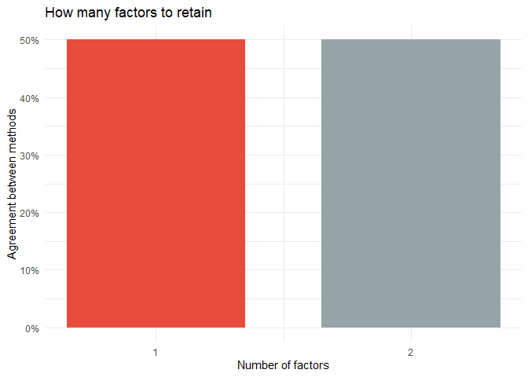
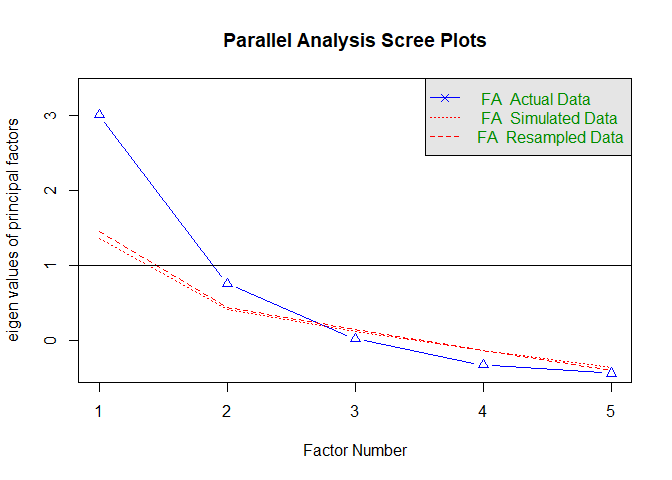
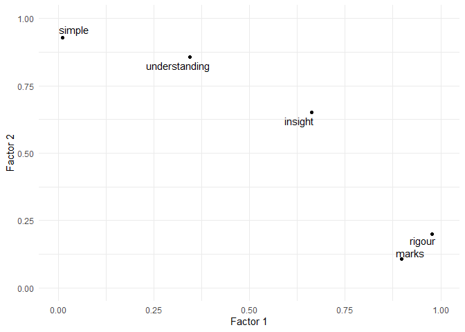
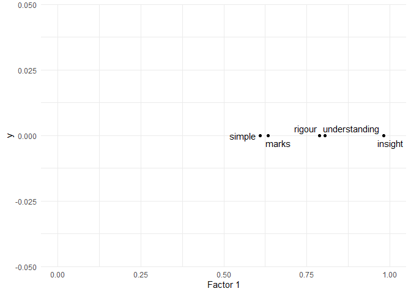
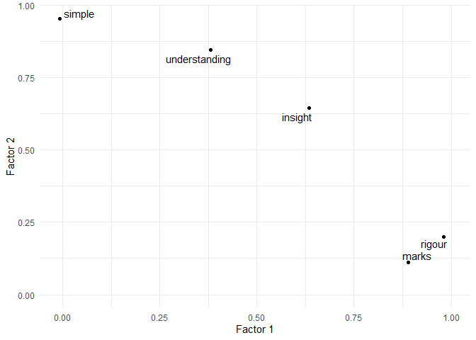
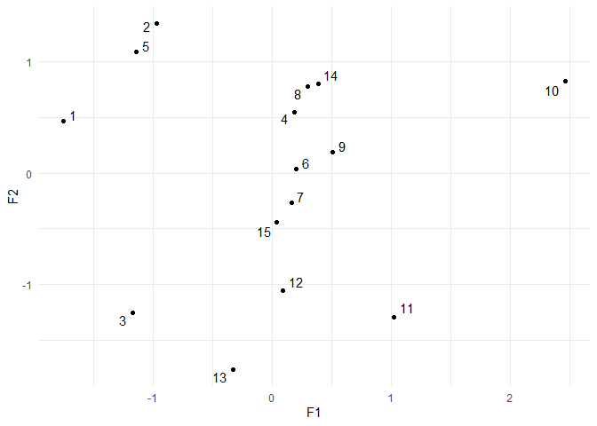
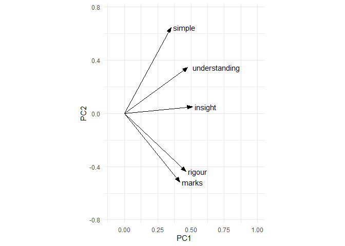
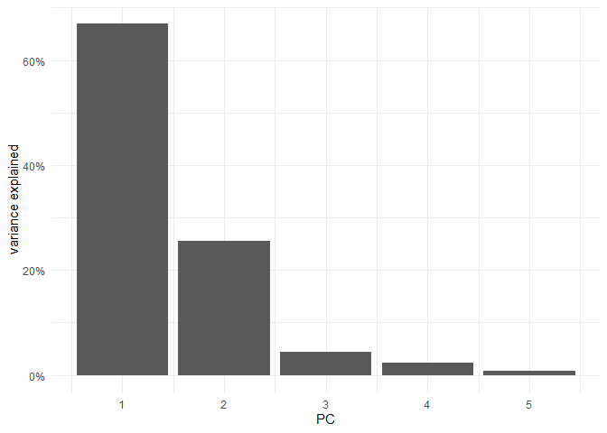
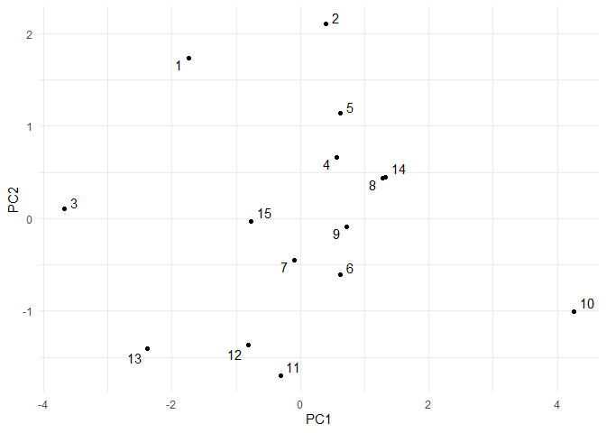

Proof CJ: Study 2 factor analysis
================
George Kinnear
25/03/2021

# Data

<table class="table table-striped" style="width: auto !important; margin-left: auto; margin-right: auto;">

<thead>

<tr>

<th style="text-align:right;">

proof

</th>

<th style="text-align:right;">

rigour

</th>

<th style="text-align:right;">

insight

</th>

<th style="text-align:right;">

simple

</th>

<th style="text-align:right;">

understanding

</th>

<th style="text-align:right;">

marks

</th>

</tr>

</thead>

<tbody>

<tr>

<td style="text-align:right;">

1

</td>

<td style="text-align:right;">

\-2.1250587

</td>

<td style="text-align:right;">

\-0.6274979

</td>

<td style="text-align:right;">

0.3511673

</td>

<td style="text-align:right;">

0.1567762

</td>

<td style="text-align:right;">

\-1.8691604

</td>

</tr>

<tr>

<td style="text-align:right;">

2

</td>

<td style="text-align:right;">

\-0.7412944

</td>

<td style="text-align:right;">

0.5274856

</td>

<td style="text-align:right;">

1.1715721

</td>

<td style="text-align:right;">

0.4485130

</td>

<td style="text-align:right;">

\-1.9992828

</td>

</tr>

<tr>

<td style="text-align:right;">

3

</td>

<td style="text-align:right;">

\-1.6352246

</td>

<td style="text-align:right;">

\-1.0688976

</td>

<td style="text-align:right;">

\-0.8004039

</td>

<td style="text-align:right;">

\-1.2839018

</td>

<td style="text-align:right;">

\-2.3741107

</td>

</tr>

<tr>

<td style="text-align:right;">

4

</td>

<td style="text-align:right;">

0.3377309

</td>

<td style="text-align:right;">

0.2626889

</td>

<td style="text-align:right;">

0.7351321

</td>

<td style="text-align:right;">

0.0975678

</td>

<td style="text-align:right;">

\-0.5753061

</td>

</tr>

<tr>

<td style="text-align:right;">

5

</td>

<td style="text-align:right;">

\-0.6293556

</td>

<td style="text-align:right;">

0.3686877

</td>

<td style="text-align:right;">

0.8606525

</td>

<td style="text-align:right;">

0.3436504

</td>

<td style="text-align:right;">

\-0.2458152

</td>

</tr>

<tr>

<td style="text-align:right;">

6

</td>

<td style="text-align:right;">

0.4384038

</td>

<td style="text-align:right;">

\-0.0640371

</td>

<td style="text-align:right;">

0.1230882

</td>

<td style="text-align:right;">

0.0431163

</td>

<td style="text-align:right;">

1.4763057

</td>

</tr>

<tr>

<td style="text-align:right;">

7

</td>

<td style="text-align:right;">

0.2234721

</td>

<td style="text-align:right;">

\-0.0577630

</td>

<td style="text-align:right;">

\-0.1697680

</td>

<td style="text-align:right;">

\-0.2157189

</td>

<td style="text-align:right;">

0.3287602

</td>

</tr>

<tr>

<td style="text-align:right;">

8

</td>

<td style="text-align:right;">

0.5706945

</td>

<td style="text-align:right;">

0.2872883

</td>

<td style="text-align:right;">

0.8901934

</td>

<td style="text-align:right;">

0.3810955

</td>

<td style="text-align:right;">

0.5314884

</td>

</tr>

<tr>

<td style="text-align:right;">

9

</td>

<td style="text-align:right;">

0.5591083

</td>

<td style="text-align:right;">

0.1288040

</td>

<td style="text-align:right;">

0.2729446

</td>

<td style="text-align:right;">

0.1701009

</td>

<td style="text-align:right;">

0.4678842

</td>

</tr>

<tr>

<td style="text-align:right;">

10

</td>

<td style="text-align:right;">

2.8567533

</td>

<td style="text-align:right;">

1.1101924

</td>

<td style="text-align:right;">

0.6719228

</td>

<td style="text-align:right;">

1.1351511

</td>

<td style="text-align:right;">

3.1498337

</td>

</tr>

<tr>

<td style="text-align:right;">

11

</td>

<td style="text-align:right;">

0.8735724

</td>

<td style="text-align:right;">

0.1428305

</td>

<td style="text-align:right;">

\-1.3628912

</td>

<td style="text-align:right;">

\-0.5370184

</td>

<td style="text-align:right;">

0.4299108

</td>

</tr>

<tr>

<td style="text-align:right;">

12

</td>

<td style="text-align:right;">

0.1909511

</td>

<td style="text-align:right;">

\-0.1093553

</td>

<td style="text-align:right;">

\-1.0392964

</td>

<td style="text-align:right;">

\-0.7107052

</td>

<td style="text-align:right;">

0.4959885

</td>

</tr>

<tr>

<td style="text-align:right;">

13

</td>

<td style="text-align:right;">

\-0.9262458

</td>

<td style="text-align:right;">

\-0.6981329

</td>

<td style="text-align:right;">

\-2.0078820

</td>

<td style="text-align:right;">

\-0.7029642

</td>

<td style="text-align:right;">

\-0.2005456

</td>

</tr>

<tr>

<td style="text-align:right;">

14

</td>

<td style="text-align:right;">

0.4491424

</td>

<td style="text-align:right;">

0.0543813

</td>

<td style="text-align:right;">

0.8952531

</td>

<td style="text-align:right;">

0.6283073

</td>

<td style="text-align:right;">

0.9518468

</td>

</tr>

<tr>

<td style="text-align:right;">

15

</td>

<td style="text-align:right;">

\-0.4426497

</td>

<td style="text-align:right;">

\-0.2566748

</td>

<td style="text-align:right;">

\-0.5916847

</td>

<td style="text-align:right;">

0.0460300

</td>

<td style="text-align:right;">

\-0.5677976

</td>

</tr>

</tbody>

</table>

# Is the data suitable for Factor Analysis?

  - KMO: The Kaiser, Meyer, Olkin (KMO) measure of sampling adequacy
    suggests that data seems appropriate for factor analysis (KMO =
    0.58).
      - Sphericity: Bartlett’s test of sphericity suggests that there is
        sufficient significant correlation in the data for factor
        analysis (Chisq(10) = 63.23, p \< .001).

# Method Agreement Procedure:

The choice of 1 dimensions is supported by 7 (50.00%) methods out of 14
(Bentler, Acceleration factor, R2, TLI, RMSEA, CRMS, BIC).
<!-- -->

<table class="table table-striped" style="width: auto !important; margin-left: auto; margin-right: auto;">

<thead>

<tr>

<th style="text-align:right;">

n\_Factors

</th>

<th style="text-align:right;">

n\_Methods

</th>

</tr>

</thead>

<tbody>

<tr>

<td style="text-align:right;">

1

</td>

<td style="text-align:right;">

7

</td>

</tr>

<tr>

<td style="text-align:right;">

2

</td>

<td style="text-align:right;">

7

</td>

</tr>

</tbody>

</table>

<table class="table table-striped" style="width: auto !important; margin-left: auto; margin-right: auto;">

<thead>

<tr>

<th style="text-align:right;">

n\_Factors

</th>

<th style="text-align:left;">

Method

</th>

<th style="text-align:left;">

Family

</th>

</tr>

</thead>

<tbody>

<tr>

<td style="text-align:right;">

1

</td>

<td style="text-align:left;">

Bentler

</td>

<td style="text-align:left;">

Bentler

</td>

</tr>

<tr>

<td style="text-align:right;">

1

</td>

<td style="text-align:left;">

Acceleration factor

</td>

<td style="text-align:left;">

Scree

</td>

</tr>

<tr>

<td style="text-align:right;">

1

</td>

<td style="text-align:left;">

R2

</td>

<td style="text-align:left;">

Scree\_SE

</td>

</tr>

<tr>

<td style="text-align:right;">

1

</td>

<td style="text-align:left;">

TLI

</td>

<td style="text-align:left;">

Fit

</td>

</tr>

<tr>

<td style="text-align:right;">

1

</td>

<td style="text-align:left;">

RMSEA

</td>

<td style="text-align:left;">

Fit

</td>

</tr>

<tr>

<td style="text-align:right;">

1

</td>

<td style="text-align:left;">

CRMS

</td>

<td style="text-align:left;">

Fit

</td>

</tr>

<tr>

<td style="text-align:right;">

1

</td>

<td style="text-align:left;">

BIC

</td>

<td style="text-align:left;">

Fit

</td>

</tr>

<tr>

<td style="text-align:right;">

2

</td>

<td style="text-align:left;">

Bartlett

</td>

<td style="text-align:left;">

Barlett

</td>

</tr>

<tr>

<td style="text-align:right;">

2

</td>

<td style="text-align:left;">

Anderson

</td>

<td style="text-align:left;">

Barlett

</td>

</tr>

<tr>

<td style="text-align:right;">

2

</td>

<td style="text-align:left;">

Lawley

</td>

<td style="text-align:left;">

Barlett

</td>

</tr>

<tr>

<td style="text-align:right;">

2

</td>

<td style="text-align:left;">

Optimal coordinates

</td>

<td style="text-align:left;">

Scree

</td>

</tr>

<tr>

<td style="text-align:right;">

2

</td>

<td style="text-align:left;">

Parallel analysis

</td>

<td style="text-align:left;">

Scree

</td>

</tr>

<tr>

<td style="text-align:right;">

2

</td>

<td style="text-align:left;">

Kaiser criterion

</td>

<td style="text-align:left;">

Scree

</td>

</tr>

<tr>

<td style="text-align:right;">

2

</td>

<td style="text-align:left;">

SE Scree

</td>

<td style="text-align:left;">

Scree\_SE

</td>

</tr>

</tbody>

</table>

<!-- -->Parallel
analysis suggests that the number of factors = 2 and the number of
components = NA

# Using `stats::factanal`

    ## 
    ## Call:
    ## factanal(x = data, factors = 2, rotation = "varimax")
    ## 
    ## Uniquenesses:
    ##        rigour       insight        simple understanding         marks 
    ##         0.005         0.139         0.136         0.145         0.182 
    ## 
    ## Loadings:
    ##               Factor1 Factor2
    ## rigour        0.977          
    ## insight       0.662   0.651  
    ## marks         0.898          
    ## simple                0.930  
    ## understanding 0.345   0.858  
    ## 
    ##                Factor1 Factor2
    ## SS loadings      2.319   2.075
    ## Proportion Var   0.464   0.415
    ## Cumulative Var   0.464   0.879
    ## 
    ## Test of the hypothesis that 2 factors are sufficient.
    ## The chi square statistic is 4.98 on 1 degree of freedom.
    ## The p-value is 0.0256

<table class="table table-striped" style="width: auto !important; margin-left: auto; margin-right: auto;">

<thead>

<tr>

<th style="text-align:left;">

dimension

</th>

<th style="text-align:right;">

Factor1

</th>

<th style="text-align:right;">

Factor2

</th>

</tr>

</thead>

<tbody>

<tr>

<td style="text-align:left;">

rigour

</td>

<td style="text-align:right;">

0.9771811

</td>

<td style="text-align:right;">

0.2003589

</td>

</tr>

<tr>

<td style="text-align:left;">

insight

</td>

<td style="text-align:right;">

0.6617080

</td>

<td style="text-align:right;">

0.6506160

</td>

</tr>

<tr>

<td style="text-align:left;">

simple

</td>

<td style="text-align:right;">

0.0114550

</td>

<td style="text-align:right;">

0.9296937

</td>

</tr>

<tr>

<td style="text-align:left;">

understanding

</td>

<td style="text-align:right;">

0.3449843

</td>

<td style="text-align:right;">

0.8578215

</td>

</tr>

<tr>

<td style="text-align:left;">

marks

</td>

<td style="text-align:right;">

0.8983930

</td>

<td style="text-align:right;">

0.1065241

</td>

</tr>

</tbody>

</table>

<!-- -->

    ## 
    ## Call:
    ## factanal(x = data, factors = 1, rotation = "varimax")
    ## 
    ## Uniquenesses:
    ##        rigour       insight        simple understanding         marks 
    ##         0.379         0.037         0.628         0.352         0.598 
    ## 
    ## Loadings:
    ## [1] 0.788 0.981 0.610 0.805 0.634
    ## 
    ##                Factor1
    ## SS loadings      3.006
    ## Proportion Var   0.601
    ## 
    ## Test of the hypothesis that 1 factor is sufficient.
    ## The chi square statistic is 28.88 on 5 degrees of freedom.
    ## The p-value is 2.44e-05

<table class="table table-striped" style="width: auto !important; margin-left: auto; margin-right: auto;">

<thead>

<tr>

<th style="text-align:left;">

dimension

</th>

<th style="text-align:right;">

fitfact\_loadings

</th>

</tr>

</thead>

<tbody>

<tr>

<td style="text-align:left;">

rigour

</td>

<td style="text-align:right;">

0.7877997

</td>

</tr>

<tr>

<td style="text-align:left;">

insight

</td>

<td style="text-align:right;">

0.9813406

</td>

</tr>

<tr>

<td style="text-align:left;">

simple

</td>

<td style="text-align:right;">

0.6100704

</td>

</tr>

<tr>

<td style="text-align:left;">

understanding

</td>

<td style="text-align:right;">

0.8050623

</td>

</tr>

<tr>

<td style="text-align:left;">

marks

</td>

<td style="text-align:right;">

0.6341208

</td>

</tr>

</tbody>

</table>

<!-- -->

# Using the `psych` package

## 1 factor

| Variable      |  MR1  | Complexity | Uniqueness |
| :------------ | :---: | :--------: | :--------: |
| insight       | 0.971 |   1.000    |   0.057    |
| understanding | 0.826 |   1.000    |   0.318    |
| rigour        | 0.796 |   1.000    |   0.366    |
| marks         | 0.683 |   1.000    |   0.534    |
| simple        | 0.539 |   1.000    |   0.710    |

Rotated loadings from Factor Analysis (varimax-rotation)

The unique latent factor (varimax rotation) accounted for 60.30% of the
total variance of the original data.

## 2 factors

| Variable      |  MR1  |  MR2  | Complexity | Uniqueness |
| :------------ | :---: | :---: | :--------: | :--------: |
| rigour        | 0.981 |       |   1.084    |  \-0.002   |
| marks         | 0.889 |       |   1.032    |   0.196    |
| simple        |       | 0.953 |   1.000    |   0.092    |
| understanding |       | 0.845 |   1.391    |   0.140    |
| insight       | 0.634 | 0.646 |   1.999    |   0.181    |

Rotated loadings from Factor Analysis (varimax-rotation)

The 2 latent factors (varimax rotation) accounted for 87.86% of the
total variance of the original data (MR1 = 46.02%, MR2 = 41.84%).

<table class="table table-striped" style="width: auto !important; margin-left: auto; margin-right: auto;">

<thead>

<tr>

<th style="text-align:left;">

variable

</th>

<th style="text-align:right;">

mr1

</th>

<th style="text-align:right;">

mr2

</th>

<th style="text-align:right;">

complexity

</th>

<th style="text-align:right;">

uniqueness

</th>

</tr>

</thead>

<tbody>

<tr>

<td style="text-align:left;">

rigour

</td>

<td style="text-align:right;">

0.9808933

</td>

<td style="text-align:right;">

0.2006538

</td>

<td style="text-align:right;">

1.083545

</td>

<td style="text-align:right;">

\-0.0024136

</td>

</tr>

<tr>

<td style="text-align:left;">

marks

</td>

<td style="text-align:right;">

0.8894528

</td>

<td style="text-align:right;">

0.1118170

</td>

<td style="text-align:right;">

1.031600

</td>

<td style="text-align:right;">

0.1963707

</td>

</tr>

<tr>

<td style="text-align:left;">

simple

</td>

<td style="text-align:right;">

\-0.0084160

</td>

<td style="text-align:right;">

0.9526052

</td>

<td style="text-align:right;">

1.000156

</td>

<td style="text-align:right;">

0.0924724

</td>

</tr>

<tr>

<td style="text-align:left;">

understanding

</td>

<td style="text-align:right;">

0.3814587

</td>

<td style="text-align:right;">

0.8453778

</td>

<td style="text-align:right;">

1.391005

</td>

<td style="text-align:right;">

0.1398256

</td>

</tr>

<tr>

<td style="text-align:left;">

insight

</td>

<td style="text-align:right;">

0.6340134

</td>

<td style="text-align:right;">

0.6460123

</td>

<td style="text-align:right;">

1.999297

</td>

<td style="text-align:right;">

0.1806951

</td>

</tr>

</tbody>

</table>

<!-- -->

Score for each proof on the two factors:

<table class="table table-striped" style="width: auto !important; margin-left: auto; margin-right: auto;">

<thead>

<tr>

<th style="text-align:left;">

proof

</th>

<th style="text-align:right;">

F1

</th>

<th style="text-align:right;">

F2

</th>

</tr>

</thead>

<tbody>

<tr>

<td style="text-align:left;">

1

</td>

<td style="text-align:right;">

\-1.7531366

</td>

<td style="text-align:right;">

0.4658468

</td>

</tr>

<tr>

<td style="text-align:left;">

2

</td>

<td style="text-align:right;">

\-0.9710361

</td>

<td style="text-align:right;">

1.3424402

</td>

</tr>

<tr>

<td style="text-align:left;">

3

</td>

<td style="text-align:right;">

\-1.1722575

</td>

<td style="text-align:right;">

\-1.2569283

</td>

</tr>

<tr>

<td style="text-align:left;">

4

</td>

<td style="text-align:right;">

0.1844528

</td>

<td style="text-align:right;">

0.5500534

</td>

</tr>

<tr>

<td style="text-align:left;">

5

</td>

<td style="text-align:right;">

\-1.1410690

</td>

<td style="text-align:right;">

1.0856001

</td>

</tr>

<tr>

<td style="text-align:left;">

6

</td>

<td style="text-align:right;">

0.2008645

</td>

<td style="text-align:right;">

0.0345394

</td>

</tr>

<tr>

<td style="text-align:left;">

7

</td>

<td style="text-align:right;">

0.1626715

</td>

<td style="text-align:right;">

\-0.2692954

</td>

</tr>

<tr>

<td style="text-align:left;">

8

</td>

<td style="text-align:right;">

0.2983030

</td>

<td style="text-align:right;">

0.7752103

</td>

</tr>

<tr>

<td style="text-align:left;">

9

</td>

<td style="text-align:right;">

0.5119916

</td>

<td style="text-align:right;">

0.1856032

</td>

</tr>

<tr>

<td style="text-align:left;">

10

</td>

<td style="text-align:right;">

2.4659396

</td>

<td style="text-align:right;">

0.8297310

</td>

</tr>

<tr>

<td style="text-align:left;">

11

</td>

<td style="text-align:right;">

1.0270046

</td>

<td style="text-align:right;">

\-1.2903820

</td>

</tr>

<tr>

<td style="text-align:left;">

12

</td>

<td style="text-align:right;">

0.0901602

</td>

<td style="text-align:right;">

\-1.0567845

</td>

</tr>

<tr>

<td style="text-align:left;">

13

</td>

<td style="text-align:right;">

\-0.3290976

</td>

<td style="text-align:right;">

\-1.7606090

</td>

</tr>

<tr>

<td style="text-align:left;">

14

</td>

<td style="text-align:right;">

0.3855199

</td>

<td style="text-align:right;">

0.8048861

</td>

</tr>

<tr>

<td style="text-align:left;">

15

</td>

<td style="text-align:right;">

0.0396891

</td>

<td style="text-align:right;">

\-0.4399113

</td>

</tr>

</tbody>

</table>

<!-- -->

# PCA

<https://wilkelab.org/SDS375/slides/dimension-reduction-1.html>

<!-- -->

<!-- -->

<table class="table table-striped" style="width: auto !important; margin-left: auto; margin-right: auto;">

<thead>

<tr>

<th style="text-align:right;">

PC

</th>

<th style="text-align:right;">

percent

</th>

<th style="text-align:right;">

cumulative

</th>

</tr>

</thead>

<tbody>

<tr>

<td style="text-align:right;">

1

</td>

<td style="text-align:right;">

0.66928

</td>

<td style="text-align:right;">

0.66928

</td>

</tr>

<tr>

<td style="text-align:right;">

2

</td>

<td style="text-align:right;">

0.25540

</td>

<td style="text-align:right;">

0.92468

</td>

</tr>

<tr>

<td style="text-align:right;">

3

</td>

<td style="text-align:right;">

0.04410

</td>

<td style="text-align:right;">

0.96879

</td>

</tr>

<tr>

<td style="text-align:right;">

4

</td>

<td style="text-align:right;">

0.02396

</td>

<td style="text-align:right;">

0.99275

</td>

</tr>

<tr>

<td style="text-align:right;">

5

</td>

<td style="text-align:right;">

0.00725

</td>

<td style="text-align:right;">

1.00000

</td>

</tr>

</tbody>

</table>

Location of the proofs on these principal components:

<!-- -->

Conjecture:

  - PC1 is “convincingness” - 10 (induction) is the most convincing,
    while 3 (pictorial II), 13 (undetermined coeffs) and 1 (experimental
    evidence) are least.

  - PC2 is “formality” - 10, 11, 12, 13 are all high on that and they
    are all the most formally written, while 1 and 2 are much more
    informal.
