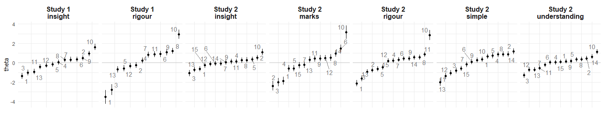
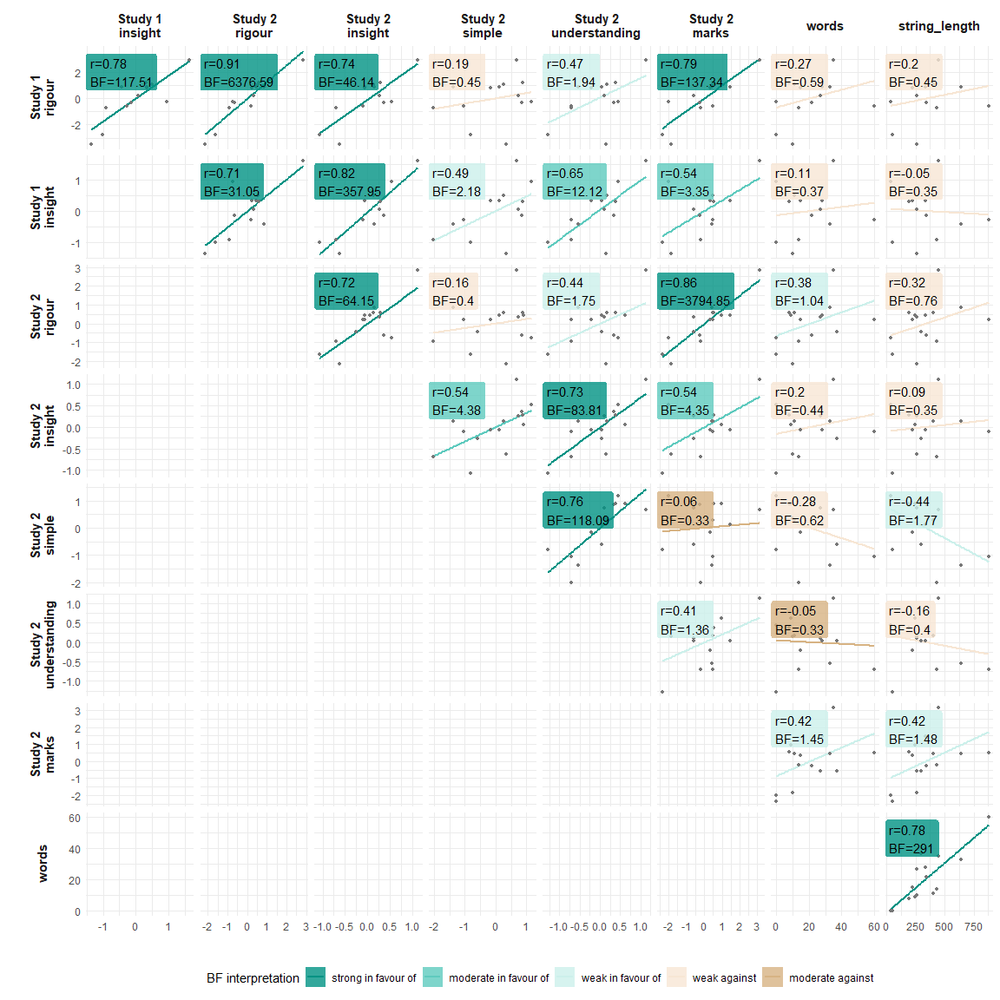
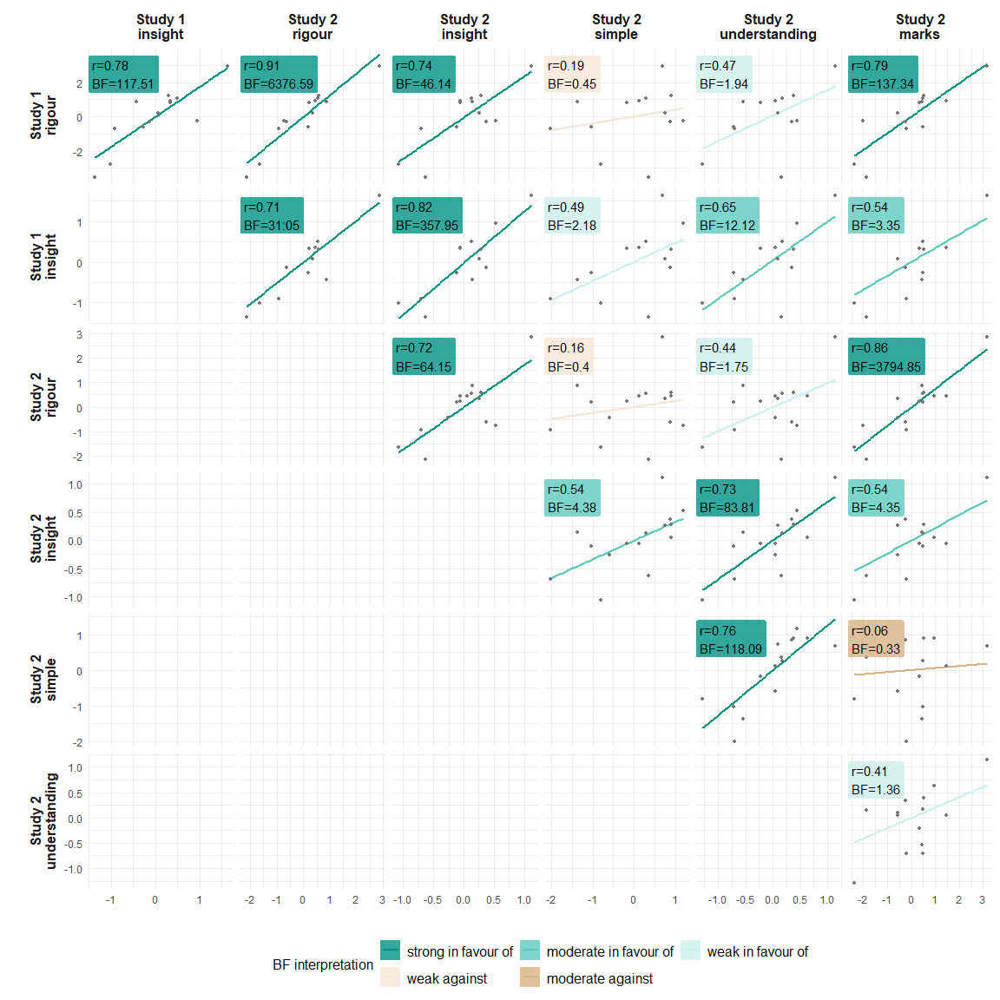
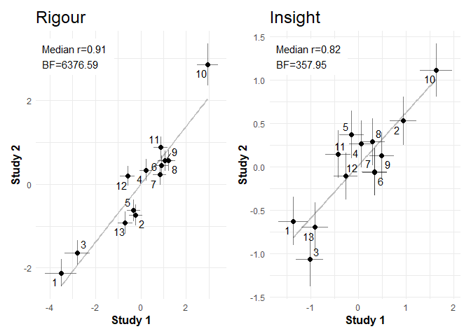

Proof CJ: Study 1 vs Study 2 analysis
================
George Kinnear
22/03/2021

# Basic plots of the scales

The scale values with standard errors:

<!-- -->

# Bayesian stats

Do a Bayesian correlation test on each combination, and describe the
resulting posteriors.

<table class="table table-striped" style="width: auto !important; ">

<thead>

<tr>

<th style="text-align:left;">

Interpretation

</th>

<th style="text-align:right;">

BF

</th>

<th style="text-align:left;">

Dimension 1

</th>

<th style="text-align:left;">

Dimension 2

</th>

<th style="text-align:right;">

Median

</th>

<th style="text-align:left;">

95% HDI

</th>

<th style="text-align:left;">

Visualisation

</th>

</tr>

</thead>

<tbody>

<tr>

<td style="text-align:left;vertical-align: top !important;" rowspan="11">

strong in favour of

</td>

<td style="text-align:right;">

6376.59

</td>

<td style="text-align:left;">

study2 rigour

</td>

<td style="text-align:left;">

study1 rigour

</td>

<td style="text-align:right;">

0.91

</td>

<td style="text-align:left;">

\[0.77, 0.98\]

</td>

<td style="text-align:left;">

<svg xmlns="http://www.w3.org/2000/svg" xmlns:xlink="http://www.w3.org/1999/xlink" class="svglite" width="48.00pt" height="12.00pt" viewbox="0 0 48.00 12.00">

<defs>

</defs><rect width="100%" height="100%" style="stroke: none; fill: none;"></rect><defs><clippath id="cpMC4wMHw0OC4wMHwwLjAwfDEyLjAw"><rect x="0.00" y="0.00" width="48.00" height="12.00"></rect></clippath></defs><g clip-path="url(#cpMC4wMHw0OC4wMHwwLjAwfDEyLjAw)">
</g><defs><clippath id="cpMC4wMHw0OC4wMHwyLjg4fDEyLjAw"><rect x="0.00" y="2.88" width="48.00" height="9.12"></rect></clippath></defs><g clip-path="url(#cpMC4wMHw0OC4wMHwyLjg4fDEyLjAw)"><rect x="42.37" y="6.94" width="1.00" height="1.00" style="stroke-width: 0.75; stroke: none; fill: #000000;"></rect><line x1="39.59" y1="7.44" x2="44.58" y2="7.44" style="stroke-width: 0.75;"></line><polyline points="39.59,5.04 39.59,7.44 39.59,9.84 " style="stroke-width: 0.75;"></polyline><polyline points="44.58,9.84 44.58,7.44 44.58,5.04 " style="stroke-width: 0.75;"></polyline><polygon points="41.52,8.79 44.22,8.79 44.22,6.09 41.52,6.09 " style="stroke-width: 0.75; stroke: none; fill: #FF0000;"></polygon><line x1="21.59" y1="12.00" x2="21.59" y2="2.88" style="stroke-width: 0.75; stroke-dasharray: 1.00,3.00;"></line></g>

</svg>

</td>

</tr>

<tr>

<td style="text-align:right;">

3794.85

</td>

<td style="text-align:left;">

study2 marks

</td>

<td style="text-align:left;">

study2 rigour

</td>

<td style="text-align:right;">

0.86

</td>

<td style="text-align:left;">

\[0.7, 0.97\]

</td>

<td style="text-align:left;">

<svg xmlns="http://www.w3.org/2000/svg" xmlns:xlink="http://www.w3.org/1999/xlink" class="svglite" width="48.00pt" height="12.00pt" viewbox="0 0 48.00 12.00">

<defs>

</defs><rect width="100%" height="100%" style="stroke: none; fill: none;"></rect><defs><clippath id="cpMC4wMHw0OC4wMHwwLjAwfDEyLjAw"><rect x="0.00" y="0.00" width="48.00" height="12.00"></rect></clippath></defs><g clip-path="url(#cpMC4wMHw0OC4wMHwwLjAwfDEyLjAw)">
</g><defs><clippath id="cpMC4wMHw0OC4wMHwyLjg4fDEyLjAw"><rect x="0.00" y="2.88" width="48.00" height="9.12"></rect></clippath></defs><g clip-path="url(#cpMC4wMHw0OC4wMHwyLjg4fDEyLjAw)"><rect x="41.38" y="6.94" width="1.00" height="1.00" style="stroke-width: 0.75; stroke: none; fill: #000000;"></rect><line x1="37.98" y1="7.44" x2="44.41" y2="7.44" style="stroke-width: 0.75;"></line><polyline points="37.98,5.04 37.98,7.44 37.98,9.84 " style="stroke-width: 0.75;"></polyline><polyline points="44.41,9.84 44.41,7.44 44.41,5.04 " style="stroke-width: 0.75;"></polyline><polygon points="40.53,8.79 43.23,8.79 43.23,6.09 40.53,6.09 " style="stroke-width: 0.75; stroke: none; fill: #FF0000;"></polygon><line x1="21.59" y1="12.00" x2="21.59" y2="2.88" style="stroke-width: 0.75; stroke-dasharray: 1.00,3.00;"></line></g>

</svg>

</td>

</tr>

<tr>

<td style="text-align:right;">

357.95

</td>

<td style="text-align:left;">

study2 insight

</td>

<td style="text-align:left;">

study1 insight

</td>

<td style="text-align:right;">

0.82

</td>

<td style="text-align:left;">

\[0.55, 0.96\]

</td>

<td style="text-align:left;">

<svg xmlns="http://www.w3.org/2000/svg" xmlns:xlink="http://www.w3.org/1999/xlink" class="svglite" width="48.00pt" height="12.00pt" viewbox="0 0 48.00 12.00">

<defs>

</defs><rect width="100%" height="100%" style="stroke: none; fill: none;"></rect><defs><clippath id="cpMC4wMHw0OC4wMHwwLjAwfDEyLjAw"><rect x="0.00" y="0.00" width="48.00" height="12.00"></rect></clippath></defs><g clip-path="url(#cpMC4wMHw0OC4wMHwwLjAwfDEyLjAw)">
</g><defs><clippath id="cpMC4wMHw0OC4wMHwyLjg4fDEyLjAw"><rect x="0.00" y="2.88" width="48.00" height="9.12"></rect></clippath></defs><g clip-path="url(#cpMC4wMHw0OC4wMHwyLjg4fDEyLjAw)"><rect x="40.46" y="6.94" width="1.00" height="1.00" style="stroke-width: 0.75; stroke: none; fill: #000000;"></rect><line x1="34.63" y1="7.44" x2="44.10" y2="7.44" style="stroke-width: 0.75;"></line><polyline points="34.63,5.04 34.63,7.44 34.63,9.84 " style="stroke-width: 0.75;"></polyline><polyline points="44.10,9.84 44.10,7.44 44.10,5.04 " style="stroke-width: 0.75;"></polyline><polygon points="39.61,8.79 42.31,8.79 42.31,6.09 39.61,6.09 " style="stroke-width: 0.75; stroke: none; fill: #FF0000;"></polygon><line x1="21.59" y1="12.00" x2="21.59" y2="2.88" style="stroke-width: 0.75; stroke-dasharray: 1.00,3.00;"></line></g>

</svg>

</td>

</tr>

<tr>

<td style="text-align:right;">

291.00

</td>

<td style="text-align:left;">

string\_length

</td>

<td style="text-align:left;">

words

</td>

<td style="text-align:right;">

0.78

</td>

<td style="text-align:left;">

\[0.54, 0.93\]

</td>

<td style="text-align:left;">

<svg xmlns="http://www.w3.org/2000/svg" xmlns:xlink="http://www.w3.org/1999/xlink" class="svglite" width="48.00pt" height="12.00pt" viewbox="0 0 48.00 12.00">

<defs>

</defs><rect width="100%" height="100%" style="stroke: none; fill: none;"></rect><defs><clippath id="cpMC4wMHw0OC4wMHwwLjAwfDEyLjAw"><rect x="0.00" y="0.00" width="48.00" height="12.00"></rect></clippath></defs><g clip-path="url(#cpMC4wMHw0OC4wMHwwLjAwfDEyLjAw)">
</g><defs><clippath id="cpMC4wMHw0OC4wMHwyLjg4fDEyLjAw"><rect x="0.00" y="2.88" width="48.00" height="9.12"></rect></clippath></defs><g clip-path="url(#cpMC4wMHw0OC4wMHwyLjg4fDEyLjAw)"><rect x="39.52" y="6.94" width="1.00" height="1.00" style="stroke-width: 0.75; stroke: none; fill: #000000;"></rect><line x1="34.17" y1="7.44" x2="43.57" y2="7.44" style="stroke-width: 0.75;"></line><polyline points="34.17,5.04 34.17,7.44 34.17,9.84 " style="stroke-width: 0.75;"></polyline><polyline points="43.57,9.84 43.57,7.44 43.57,5.04 " style="stroke-width: 0.75;"></polyline><polygon points="38.67,8.79 41.37,8.79 41.37,6.09 38.67,6.09 " style="stroke-width: 0.75; stroke: none; fill: #FF0000;"></polygon><line x1="21.59" y1="12.00" x2="21.59" y2="2.88" style="stroke-width: 0.75; stroke-dasharray: 1.00,3.00;"></line></g>

</svg>

</td>

</tr>

<tr>

<td style="text-align:right;">

137.34

</td>

<td style="text-align:left;">

study2 marks

</td>

<td style="text-align:left;">

study1 rigour

</td>

<td style="text-align:right;">

0.79

</td>

<td style="text-align:left;">

\[0.51, 0.95\]

</td>

<td style="text-align:left;">

<svg xmlns="http://www.w3.org/2000/svg" xmlns:xlink="http://www.w3.org/1999/xlink" class="svglite" width="48.00pt" height="12.00pt" viewbox="0 0 48.00 12.00">

<defs>

</defs><rect width="100%" height="100%" style="stroke: none; fill: none;"></rect><defs><clippath id="cpMC4wMHw0OC4wMHwwLjAwfDEyLjAw"><rect x="0.00" y="0.00" width="48.00" height="12.00"></rect></clippath></defs><g clip-path="url(#cpMC4wMHw0OC4wMHwwLjAwfDEyLjAw)">
</g><defs><clippath id="cpMC4wMHw0OC4wMHwyLjg4fDEyLjAw"><rect x="0.00" y="2.88" width="48.00" height="9.12"></rect></clippath></defs><g clip-path="url(#cpMC4wMHw0OC4wMHwyLjg4fDEyLjAw)"><rect x="39.75" y="6.94" width="1.00" height="1.00" style="stroke-width: 0.75; stroke: none; fill: #000000;"></rect><line x1="33.67" y1="7.44" x2="43.81" y2="7.44" style="stroke-width: 0.75;"></line><polyline points="33.67,5.04 33.67,7.44 33.67,9.84 " style="stroke-width: 0.75;"></polyline><polyline points="43.81,9.84 43.81,7.44 43.81,5.04 " style="stroke-width: 0.75;"></polyline><polygon points="38.90,8.79 41.60,8.79 41.60,6.09 38.90,6.09 " style="stroke-width: 0.75; stroke: none; fill: #FF0000;"></polygon><line x1="21.59" y1="12.00" x2="21.59" y2="2.88" style="stroke-width: 0.75; stroke-dasharray: 1.00,3.00;"></line></g>

</svg>

</td>

</tr>

<tr>

<td style="text-align:right;">

118.09

</td>

<td style="text-align:left;">

study2 understanding

</td>

<td style="text-align:left;">

study2 simple

</td>

<td style="text-align:right;">

0.76

</td>

<td style="text-align:left;">

\[0.46, 0.92\]

</td>

<td style="text-align:left;">

<svg xmlns="http://www.w3.org/2000/svg" xmlns:xlink="http://www.w3.org/1999/xlink" class="svglite" width="48.00pt" height="12.00pt" viewbox="0 0 48.00 12.00">

<defs>

</defs><rect width="100%" height="100%" style="stroke: none; fill: none;"></rect><defs><clippath id="cpMC4wMHw0OC4wMHwwLjAwfDEyLjAw"><rect x="0.00" y="0.00" width="48.00" height="12.00"></rect></clippath></defs><g clip-path="url(#cpMC4wMHw0OC4wMHwwLjAwfDEyLjAw)">
</g><defs><clippath id="cpMC4wMHw0OC4wMHwyLjg4fDEyLjAw"><rect x="0.00" y="2.88" width="48.00" height="9.12"></rect></clippath></defs><g clip-path="url(#cpMC4wMHw0OC4wMHwyLjg4fDEyLjAw)"><rect x="38.86" y="6.94" width="1.00" height="1.00" style="stroke-width: 0.75; stroke: none; fill: #000000;"></rect><line x1="32.52" y1="7.44" x2="43.23" y2="7.44" style="stroke-width: 0.75;"></line><polyline points="32.52,5.04 32.52,7.44 32.52,9.84 " style="stroke-width: 0.75;"></polyline><polyline points="43.23,9.84 43.23,7.44 43.23,5.04 " style="stroke-width: 0.75;"></polyline><polygon points="38.01,8.79 40.71,8.79 40.71,6.09 38.01,6.09 " style="stroke-width: 0.75; stroke: none; fill: #FF0000;"></polygon><line x1="21.59" y1="12.00" x2="21.59" y2="2.88" style="stroke-width: 0.75; stroke-dasharray: 1.00,3.00;"></line></g>

</svg>

</td>

</tr>

<tr>

<td style="text-align:right;">

117.51

</td>

<td style="text-align:left;">

study1 insight

</td>

<td style="text-align:left;">

study1 rigour

</td>

<td style="text-align:right;">

0.78

</td>

<td style="text-align:left;">

\[0.5, 0.94\]

</td>

<td style="text-align:left;">

<svg xmlns="http://www.w3.org/2000/svg" xmlns:xlink="http://www.w3.org/1999/xlink" class="svglite" width="48.00pt" height="12.00pt" viewbox="0 0 48.00 12.00">

<defs>

</defs><rect width="100%" height="100%" style="stroke: none; fill: none;"></rect><defs><clippath id="cpMC4wMHw0OC4wMHwwLjAwfDEyLjAw"><rect x="0.00" y="0.00" width="48.00" height="12.00"></rect></clippath></defs><g clip-path="url(#cpMC4wMHw0OC4wMHwwLjAwfDEyLjAw)">
</g><defs><clippath id="cpMC4wMHw0OC4wMHwyLjg4fDEyLjAw"><rect x="0.00" y="2.88" width="48.00" height="9.12"></rect></clippath></defs><g clip-path="url(#cpMC4wMHw0OC4wMHwyLjg4fDEyLjAw)"><rect x="39.51" y="6.94" width="1.00" height="1.00" style="stroke-width: 0.75; stroke: none; fill: #000000;"></rect><line x1="33.39" y1="7.44" x2="43.65" y2="7.44" style="stroke-width: 0.75;"></line><polyline points="33.39,5.04 33.39,7.44 33.39,9.84 " style="stroke-width: 0.75;"></polyline><polyline points="43.65,9.84 43.65,7.44 43.65,5.04 " style="stroke-width: 0.75;"></polyline><polygon points="38.66,8.79 41.36,8.79 41.36,6.09 38.66,6.09 " style="stroke-width: 0.75; stroke: none; fill: #FF0000;"></polygon><line x1="21.59" y1="12.00" x2="21.59" y2="2.88" style="stroke-width: 0.75; stroke-dasharray: 1.00,3.00;"></line></g>

</svg>

</td>

</tr>

<tr>

<td style="text-align:right;">

83.81

</td>

<td style="text-align:left;">

study2 understanding

</td>

<td style="text-align:left;">

study2 insight

</td>

<td style="text-align:right;">

0.73

</td>

<td style="text-align:left;">

\[0.45, 0.91\]

</td>

<td style="text-align:left;">

<svg xmlns="http://www.w3.org/2000/svg" xmlns:xlink="http://www.w3.org/1999/xlink" class="svglite" width="48.00pt" height="12.00pt" viewbox="0 0 48.00 12.00">

<defs>

</defs><rect width="100%" height="100%" style="stroke: none; fill: none;"></rect><defs><clippath id="cpMC4wMHw0OC4wMHwwLjAwfDEyLjAw"><rect x="0.00" y="0.00" width="48.00" height="12.00"></rect></clippath></defs><g clip-path="url(#cpMC4wMHw0OC4wMHwwLjAwfDEyLjAw)">
</g><defs><clippath id="cpMC4wMHw0OC4wMHwyLjg4fDEyLjAw"><rect x="0.00" y="2.88" width="48.00" height="9.12"></rect></clippath></defs><g clip-path="url(#cpMC4wMHw0OC4wMHwyLjg4fDEyLjAw)"><rect x="38.36" y="6.94" width="1.00" height="1.00" style="stroke-width: 0.75; stroke: none; fill: #000000;"></rect><line x1="32.16" y1="7.44" x2="42.89" y2="7.44" style="stroke-width: 0.75;"></line><polyline points="32.16,5.04 32.16,7.44 32.16,9.84 " style="stroke-width: 0.75;"></polyline><polyline points="42.89,9.84 42.89,7.44 42.89,5.04 " style="stroke-width: 0.75;"></polyline><polygon points="37.51,8.79 40.21,8.79 40.21,6.09 37.51,6.09 " style="stroke-width: 0.75; stroke: none; fill: #FF0000;"></polygon><line x1="21.59" y1="12.00" x2="21.59" y2="2.88" style="stroke-width: 0.75; stroke-dasharray: 1.00,3.00;"></line></g>

</svg>

</td>

</tr>

<tr>

<td style="text-align:right;">

64.15

</td>

<td style="text-align:left;">

study2 insight

</td>

<td style="text-align:left;">

study2 rigour

</td>

<td style="text-align:right;">

0.72

</td>

<td style="text-align:left;">

\[0.38, 0.92\]

</td>

<td style="text-align:left;">

<svg xmlns="http://www.w3.org/2000/svg" xmlns:xlink="http://www.w3.org/1999/xlink" class="svglite" width="48.00pt" height="12.00pt" viewbox="0 0 48.00 12.00">

<defs>

</defs><rect width="100%" height="100%" style="stroke: none; fill: none;"></rect><defs><clippath id="cpMC4wMHw0OC4wMHwwLjAwfDEyLjAw"><rect x="0.00" y="0.00" width="48.00" height="12.00"></rect></clippath></defs><g clip-path="url(#cpMC4wMHw0OC4wMHwwLjAwfDEyLjAw)">
</g><defs><clippath id="cpMC4wMHw0OC4wMHwyLjg4fDEyLjAw"><rect x="0.00" y="2.88" width="48.00" height="9.12"></rect></clippath></defs><g clip-path="url(#cpMC4wMHw0OC4wMHwyLjg4fDEyLjAw)"><rect x="37.98" y="6.94" width="1.00" height="1.00" style="stroke-width: 0.75; stroke: none; fill: #000000;"></rect><line x1="30.60" y1="7.44" x2="43.11" y2="7.44" style="stroke-width: 0.75;"></line><polyline points="30.60,5.04 30.60,7.44 30.60,9.84 " style="stroke-width: 0.75;"></polyline><polyline points="43.11,9.84 43.11,7.44 43.11,5.04 " style="stroke-width: 0.75;"></polyline><polygon points="37.13,8.79 39.83,8.79 39.83,6.09 37.13,6.09 " style="stroke-width: 0.75; stroke: none; fill: #FF0000;"></polygon><line x1="21.59" y1="12.00" x2="21.59" y2="2.88" style="stroke-width: 0.75; stroke-dasharray: 1.00,3.00;"></line></g>

</svg>

</td>

</tr>

<tr>

<td style="text-align:right;">

46.14

</td>

<td style="text-align:left;">

study2 insight

</td>

<td style="text-align:left;">

study1 rigour

</td>

<td style="text-align:right;">

0.74

</td>

<td style="text-align:left;">

\[0.41, 0.93\]

</td>

<td style="text-align:left;">

<svg xmlns="http://www.w3.org/2000/svg" xmlns:xlink="http://www.w3.org/1999/xlink" class="svglite" width="48.00pt" height="12.00pt" viewbox="0 0 48.00 12.00">

<defs>

</defs><rect width="100%" height="100%" style="stroke: none; fill: none;"></rect><defs><clippath id="cpMC4wMHw0OC4wMHwwLjAwfDEyLjAw"><rect x="0.00" y="0.00" width="48.00" height="12.00"></rect></clippath></defs><g clip-path="url(#cpMC4wMHw0OC4wMHwwLjAwfDEyLjAw)">
</g><defs><clippath id="cpMC4wMHw0OC4wMHwyLjg4fDEyLjAw"><rect x="0.00" y="2.88" width="48.00" height="9.12"></rect></clippath></defs><g clip-path="url(#cpMC4wMHw0OC4wMHwyLjg4fDEyLjAw)"><rect x="38.39" y="6.94" width="1.00" height="1.00" style="stroke-width: 0.75; stroke: none; fill: #000000;"></rect><line x1="31.30" y1="7.44" x2="43.47" y2="7.44" style="stroke-width: 0.75;"></line><polyline points="31.30,5.04 31.30,7.44 31.30,9.84 " style="stroke-width: 0.75;"></polyline><polyline points="43.47,9.84 43.47,7.44 43.47,5.04 " style="stroke-width: 0.75;"></polyline><polygon points="37.54,8.79 40.24,8.79 40.24,6.09 37.54,6.09 " style="stroke-width: 0.75; stroke: none; fill: #FF0000;"></polygon><line x1="21.59" y1="12.00" x2="21.59" y2="2.88" style="stroke-width: 0.75; stroke-dasharray: 1.00,3.00;"></line></g>

</svg>

</td>

</tr>

<tr>

<td style="text-align:right;">

31.05

</td>

<td style="text-align:left;">

study2 rigour

</td>

<td style="text-align:left;">

study1 insight

</td>

<td style="text-align:right;">

0.71

</td>

<td style="text-align:left;">

\[0.35, 0.92\]

</td>

<td style="text-align:left;">

<svg xmlns="http://www.w3.org/2000/svg" xmlns:xlink="http://www.w3.org/1999/xlink" class="svglite" width="48.00pt" height="12.00pt" viewbox="0 0 48.00 12.00">

<defs>

</defs><rect width="100%" height="100%" style="stroke: none; fill: none;"></rect><defs><clippath id="cpMC4wMHw0OC4wMHwwLjAwfDEyLjAw"><rect x="0.00" y="0.00" width="48.00" height="12.00"></rect></clippath></defs><g clip-path="url(#cpMC4wMHw0OC4wMHwwLjAwfDEyLjAw)">
</g><defs><clippath id="cpMC4wMHw0OC4wMHwyLjg4fDEyLjAw"><rect x="0.00" y="2.88" width="48.00" height="9.12"></rect></clippath></defs><g clip-path="url(#cpMC4wMHw0OC4wMHwyLjg4fDEyLjAw)"><rect x="37.68" y="6.94" width="1.00" height="1.00" style="stroke-width: 0.75; stroke: none; fill: #000000;"></rect><line x1="29.70" y1="7.44" x2="43.30" y2="7.44" style="stroke-width: 0.75;"></line><polyline points="29.70,5.04 29.70,7.44 29.70,9.84 " style="stroke-width: 0.75;"></polyline><polyline points="43.30,9.84 43.30,7.44 43.30,5.04 " style="stroke-width: 0.75;"></polyline><polygon points="36.83,8.79 39.53,8.79 39.53,6.09 36.83,6.09 " style="stroke-width: 0.75; stroke: none; fill: #FF0000;"></polygon><line x1="21.59" y1="12.00" x2="21.59" y2="2.88" style="stroke-width: 0.75; stroke-dasharray: 1.00,3.00;"></line></g>

</svg>

</td>

</tr>

<tr>

<td style="text-align:left;vertical-align: top !important;" rowspan="4">

moderate in favour of

</td>

<td style="text-align:right;">

12.12

</td>

<td style="text-align:left;">

study2 understanding

</td>

<td style="text-align:left;">

study1 insight

</td>

<td style="text-align:right;">

0.65

</td>

<td style="text-align:left;">

\[0.23, 0.9\]

</td>

<td style="text-align:left;">

<svg xmlns="http://www.w3.org/2000/svg" xmlns:xlink="http://www.w3.org/1999/xlink" class="svglite" width="48.00pt" height="12.00pt" viewbox="0 0 48.00 12.00">

<defs>

</defs><rect width="100%" height="100%" style="stroke: none; fill: none;"></rect><defs><clippath id="cpMC4wMHw0OC4wMHwwLjAwfDEyLjAw"><rect x="0.00" y="0.00" width="48.00" height="12.00"></rect></clippath></defs><g clip-path="url(#cpMC4wMHw0OC4wMHwwLjAwfDEyLjAw)">
</g><defs><clippath id="cpMC4wMHw0OC4wMHwyLjg4fDEyLjAw"><rect x="0.00" y="2.88" width="48.00" height="9.12"></rect></clippath></defs><g clip-path="url(#cpMC4wMHw0OC4wMHwyLjg4fDEyLjAw)"><rect x="36.36" y="6.94" width="1.00" height="1.00" style="stroke-width: 0.75; stroke: none; fill: #000000;"></rect><line x1="27.10" y1="7.44" x2="42.64" y2="7.44" style="stroke-width: 0.75;"></line><polyline points="27.10,5.04 27.10,7.44 27.10,9.84 " style="stroke-width: 0.75;"></polyline><polyline points="42.64,9.84 42.64,7.44 42.64,5.04 " style="stroke-width: 0.75;"></polyline><polygon points="35.51,8.79 38.21,8.79 38.21,6.09 35.51,6.09 " style="stroke-width: 0.75; stroke: none; fill: #FF0000;"></polygon><line x1="21.59" y1="12.00" x2="21.59" y2="2.88" style="stroke-width: 0.75; stroke-dasharray: 1.00,3.00;"></line></g>

</svg>

</td>

</tr>

<tr>

<td style="text-align:right;">

4.38

</td>

<td style="text-align:left;">

study2 simple

</td>

<td style="text-align:left;">

study2 insight

</td>

<td style="text-align:right;">

0.54

</td>

<td style="text-align:left;">

\[0.13, 0.83\]

</td>

<td style="text-align:left;">

<svg xmlns="http://www.w3.org/2000/svg" xmlns:xlink="http://www.w3.org/1999/xlink" class="svglite" width="48.00pt" height="12.00pt" viewbox="0 0 48.00 12.00">

<defs>

</defs><rect width="100%" height="100%" style="stroke: none; fill: none;"></rect><defs><clippath id="cpMC4wMHw0OC4wMHwwLjAwfDEyLjAw"><rect x="0.00" y="0.00" width="48.00" height="12.00"></rect></clippath></defs><g clip-path="url(#cpMC4wMHw0OC4wMHwwLjAwfDEyLjAw)">
</g><defs><clippath id="cpMC4wMHw0OC4wMHwyLjg4fDEyLjAw"><rect x="0.00" y="2.88" width="48.00" height="9.12"></rect></clippath></defs><g clip-path="url(#cpMC4wMHw0OC4wMHwyLjg4fDEyLjAw)"><rect x="33.89" y="6.94" width="1.00" height="1.00" style="stroke-width: 0.75; stroke: none; fill: #000000;"></rect><line x1="24.68" y1="7.44" x2="41.16" y2="7.44" style="stroke-width: 0.75;"></line><polyline points="24.68,5.04 24.68,7.44 24.68,9.84 " style="stroke-width: 0.75;"></polyline><polyline points="41.16,9.84 41.16,7.44 41.16,5.04 " style="stroke-width: 0.75;"></polyline><polygon points="33.04,8.79 35.74,8.79 35.74,6.09 33.04,6.09 " style="stroke-width: 0.75; stroke: none; fill: #FF0000;"></polygon><line x1="21.59" y1="12.00" x2="21.59" y2="2.88" style="stroke-width: 0.75; stroke-dasharray: 1.00,3.00;"></line></g>

</svg>

</td>

</tr>

<tr>

<td style="text-align:right;">

4.35

</td>

<td style="text-align:left;">

study2 marks

</td>

<td style="text-align:left;">

study2 insight

</td>

<td style="text-align:right;">

0.54

</td>

<td style="text-align:left;">

\[0.16, 0.85\]

</td>

<td style="text-align:left;">

<svg xmlns="http://www.w3.org/2000/svg" xmlns:xlink="http://www.w3.org/1999/xlink" class="svglite" width="48.00pt" height="12.00pt" viewbox="0 0 48.00 12.00">

<defs>

</defs><rect width="100%" height="100%" style="stroke: none; fill: none;"></rect><defs><clippath id="cpMC4wMHw0OC4wMHwwLjAwfDEyLjAw"><rect x="0.00" y="0.00" width="48.00" height="12.00"></rect></clippath></defs><g clip-path="url(#cpMC4wMHw0OC4wMHwwLjAwfDEyLjAw)">
</g><defs><clippath id="cpMC4wMHw0OC4wMHwyLjg4fDEyLjAw"><rect x="0.00" y="2.88" width="48.00" height="9.12"></rect></clippath></defs><g clip-path="url(#cpMC4wMHw0OC4wMHwyLjg4fDEyLjAw)"><rect x="33.90" y="6.94" width="1.00" height="1.00" style="stroke-width: 0.75; stroke: none; fill: #000000;"></rect><line x1="25.32" y1="7.44" x2="41.52" y2="7.44" style="stroke-width: 0.75;"></line><polyline points="25.32,5.04 25.32,7.44 25.32,9.84 " style="stroke-width: 0.75;"></polyline><polyline points="41.52,9.84 41.52,7.44 41.52,5.04 " style="stroke-width: 0.75;"></polyline><polygon points="33.05,8.79 35.75,8.79 35.75,6.09 33.05,6.09 " style="stroke-width: 0.75; stroke: none; fill: #FF0000;"></polygon><line x1="21.59" y1="12.00" x2="21.59" y2="2.88" style="stroke-width: 0.75; stroke-dasharray: 1.00,3.00;"></line></g>

</svg>

</td>

</tr>

<tr>

<td style="text-align:right;">

3.35

</td>

<td style="text-align:left;">

study2 marks

</td>

<td style="text-align:left;">

study1 insight

</td>

<td style="text-align:right;">

0.54

</td>

<td style="text-align:left;">

\[0.09, 0.85\]

</td>

<td style="text-align:left;">

<svg xmlns="http://www.w3.org/2000/svg" xmlns:xlink="http://www.w3.org/1999/xlink" class="svglite" width="48.00pt" height="12.00pt" viewbox="0 0 48.00 12.00">

<defs>

</defs><rect width="100%" height="100%" style="stroke: none; fill: none;"></rect><defs><clippath id="cpMC4wMHw0OC4wMHwwLjAwfDEyLjAw"><rect x="0.00" y="0.00" width="48.00" height="12.00"></rect></clippath></defs><g clip-path="url(#cpMC4wMHw0OC4wMHwwLjAwfDEyLjAw)">
</g><defs><clippath id="cpMC4wMHw0OC4wMHwyLjg4fDEyLjAw"><rect x="0.00" y="2.88" width="48.00" height="9.12"></rect></clippath></defs><g clip-path="url(#cpMC4wMHw0OC4wMHwyLjg4fDEyLjAw)"><rect x="33.68" y="6.94" width="1.00" height="1.00" style="stroke-width: 0.75; stroke: none; fill: #000000;"></rect><line x1="23.66" y1="7.44" x2="41.56" y2="7.44" style="stroke-width: 0.75;"></line><polyline points="23.66,5.04 23.66,7.44 23.66,9.84 " style="stroke-width: 0.75;"></polyline><polyline points="41.56,9.84 41.56,7.44 41.56,5.04 " style="stroke-width: 0.75;"></polyline><polygon points="32.83,8.79 35.53,8.79 35.53,6.09 32.83,6.09 " style="stroke-width: 0.75; stroke: none; fill: #FF0000;"></polygon><line x1="21.59" y1="12.00" x2="21.59" y2="2.88" style="stroke-width: 0.75; stroke-dasharray: 1.00,3.00;"></line></g>

</svg>

</td>

</tr>

<tr>

<td style="text-align:left;vertical-align: top !important;" rowspan="8">

weak in favour of

</td>

<td style="text-align:right;">

2.18

</td>

<td style="text-align:left;">

study2 simple

</td>

<td style="text-align:left;">

study1 insight

</td>

<td style="text-align:right;">

0.49

</td>

<td style="text-align:left;">

\[0, 0.83\]

</td>

<td style="text-align:left;">

<svg xmlns="http://www.w3.org/2000/svg" xmlns:xlink="http://www.w3.org/1999/xlink" class="svglite" width="48.00pt" height="12.00pt" viewbox="0 0 48.00 12.00">

<defs>

</defs><rect width="100%" height="100%" style="stroke: none; fill: none;"></rect><defs><clippath id="cpMC4wMHw0OC4wMHwwLjAwfDEyLjAw"><rect x="0.00" y="0.00" width="48.00" height="12.00"></rect></clippath></defs><g clip-path="url(#cpMC4wMHw0OC4wMHwwLjAwfDEyLjAw)">
</g><defs><clippath id="cpMC4wMHw0OC4wMHwyLjg4fDEyLjAw"><rect x="0.00" y="2.88" width="48.00" height="9.12"></rect></clippath></defs><g clip-path="url(#cpMC4wMHw0OC4wMHwyLjg4fDEyLjAw)"><rect x="32.52" y="6.94" width="1.00" height="1.00" style="stroke-width: 0.75; stroke: none; fill: #000000;"></rect><line x1="21.70" y1="7.44" x2="41.12" y2="7.44" style="stroke-width: 0.75;"></line><polyline points="21.70,5.04 21.70,7.44 21.70,9.84 " style="stroke-width: 0.75;"></polyline><polyline points="41.12,9.84 41.12,7.44 41.12,5.04 " style="stroke-width: 0.75;"></polyline><polygon points="31.67,8.79 34.37,8.79 34.37,6.09 31.67,6.09 " style="stroke-width: 0.75; stroke: none; fill: #FF0000;"></polygon><line x1="21.59" y1="12.00" x2="21.59" y2="2.88" style="stroke-width: 0.75; stroke-dasharray: 1.00,3.00;"></line></g>

</svg>

</td>

</tr>

<tr>

<td style="text-align:right;">

1.94

</td>

<td style="text-align:left;">

study2 understanding

</td>

<td style="text-align:left;">

study1 rigour

</td>

<td style="text-align:right;">

0.47

</td>

<td style="text-align:left;">

\[-0.03, 0.8\]

</td>

<td style="text-align:left;">

<svg xmlns="http://www.w3.org/2000/svg" xmlns:xlink="http://www.w3.org/1999/xlink" class="svglite" width="48.00pt" height="12.00pt" viewbox="0 0 48.00 12.00">

<defs>

</defs><rect width="100%" height="100%" style="stroke: none; fill: none;"></rect><defs><clippath id="cpMC4wMHw0OC4wMHwwLjAwfDEyLjAw"><rect x="0.00" y="0.00" width="48.00" height="12.00"></rect></clippath></defs><g clip-path="url(#cpMC4wMHw0OC4wMHwwLjAwfDEyLjAw)">
</g><defs><clippath id="cpMC4wMHw0OC4wMHwyLjg4fDEyLjAw"><rect x="0.00" y="2.88" width="48.00" height="9.12"></rect></clippath></defs><g clip-path="url(#cpMC4wMHw0OC4wMHwyLjg4fDEyLjAw)"><rect x="32.16" y="6.94" width="1.00" height="1.00" style="stroke-width: 0.75; stroke: none; fill: #000000;"></rect><line x1="21.00" y1="7.44" x2="40.49" y2="7.44" style="stroke-width: 0.75;"></line><polyline points="21.00,5.04 21.00,7.44 21.00,9.84 " style="stroke-width: 0.75;"></polyline><polyline points="40.49,9.84 40.49,7.44 40.49,5.04 " style="stroke-width: 0.75;"></polyline><polygon points="31.31,8.79 34.01,8.79 34.01,6.09 31.31,6.09 " style="stroke-width: 0.75; stroke: none; fill: #FF0000;"></polygon><line x1="21.59" y1="12.00" x2="21.59" y2="2.88" style="stroke-width: 0.75; stroke-dasharray: 1.00,3.00;"></line></g>

</svg>

</td>

</tr>

<tr>

<td style="text-align:right;">

1.77

</td>

<td style="text-align:left;">

string\_length

</td>

<td style="text-align:left;">

study2 simple

</td>

<td style="text-align:right;">

\-0.44

</td>

<td style="text-align:left;">

\[-0.77, -0.01\]

</td>

<td style="text-align:left;">

<svg xmlns="http://www.w3.org/2000/svg" xmlns:xlink="http://www.w3.org/1999/xlink" class="svglite" width="48.00pt" height="12.00pt" viewbox="0 0 48.00 12.00">

<defs>

</defs><rect width="100%" height="100%" style="stroke: none; fill: none;"></rect><defs><clippath id="cpMC4wMHw0OC4wMHwwLjAwfDEyLjAw"><rect x="0.00" y="0.00" width="48.00" height="12.00"></rect></clippath></defs><g clip-path="url(#cpMC4wMHw0OC4wMHwwLjAwfDEyLjAw)">
</g><defs><clippath id="cpMC4wMHw0OC4wMHwyLjg4fDEyLjAw"><rect x="0.00" y="2.88" width="48.00" height="9.12"></rect></clippath></defs><g clip-path="url(#cpMC4wMHw0OC4wMHwyLjg4fDEyLjAw)"><rect x="10.70" y="6.94" width="1.00" height="1.00" style="stroke-width: 0.75; stroke: none; fill: #000000;"></rect><line x1="3.42" y1="7.44" x2="21.41" y2="7.44" style="stroke-width: 0.75;"></line><polyline points="3.42,5.04 3.42,7.44 3.42,9.84 " style="stroke-width: 0.75;"></polyline><polyline points="21.41,9.84 21.41,7.44 21.41,5.04 " style="stroke-width: 0.75;"></polyline><polygon points="9.85,8.79 12.55,8.79 12.55,6.09 9.85,6.09 " style="stroke-width: 0.75; stroke: none; fill: #FF0000;"></polygon><line x1="21.59" y1="12.00" x2="21.59" y2="2.88" style="stroke-width: 0.75; stroke-dasharray: 1.00,3.00;"></line></g>

</svg>

</td>

</tr>

<tr>

<td style="text-align:right;">

1.75

</td>

<td style="text-align:left;">

study2 understanding

</td>

<td style="text-align:left;">

study2 rigour

</td>

<td style="text-align:right;">

0.44

</td>

<td style="text-align:left;">

\[0.03, 0.82\]

</td>

<td style="text-align:left;">

<svg xmlns="http://www.w3.org/2000/svg" xmlns:xlink="http://www.w3.org/1999/xlink" class="svglite" width="48.00pt" height="12.00pt" viewbox="0 0 48.00 12.00">

<defs>

</defs><rect width="100%" height="100%" style="stroke: none; fill: none;"></rect><defs><clippath id="cpMC4wMHw0OC4wMHwwLjAwfDEyLjAw"><rect x="0.00" y="0.00" width="48.00" height="12.00"></rect></clippath></defs><g clip-path="url(#cpMC4wMHw0OC4wMHwwLjAwfDEyLjAw)">
</g><defs><clippath id="cpMC4wMHw0OC4wMHwyLjg4fDEyLjAw"><rect x="0.00" y="2.88" width="48.00" height="9.12"></rect></clippath></defs><g clip-path="url(#cpMC4wMHw0OC4wMHwyLjg4fDEyLjAw)"><rect x="31.35" y="6.94" width="1.00" height="1.00" style="stroke-width: 0.75; stroke: none; fill: #000000;"></rect><line x1="22.21" y1="7.44" x2="40.76" y2="7.44" style="stroke-width: 0.75;"></line><polyline points="22.21,5.04 22.21,7.44 22.21,9.84 " style="stroke-width: 0.75;"></polyline><polyline points="40.76,9.84 40.76,7.44 40.76,5.04 " style="stroke-width: 0.75;"></polyline><polygon points="30.50,8.79 33.20,8.79 33.20,6.09 30.50,6.09 " style="stroke-width: 0.75; stroke: none; fill: #FF0000;"></polygon><line x1="21.59" y1="12.00" x2="21.59" y2="2.88" style="stroke-width: 0.75; stroke-dasharray: 1.00,3.00;"></line></g>

</svg>

</td>

</tr>

<tr>

<td style="text-align:right;">

1.48

</td>

<td style="text-align:left;">

string\_length

</td>

<td style="text-align:left;">

study2 marks

</td>

<td style="text-align:right;">

0.42

</td>

<td style="text-align:left;">

\[-0.01, 0.78\]

</td>

<td style="text-align:left;">

<svg xmlns="http://www.w3.org/2000/svg" xmlns:xlink="http://www.w3.org/1999/xlink" class="svglite" width="48.00pt" height="12.00pt" viewbox="0 0 48.00 12.00">

<defs>

</defs><rect width="100%" height="100%" style="stroke: none; fill: none;"></rect><defs><clippath id="cpMC4wMHw0OC4wMHwwLjAwfDEyLjAw"><rect x="0.00" y="0.00" width="48.00" height="12.00"></rect></clippath></defs><g clip-path="url(#cpMC4wMHw0OC4wMHwwLjAwfDEyLjAw)">
</g><defs><clippath id="cpMC4wMHw0OC4wMHwyLjg4fDEyLjAw"><rect x="0.00" y="2.88" width="48.00" height="9.12"></rect></clippath></defs><g clip-path="url(#cpMC4wMHw0OC4wMHwyLjg4fDEyLjAw)"><rect x="30.97" y="6.94" width="1.00" height="1.00" style="stroke-width: 0.75; stroke: none; fill: #000000;"></rect><line x1="21.43" y1="7.44" x2="39.95" y2="7.44" style="stroke-width: 0.75;"></line><polyline points="21.43,5.04 21.43,7.44 21.43,9.84 " style="stroke-width: 0.75;"></polyline><polyline points="39.95,9.84 39.95,7.44 39.95,5.04 " style="stroke-width: 0.75;"></polyline><polygon points="30.12,8.79 32.82,8.79 32.82,6.09 30.12,6.09 " style="stroke-width: 0.75; stroke: none; fill: #FF0000;"></polygon><line x1="21.59" y1="12.00" x2="21.59" y2="2.88" style="stroke-width: 0.75; stroke-dasharray: 1.00,3.00;"></line></g>

</svg>

</td>

</tr>

<tr>

<td style="text-align:right;">

1.45

</td>

<td style="text-align:left;">

words

</td>

<td style="text-align:left;">

study2 marks

</td>

<td style="text-align:right;">

0.42

</td>

<td style="text-align:left;">

\[-0.01, 0.77\]

</td>

<td style="text-align:left;">

<svg xmlns="http://www.w3.org/2000/svg" xmlns:xlink="http://www.w3.org/1999/xlink" class="svglite" width="48.00pt" height="12.00pt" viewbox="0 0 48.00 12.00">

<defs>

</defs><rect width="100%" height="100%" style="stroke: none; fill: none;"></rect><defs><clippath id="cpMC4wMHw0OC4wMHwwLjAwfDEyLjAw"><rect x="0.00" y="0.00" width="48.00" height="12.00"></rect></clippath></defs><g clip-path="url(#cpMC4wMHw0OC4wMHwwLjAwfDEyLjAw)">
</g><defs><clippath id="cpMC4wMHw0OC4wMHwyLjg4fDEyLjAw"><rect x="0.00" y="2.88" width="48.00" height="9.12"></rect></clippath></defs><g clip-path="url(#cpMC4wMHw0OC4wMHwyLjg4fDEyLjAw)"><rect x="30.93" y="6.94" width="1.00" height="1.00" style="stroke-width: 0.75; stroke: none; fill: #000000;"></rect><line x1="21.26" y1="7.44" x2="39.58" y2="7.44" style="stroke-width: 0.75;"></line><polyline points="21.26,5.04 21.26,7.44 21.26,9.84 " style="stroke-width: 0.75;"></polyline><polyline points="39.58,9.84 39.58,7.44 39.58,5.04 " style="stroke-width: 0.75;"></polyline><polygon points="30.08,8.79 32.78,8.79 32.78,6.09 30.08,6.09 " style="stroke-width: 0.75; stroke: none; fill: #FF0000;"></polygon><line x1="21.59" y1="12.00" x2="21.59" y2="2.88" style="stroke-width: 0.75; stroke-dasharray: 1.00,3.00;"></line></g>

</svg>

</td>

</tr>

<tr>

<td style="text-align:right;">

1.36

</td>

<td style="text-align:left;">

study2 marks

</td>

<td style="text-align:left;">

study2 understanding

</td>

<td style="text-align:right;">

0.41

</td>

<td style="text-align:left;">

\[-0.06, 0.75\]

</td>

<td style="text-align:left;">

<svg xmlns="http://www.w3.org/2000/svg" xmlns:xlink="http://www.w3.org/1999/xlink" class="svglite" width="48.00pt" height="12.00pt" viewbox="0 0 48.00 12.00">

<defs>

</defs><rect width="100%" height="100%" style="stroke: none; fill: none;"></rect><defs><clippath id="cpMC4wMHw0OC4wMHwwLjAwfDEyLjAw"><rect x="0.00" y="0.00" width="48.00" height="12.00"></rect></clippath></defs><g clip-path="url(#cpMC4wMHw0OC4wMHwwLjAwfDEyLjAw)">
</g><defs><clippath id="cpMC4wMHw0OC4wMHwyLjg4fDEyLjAw"><rect x="0.00" y="2.88" width="48.00" height="9.12"></rect></clippath></defs><g clip-path="url(#cpMC4wMHw0OC4wMHwyLjg4fDEyLjAw)"><rect x="30.72" y="6.94" width="1.00" height="1.00" style="stroke-width: 0.75; stroke: none; fill: #000000;"></rect><line x1="20.29" y1="7.44" x2="39.31" y2="7.44" style="stroke-width: 0.75;"></line><polyline points="20.29,5.04 20.29,7.44 20.29,9.84 " style="stroke-width: 0.75;"></polyline><polyline points="39.31,9.84 39.31,7.44 39.31,5.04 " style="stroke-width: 0.75;"></polyline><polygon points="29.87,8.79 32.57,8.79 32.57,6.09 29.87,6.09 " style="stroke-width: 0.75; stroke: none; fill: #FF0000;"></polygon><line x1="21.59" y1="12.00" x2="21.59" y2="2.88" style="stroke-width: 0.75; stroke-dasharray: 1.00,3.00;"></line></g>

</svg>

</td>

</tr>

<tr>

<td style="text-align:right;">

1.04

</td>

<td style="text-align:left;">

words

</td>

<td style="text-align:left;">

study2 rigour

</td>

<td style="text-align:right;">

0.38

</td>

<td style="text-align:left;">

\[-0.05, 0.73\]

</td>

<td style="text-align:left;">

<svg xmlns="http://www.w3.org/2000/svg" xmlns:xlink="http://www.w3.org/1999/xlink" class="svglite" width="48.00pt" height="12.00pt" viewbox="0 0 48.00 12.00">

<defs>

</defs><rect width="100%" height="100%" style="stroke: none; fill: none;"></rect><defs><clippath id="cpMC4wMHw0OC4wMHwwLjAwfDEyLjAw"><rect x="0.00" y="0.00" width="48.00" height="12.00"></rect></clippath></defs><g clip-path="url(#cpMC4wMHw0OC4wMHwwLjAwfDEyLjAw)">
</g><defs><clippath id="cpMC4wMHw0OC4wMHwyLjg4fDEyLjAw"><rect x="0.00" y="2.88" width="48.00" height="9.12"></rect></clippath></defs><g clip-path="url(#cpMC4wMHw0OC4wMHwyLjg4fDEyLjAw)"><rect x="30.00" y="6.94" width="1.00" height="1.00" style="stroke-width: 0.75; stroke: none; fill: #000000;"></rect><line x1="20.40" y1="7.44" x2="38.83" y2="7.44" style="stroke-width: 0.75;"></line><polyline points="20.40,5.04 20.40,7.44 20.40,9.84 " style="stroke-width: 0.75;"></polyline><polyline points="38.83,9.84 38.83,7.44 38.83,5.04 " style="stroke-width: 0.75;"></polyline><polygon points="29.15,8.79 31.85,8.79 31.85,6.09 29.15,6.09 " style="stroke-width: 0.75; stroke: none; fill: #FF0000;"></polygon><line x1="21.59" y1="12.00" x2="21.59" y2="2.88" style="stroke-width: 0.75; stroke-dasharray: 1.00,3.00;"></line></g>

</svg>

</td>

</tr>

<tr>

<td style="text-align:left;vertical-align: top !important;" rowspan="11">

weak against

</td>

<td style="text-align:right;">

0.76

</td>

<td style="text-align:left;">

string\_length

</td>

<td style="text-align:left;">

study2 rigour

</td>

<td style="text-align:right;">

0.32

</td>

<td style="text-align:left;">

\[-0.13, 0.69\]

</td>

<td style="text-align:left;">

<svg xmlns="http://www.w3.org/2000/svg" xmlns:xlink="http://www.w3.org/1999/xlink" class="svglite" width="48.00pt" height="12.00pt" viewbox="0 0 48.00 12.00">

<defs>

</defs><rect width="100%" height="100%" style="stroke: none; fill: none;"></rect><defs><clippath id="cpMC4wMHw0OC4wMHwwLjAwfDEyLjAw"><rect x="0.00" y="0.00" width="48.00" height="12.00"></rect></clippath></defs><g clip-path="url(#cpMC4wMHw0OC4wMHwwLjAwfDEyLjAw)">
</g><defs><clippath id="cpMC4wMHw0OC4wMHwyLjg4fDEyLjAw"><rect x="0.00" y="2.88" width="48.00" height="9.12"></rect></clippath></defs><g clip-path="url(#cpMC4wMHw0OC4wMHwyLjg4fDEyLjAw)"><rect x="28.56" y="6.94" width="1.00" height="1.00" style="stroke-width: 0.75; stroke: none; fill: #000000;"></rect><line x1="18.56" y1="7.44" x2="37.93" y2="7.44" style="stroke-width: 0.75;"></line><polyline points="18.56,5.04 18.56,7.44 18.56,9.84 " style="stroke-width: 0.75;"></polyline><polyline points="37.93,9.84 37.93,7.44 37.93,5.04 " style="stroke-width: 0.75;"></polyline><polygon points="27.71,8.79 30.41,8.79 30.41,6.09 27.71,6.09 " style="stroke-width: 0.75; stroke: none; fill: #FF0000;"></polygon><line x1="21.59" y1="12.00" x2="21.59" y2="2.88" style="stroke-width: 0.75; stroke-dasharray: 1.00,3.00;"></line></g>

</svg>

</td>

</tr>

<tr>

<td style="text-align:right;">

0.62

</td>

<td style="text-align:left;">

words

</td>

<td style="text-align:left;">

study2 simple

</td>

<td style="text-align:right;">

\-0.28

</td>

<td style="text-align:left;">

\[-0.67, 0.17\]

</td>

<td style="text-align:left;">

<svg xmlns="http://www.w3.org/2000/svg" xmlns:xlink="http://www.w3.org/1999/xlink" class="svglite" width="48.00pt" height="12.00pt" viewbox="0 0 48.00 12.00">

<defs>

</defs><rect width="100%" height="100%" style="stroke: none; fill: none;"></rect><defs><clippath id="cpMC4wMHw0OC4wMHwwLjAwfDEyLjAw"><rect x="0.00" y="0.00" width="48.00" height="12.00"></rect></clippath></defs><g clip-path="url(#cpMC4wMHw0OC4wMHwwLjAwfDEyLjAw)">
</g><defs><clippath id="cpMC4wMHw0OC4wMHwyLjg4fDEyLjAw"><rect x="0.00" y="2.88" width="48.00" height="9.12"></rect></clippath></defs><g clip-path="url(#cpMC4wMHw0OC4wMHwyLjg4fDEyLjAw)"><rect x="14.50" y="6.94" width="1.00" height="1.00" style="stroke-width: 0.75; stroke: none; fill: #000000;"></rect><line x1="5.74" y1="7.44" x2="25.60" y2="7.44" style="stroke-width: 0.75;"></line><polyline points="5.74,5.04 5.74,7.44 5.74,9.84 " style="stroke-width: 0.75;"></polyline><polyline points="25.60,9.84 25.60,7.44 25.60,5.04 " style="stroke-width: 0.75;"></polyline><polygon points="13.65,8.79 16.35,8.79 16.35,6.09 13.65,6.09 " style="stroke-width: 0.75; stroke: none; fill: #FF0000;"></polygon><line x1="21.59" y1="12.00" x2="21.59" y2="2.88" style="stroke-width: 0.75; stroke-dasharray: 1.00,3.00;"></line></g>

</svg>

</td>

</tr>

<tr>

<td style="text-align:right;">

0.59

</td>

<td style="text-align:left;">

words

</td>

<td style="text-align:left;">

study1 rigour

</td>

<td style="text-align:right;">

0.27

</td>

<td style="text-align:left;">

\[-0.23, 0.68\]

</td>

<td style="text-align:left;">

<svg xmlns="http://www.w3.org/2000/svg" xmlns:xlink="http://www.w3.org/1999/xlink" class="svglite" width="48.00pt" height="12.00pt" viewbox="0 0 48.00 12.00">

<defs>

</defs><rect width="100%" height="100%" style="stroke: none; fill: none;"></rect><defs><clippath id="cpMC4wMHw0OC4wMHwwLjAwfDEyLjAw"><rect x="0.00" y="0.00" width="48.00" height="12.00"></rect></clippath></defs><g clip-path="url(#cpMC4wMHw0OC4wMHwwLjAwfDEyLjAw)">
</g><defs><clippath id="cpMC4wMHw0OC4wMHwyLjg4fDEyLjAw"><rect x="0.00" y="2.88" width="48.00" height="9.12"></rect></clippath></defs><g clip-path="url(#cpMC4wMHw0OC4wMHwyLjg4fDEyLjAw)"><rect x="27.53" y="6.94" width="1.00" height="1.00" style="stroke-width: 0.75; stroke: none; fill: #000000;"></rect><line x1="16.25" y1="7.44" x2="37.67" y2="7.44" style="stroke-width: 0.75;"></line><polyline points="16.25,5.04 16.25,7.44 16.25,9.84 " style="stroke-width: 0.75;"></polyline><polyline points="37.67,9.84 37.67,7.44 37.67,5.04 " style="stroke-width: 0.75;"></polyline><polygon points="26.68,8.79 29.38,8.79 29.38,6.09 26.68,6.09 " style="stroke-width: 0.75; stroke: none; fill: #FF0000;"></polygon><line x1="21.59" y1="12.00" x2="21.59" y2="2.88" style="stroke-width: 0.75; stroke-dasharray: 1.00,3.00;"></line></g>

</svg>

</td>

</tr>

<tr>

<td style="text-align:right;">

0.45

</td>

<td style="text-align:left;">

string\_length

</td>

<td style="text-align:left;">

study1 rigour

</td>

<td style="text-align:right;">

0.20

</td>

<td style="text-align:left;">

\[-0.31, 0.65\]

</td>

<td style="text-align:left;">

<svg xmlns="http://www.w3.org/2000/svg" xmlns:xlink="http://www.w3.org/1999/xlink" class="svglite" width="48.00pt" height="12.00pt" viewbox="0 0 48.00 12.00">

<defs>

</defs><rect width="100%" height="100%" style="stroke: none; fill: none;"></rect><defs><clippath id="cpMC4wMHw0OC4wMHwwLjAwfDEyLjAw"><rect x="0.00" y="0.00" width="48.00" height="12.00"></rect></clippath></defs><g clip-path="url(#cpMC4wMHw0OC4wMHwwLjAwfDEyLjAw)">
</g><defs><clippath id="cpMC4wMHw0OC4wMHwyLjg4fDEyLjAw"><rect x="0.00" y="2.88" width="48.00" height="9.12"></rect></clippath></defs><g clip-path="url(#cpMC4wMHw0OC4wMHwyLjg4fDEyLjAw)"><rect x="25.86" y="6.94" width="1.00" height="1.00" style="stroke-width: 0.75; stroke: none; fill: #000000;"></rect><line x1="14.21" y1="7.44" x2="36.96" y2="7.44" style="stroke-width: 0.75;"></line><polyline points="14.21,5.04 14.21,7.44 14.21,9.84 " style="stroke-width: 0.75;"></polyline><polyline points="36.96,9.84 36.96,7.44 36.96,5.04 " style="stroke-width: 0.75;"></polyline><polygon points="25.01,8.79 27.71,8.79 27.71,6.09 25.01,6.09 " style="stroke-width: 0.75; stroke: none; fill: #FF0000;"></polygon><line x1="21.59" y1="12.00" x2="21.59" y2="2.88" style="stroke-width: 0.75; stroke-dasharray: 1.00,3.00;"></line></g>

</svg>

</td>

</tr>

<tr>

<td style="text-align:right;">

0.45

</td>

<td style="text-align:left;">

study2 simple

</td>

<td style="text-align:left;">

study1 rigour

</td>

<td style="text-align:right;">

0.19

</td>

<td style="text-align:left;">

\[-0.32, 0.66\]

</td>

<td style="text-align:left;">

<svg xmlns="http://www.w3.org/2000/svg" xmlns:xlink="http://www.w3.org/1999/xlink" class="svglite" width="48.00pt" height="12.00pt" viewbox="0 0 48.00 12.00">

<defs>

</defs><rect width="100%" height="100%" style="stroke: none; fill: none;"></rect><defs><clippath id="cpMC4wMHw0OC4wMHwwLjAwfDEyLjAw"><rect x="0.00" y="0.00" width="48.00" height="12.00"></rect></clippath></defs><g clip-path="url(#cpMC4wMHw0OC4wMHwwLjAwfDEyLjAw)">
</g><defs><clippath id="cpMC4wMHw0OC4wMHwyLjg4fDEyLjAw"><rect x="0.00" y="2.88" width="48.00" height="9.12"></rect></clippath></defs><g clip-path="url(#cpMC4wMHw0OC4wMHwyLjg4fDEyLjAw)"><rect x="25.50" y="6.94" width="1.00" height="1.00" style="stroke-width: 0.75; stroke: none; fill: #000000;"></rect><line x1="14.15" y1="7.44" x2="37.04" y2="7.44" style="stroke-width: 0.75;"></line><polyline points="14.15,5.04 14.15,7.44 14.15,9.84 " style="stroke-width: 0.75;"></polyline><polyline points="37.04,9.84 37.04,7.44 37.04,5.04 " style="stroke-width: 0.75;"></polyline><polygon points="24.65,8.79 27.35,8.79 27.35,6.09 24.65,6.09 " style="stroke-width: 0.75; stroke: none; fill: #FF0000;"></polygon><line x1="21.59" y1="12.00" x2="21.59" y2="2.88" style="stroke-width: 0.75; stroke-dasharray: 1.00,3.00;"></line></g>

</svg>

</td>

</tr>

<tr>

<td style="text-align:right;">

0.44

</td>

<td style="text-align:left;">

words

</td>

<td style="text-align:left;">

study2 insight

</td>

<td style="text-align:right;">

0.20

</td>

<td style="text-align:left;">

\[-0.26, 0.64\]

</td>

<td style="text-align:left;">

<svg xmlns="http://www.w3.org/2000/svg" xmlns:xlink="http://www.w3.org/1999/xlink" class="svglite" width="48.00pt" height="12.00pt" viewbox="0 0 48.00 12.00">

<defs>

</defs><rect width="100%" height="100%" style="stroke: none; fill: none;"></rect><defs><clippath id="cpMC4wMHw0OC4wMHwwLjAwfDEyLjAw"><rect x="0.00" y="0.00" width="48.00" height="12.00"></rect></clippath></defs><g clip-path="url(#cpMC4wMHw0OC4wMHwwLjAwfDEyLjAw)">
</g><defs><clippath id="cpMC4wMHw0OC4wMHwyLjg4fDEyLjAw"><rect x="0.00" y="2.88" width="48.00" height="9.12"></rect></clippath></defs><g clip-path="url(#cpMC4wMHw0OC4wMHwyLjg4fDEyLjAw)"><rect x="25.71" y="6.94" width="1.00" height="1.00" style="stroke-width: 0.75; stroke: none; fill: #000000;"></rect><line x1="15.57" y1="7.44" x2="36.66" y2="7.44" style="stroke-width: 0.75;"></line><polyline points="15.57,5.04 15.57,7.44 15.57,9.84 " style="stroke-width: 0.75;"></polyline><polyline points="36.66,9.84 36.66,7.44 36.66,5.04 " style="stroke-width: 0.75;"></polyline><polygon points="24.86,8.79 27.56,8.79 27.56,6.09 24.86,6.09 " style="stroke-width: 0.75; stroke: none; fill: #FF0000;"></polygon><line x1="21.59" y1="12.00" x2="21.59" y2="2.88" style="stroke-width: 0.75; stroke-dasharray: 1.00,3.00;"></line></g>

</svg>

</td>

</tr>

<tr>

<td style="text-align:right;">

0.40

</td>

<td style="text-align:left;">

string\_length

</td>

<td style="text-align:left;">

study2 understanding

</td>

<td style="text-align:right;">

\-0.16

</td>

<td style="text-align:left;">

\[-0.59, 0.3\]

</td>

<td style="text-align:left;">

<svg xmlns="http://www.w3.org/2000/svg" xmlns:xlink="http://www.w3.org/1999/xlink" class="svglite" width="48.00pt" height="12.00pt" viewbox="0 0 48.00 12.00">

<defs>

</defs><rect width="100%" height="100%" style="stroke: none; fill: none;"></rect><defs><clippath id="cpMC4wMHw0OC4wMHwwLjAwfDEyLjAw"><rect x="0.00" y="0.00" width="48.00" height="12.00"></rect></clippath></defs><g clip-path="url(#cpMC4wMHw0OC4wMHwwLjAwfDEyLjAw)">
</g><defs><clippath id="cpMC4wMHw0OC4wMHwyLjg4fDEyLjAw"><rect x="0.00" y="2.88" width="48.00" height="9.12"></rect></clippath></defs><g clip-path="url(#cpMC4wMHw0OC4wMHwyLjg4fDEyLjAw)"><rect x="17.31" y="6.94" width="1.00" height="1.00" style="stroke-width: 0.75; stroke: none; fill: #000000;"></rect><line x1="7.81" y1="7.44" x2="28.67" y2="7.44" style="stroke-width: 0.75;"></line><polyline points="7.81,5.04 7.81,7.44 7.81,9.84 " style="stroke-width: 0.75;"></polyline><polyline points="28.67,9.84 28.67,7.44 28.67,5.04 " style="stroke-width: 0.75;"></polyline><polygon points="16.46,8.79 19.16,8.79 19.16,6.09 16.46,6.09 " style="stroke-width: 0.75; stroke: none; fill: #FF0000;"></polygon><line x1="21.59" y1="12.00" x2="21.59" y2="2.88" style="stroke-width: 0.75; stroke-dasharray: 1.00,3.00;"></line></g>

</svg>

</td>

</tr>

<tr>

<td style="text-align:right;">

0.40

</td>

<td style="text-align:left;">

study2 simple

</td>

<td style="text-align:left;">

study2 rigour

</td>

<td style="text-align:right;">

0.16

</td>

<td style="text-align:left;">

\[-0.31, 0.59\]

</td>

<td style="text-align:left;">

<svg xmlns="http://www.w3.org/2000/svg" xmlns:xlink="http://www.w3.org/1999/xlink" class="svglite" width="48.00pt" height="12.00pt" viewbox="0 0 48.00 12.00">

<defs>

</defs><rect width="100%" height="100%" style="stroke: none; fill: none;"></rect><defs><clippath id="cpMC4wMHw0OC4wMHwwLjAwfDEyLjAw"><rect x="0.00" y="0.00" width="48.00" height="12.00"></rect></clippath></defs><g clip-path="url(#cpMC4wMHw0OC4wMHwwLjAwfDEyLjAw)">
</g><defs><clippath id="cpMC4wMHw0OC4wMHwyLjg4fDEyLjAw"><rect x="0.00" y="2.88" width="48.00" height="9.12"></rect></clippath></defs><g clip-path="url(#cpMC4wMHw0OC4wMHwyLjg4fDEyLjAw)"><rect x="24.96" y="6.94" width="1.00" height="1.00" style="stroke-width: 0.75; stroke: none; fill: #000000;"></rect><line x1="14.36" y1="7.44" x2="35.58" y2="7.44" style="stroke-width: 0.75;"></line><polyline points="14.36,5.04 14.36,7.44 14.36,9.84 " style="stroke-width: 0.75;"></polyline><polyline points="35.58,9.84 35.58,7.44 35.58,5.04 " style="stroke-width: 0.75;"></polyline><polygon points="24.11,8.79 26.81,8.79 26.81,6.09 24.11,6.09 " style="stroke-width: 0.75; stroke: none; fill: #FF0000;"></polygon><line x1="21.59" y1="12.00" x2="21.59" y2="2.88" style="stroke-width: 0.75; stroke-dasharray: 1.00,3.00;"></line></g>

</svg>

</td>

</tr>

<tr>

<td style="text-align:right;">

0.37

</td>

<td style="text-align:left;">

words

</td>

<td style="text-align:left;">

study1 insight

</td>

<td style="text-align:right;">

0.11

</td>

<td style="text-align:left;">

\[-0.42, 0.57\]

</td>

<td style="text-align:left;">

<svg xmlns="http://www.w3.org/2000/svg" xmlns:xlink="http://www.w3.org/1999/xlink" class="svglite" width="48.00pt" height="12.00pt" viewbox="0 0 48.00 12.00">

<defs>

</defs><rect width="100%" height="100%" style="stroke: none; fill: none;"></rect><defs><clippath id="cpMC4wMHw0OC4wMHwwLjAwfDEyLjAw"><rect x="0.00" y="0.00" width="48.00" height="12.00"></rect></clippath></defs><g clip-path="url(#cpMC4wMHw0OC4wMHwwLjAwfDEyLjAw)">
</g><defs><clippath id="cpMC4wMHw0OC4wMHwyLjg4fDEyLjAw"><rect x="0.00" y="2.88" width="48.00" height="9.12"></rect></clippath></defs><g clip-path="url(#cpMC4wMHw0OC4wMHwyLjg4fDEyLjAw)"><rect x="23.73" y="6.94" width="1.00" height="1.00" style="stroke-width: 0.75; stroke: none; fill: #000000;"></rect><line x1="11.79" y1="7.44" x2="34.90" y2="7.44" style="stroke-width: 0.75;"></line><polyline points="11.79,5.04 11.79,7.44 11.79,9.84 " style="stroke-width: 0.75;"></polyline><polyline points="34.90,9.84 34.90,7.44 34.90,5.04 " style="stroke-width: 0.75;"></polyline><polygon points="22.88,8.79 25.58,8.79 25.58,6.09 22.88,6.09 " style="stroke-width: 0.75; stroke: none; fill: #FF0000;"></polygon><line x1="21.59" y1="12.00" x2="21.59" y2="2.88" style="stroke-width: 0.75; stroke-dasharray: 1.00,3.00;"></line></g>

</svg>

</td>

</tr>

<tr>

<td style="text-align:right;">

0.35

</td>

<td style="text-align:left;">

string\_length

</td>

<td style="text-align:left;">

study1 insight

</td>

<td style="text-align:right;">

\-0.05

</td>

<td style="text-align:left;">

\[-0.59, 0.44\]

</td>

<td style="text-align:left;">

<svg xmlns="http://www.w3.org/2000/svg" xmlns:xlink="http://www.w3.org/1999/xlink" class="svglite" width="48.00pt" height="12.00pt" viewbox="0 0 48.00 12.00">

<defs>

</defs><rect width="100%" height="100%" style="stroke: none; fill: none;"></rect><defs><clippath id="cpMC4wMHw0OC4wMHwwLjAwfDEyLjAw"><rect x="0.00" y="0.00" width="48.00" height="12.00"></rect></clippath></defs><g clip-path="url(#cpMC4wMHw0OC4wMHwwLjAwfDEyLjAw)">
</g><defs><clippath id="cpMC4wMHw0OC4wMHwyLjg4fDEyLjAw"><rect x="0.00" y="2.88" width="48.00" height="9.12"></rect></clippath></defs><g clip-path="url(#cpMC4wMHw0OC4wMHwyLjg4fDEyLjAw)"><rect x="19.85" y="6.94" width="1.00" height="1.00" style="stroke-width: 0.75; stroke: none; fill: #000000;"></rect><line x1="7.76" y1="7.44" x2="31.87" y2="7.44" style="stroke-width: 0.75;"></line><polyline points="7.76,5.04 7.76,7.44 7.76,9.84 " style="stroke-width: 0.75;"></polyline><polyline points="31.87,9.84 31.87,7.44 31.87,5.04 " style="stroke-width: 0.75;"></polyline><polygon points="19.00,8.79 21.70,8.79 21.70,6.09 19.00,6.09 " style="stroke-width: 0.75; stroke: none; fill: #FF0000;"></polygon><line x1="21.59" y1="12.00" x2="21.59" y2="2.88" style="stroke-width: 0.75; stroke-dasharray: 1.00,3.00;"></line></g>

</svg>

</td>

</tr>

<tr>

<td style="text-align:right;">

0.35

</td>

<td style="text-align:left;">

string\_length

</td>

<td style="text-align:left;">

study2 insight

</td>

<td style="text-align:right;">

0.09

</td>

<td style="text-align:left;">

\[-0.37, 0.56\]

</td>

<td style="text-align:left;">

<svg xmlns="http://www.w3.org/2000/svg" xmlns:xlink="http://www.w3.org/1999/xlink" class="svglite" width="48.00pt" height="12.00pt" viewbox="0 0 48.00 12.00">

<defs>

</defs><rect width="100%" height="100%" style="stroke: none; fill: none;"></rect><defs><clippath id="cpMC4wMHw0OC4wMHwwLjAwfDEyLjAw"><rect x="0.00" y="0.00" width="48.00" height="12.00"></rect></clippath></defs><g clip-path="url(#cpMC4wMHw0OC4wMHwwLjAwfDEyLjAw)">
</g><defs><clippath id="cpMC4wMHw0OC4wMHwyLjg4fDEyLjAw"><rect x="0.00" y="2.88" width="48.00" height="9.12"></rect></clippath></defs><g clip-path="url(#cpMC4wMHw0OC4wMHwyLjg4fDEyLjAw)"><rect x="23.22" y="6.94" width="1.00" height="1.00" style="stroke-width: 0.75; stroke: none; fill: #000000;"></rect><line x1="12.89" y1="7.44" x2="34.67" y2="7.44" style="stroke-width: 0.75;"></line><polyline points="12.89,5.04 12.89,7.44 12.89,9.84 " style="stroke-width: 0.75;"></polyline><polyline points="34.67,9.84 34.67,7.44 34.67,5.04 " style="stroke-width: 0.75;"></polyline><polygon points="22.37,8.79 25.07,8.79 25.07,6.09 22.37,6.09 " style="stroke-width: 0.75; stroke: none; fill: #FF0000;"></polygon><line x1="21.59" y1="12.00" x2="21.59" y2="2.88" style="stroke-width: 0.75; stroke-dasharray: 1.00,3.00;"></line></g>

</svg>

</td>

</tr>

<tr>

<td style="text-align:left;vertical-align: top !important;" rowspan="2">

moderate against

</td>

<td style="text-align:right;">

0.33

</td>

<td style="text-align:left;">

study2 marks

</td>

<td style="text-align:left;">

study2 simple

</td>

<td style="text-align:right;">

0.06

</td>

<td style="text-align:left;">

\[-0.42, 0.49\]

</td>

<td style="text-align:left;">

<svg xmlns="http://www.w3.org/2000/svg" xmlns:xlink="http://www.w3.org/1999/xlink" class="svglite" width="48.00pt" height="12.00pt" viewbox="0 0 48.00 12.00">

<defs>

</defs><rect width="100%" height="100%" style="stroke: none; fill: none;"></rect><defs><clippath id="cpMC4wMHw0OC4wMHwwLjAwfDEyLjAw"><rect x="0.00" y="0.00" width="48.00" height="12.00"></rect></clippath></defs><g clip-path="url(#cpMC4wMHw0OC4wMHwwLjAwfDEyLjAw)">
</g><defs><clippath id="cpMC4wMHw0OC4wMHwyLjg4fDEyLjAw"><rect x="0.00" y="2.88" width="48.00" height="9.12"></rect></clippath></defs><g clip-path="url(#cpMC4wMHw0OC4wMHwyLjg4fDEyLjAw)"><rect x="22.53" y="6.94" width="1.00" height="1.00" style="stroke-width: 0.75; stroke: none; fill: #000000;"></rect><line x1="11.72" y1="7.44" x2="33.15" y2="7.44" style="stroke-width: 0.75;"></line><polyline points="11.72,5.04 11.72,7.44 11.72,9.84 " style="stroke-width: 0.75;"></polyline><polyline points="33.15,9.84 33.15,7.44 33.15,5.04 " style="stroke-width: 0.75;"></polyline><polygon points="21.68,8.79 24.38,8.79 24.38,6.09 21.68,6.09 " style="stroke-width: 0.75; stroke: none; fill: #FF0000;"></polygon><line x1="21.59" y1="12.00" x2="21.59" y2="2.88" style="stroke-width: 0.75; stroke-dasharray: 1.00,3.00;"></line></g>

</svg>

</td>

</tr>

<tr>

<td style="text-align:right;">

0.33

</td>

<td style="text-align:left;">

words

</td>

<td style="text-align:left;">

study2 understanding

</td>

<td style="text-align:right;">

\-0.05

</td>

<td style="text-align:left;">

\[-0.53, 0.41\]

</td>

<td style="text-align:left;">

<svg xmlns="http://www.w3.org/2000/svg" xmlns:xlink="http://www.w3.org/1999/xlink" class="svglite" width="48.00pt" height="12.00pt" viewbox="0 0 48.00 12.00">

<defs>

</defs><rect width="100%" height="100%" style="stroke: none; fill: none;"></rect><defs><clippath id="cpMC4wMHw0OC4wMHwwLjAwfDEyLjAw"><rect x="0.00" y="0.00" width="48.00" height="12.00"></rect></clippath></defs><g clip-path="url(#cpMC4wMHw0OC4wMHwwLjAwfDEyLjAw)">
</g><defs><clippath id="cpMC4wMHw0OC4wMHwyLjg4fDEyLjAw"><rect x="0.00" y="2.88" width="48.00" height="9.12"></rect></clippath></defs><g clip-path="url(#cpMC4wMHw0OC4wMHwyLjg4fDEyLjAw)"><rect x="19.93" y="6.94" width="1.00" height="1.00" style="stroke-width: 0.75; stroke: none; fill: #000000;"></rect><line x1="9.10" y1="7.44" x2="31.18" y2="7.44" style="stroke-width: 0.75;"></line><polyline points="9.10,5.04 9.10,7.44 9.10,9.84 " style="stroke-width: 0.75;"></polyline><polyline points="31.18,9.84 31.18,7.44 31.18,5.04 " style="stroke-width: 0.75;"></polyline><polygon points="19.08,8.79 21.78,8.79 21.78,6.09 19.08,6.09 " style="stroke-width: 0.75; stroke: none; fill: #FF0000;"></polygon><line x1="21.59" y1="12.00" x2="21.59" y2="2.88" style="stroke-width: 0.75; stroke-dasharray: 1.00,3.00;"></line></g>

</svg>

</td>

</tr>

</tbody>

</table>

This shows there is no evidence of the string/word length correlating
with the scales, and that there is a reasonable correlation between the
scales.

Here is the detail on the correlation between judging scales from the
two sessions:

<table class="table" style="width: auto !important; ">

<thead>

<tr>

<th style="text-align:left;">

Dimension 1

</th>

<th style="text-align:left;">

Dimension 2

</th>

<th style="text-align:right;">

Median

</th>

<th style="text-align:left;">

95% HDI

</th>

<th style="text-align:right;">

BF

</th>

<th style="text-align:left;">

Interpretation

</th>

</tr>

</thead>

<tbody>

<tr>

<td style="text-align:left;">

study2 rigour

</td>

<td style="text-align:left;">

study1 rigour

</td>

<td style="text-align:right;">

0.91

</td>

<td style="text-align:left;">

\[0.77, 0.98\]

</td>

<td style="text-align:right;">

6376.59

</td>

<td style="text-align:left;">

strong in favour of

</td>

</tr>

<tr>

<td style="text-align:left;">

study2 insight

</td>

<td style="text-align:left;">

study1 insight

</td>

<td style="text-align:right;">

0.82

</td>

<td style="text-align:left;">

\[0.55, 0.96\]

</td>

<td style="text-align:right;">

357.95

</td>

<td style="text-align:left;">

</td>

</tr>

<tr>

<td style="text-align:left;">

study2 marks

</td>

<td style="text-align:left;">

study1 rigour

</td>

<td style="text-align:right;">

0.79

</td>

<td style="text-align:left;">

\[0.51, 0.95\]

</td>

<td style="text-align:right;">

137.34

</td>

<td style="text-align:left;">

</td>

</tr>

<tr>

<td style="text-align:left;">

study2 insight

</td>

<td style="text-align:left;">

study1 rigour

</td>

<td style="text-align:right;">

0.74

</td>

<td style="text-align:left;">

\[0.41, 0.93\]

</td>

<td style="text-align:right;">

46.14

</td>

<td style="text-align:left;">

</td>

</tr>

<tr>

<td style="text-align:left;">

study2 rigour

</td>

<td style="text-align:left;">

study1 insight

</td>

<td style="text-align:right;">

0.71

</td>

<td style="text-align:left;">

\[0.35, 0.92\]

</td>

<td style="text-align:right;">

31.05

</td>

<td style="text-align:left;">

</td>

</tr>

<tr>

<td style="text-align:left;">

study2 understanding

</td>

<td style="text-align:left;">

study1 insight

</td>

<td style="text-align:right;">

0.65

</td>

<td style="text-align:left;">

\[0.23, 0.9\]

</td>

<td style="text-align:right;">

12.12

</td>

<td style="text-align:left;">

moderate in favour of

</td>

</tr>

<tr>

<td style="text-align:left;">

study2 marks

</td>

<td style="text-align:left;">

study1 insight

</td>

<td style="text-align:right;">

0.54

</td>

<td style="text-align:left;">

\[0.09, 0.85\]

</td>

<td style="text-align:right;">

3.35

</td>

<td style="text-align:left;">

</td>

</tr>

<tr>

<td style="text-align:left;">

study2 simple

</td>

<td style="text-align:left;">

study1 insight

</td>

<td style="text-align:right;">

0.49

</td>

<td style="text-align:left;">

\[0, 0.83\]

</td>

<td style="text-align:right;">

2.18

</td>

<td style="text-align:left;">

weak in favour of

</td>

</tr>

<tr>

<td style="text-align:left;">

study2 understanding

</td>

<td style="text-align:left;">

study1 rigour

</td>

<td style="text-align:right;">

0.47

</td>

<td style="text-align:left;">

\[-0.03, 0.8\]

</td>

<td style="text-align:right;">

1.94

</td>

<td style="text-align:left;">

</td>

</tr>

<tr>

<td style="text-align:left;">

study2 simple

</td>

<td style="text-align:left;">

study1 rigour

</td>

<td style="text-align:right;">

0.19

</td>

<td style="text-align:left;">

\[-0.32, 0.66\]

</td>

<td style="text-align:right;">

0.45

</td>

<td style="text-align:left;">

weak against

</td>

</tr>

</tbody>

</table>

## Summary plots

<!-- --><!-- -->

## Detail plots

<!-- -->
